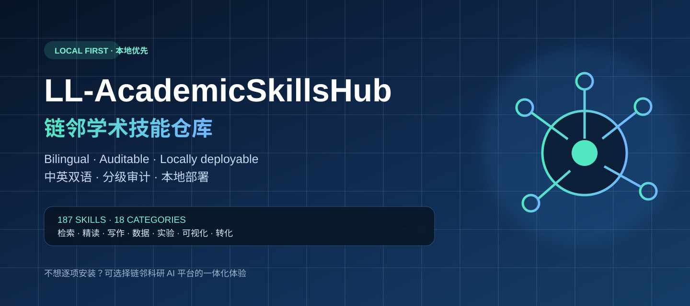
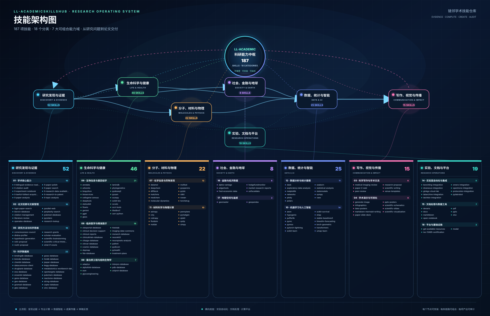
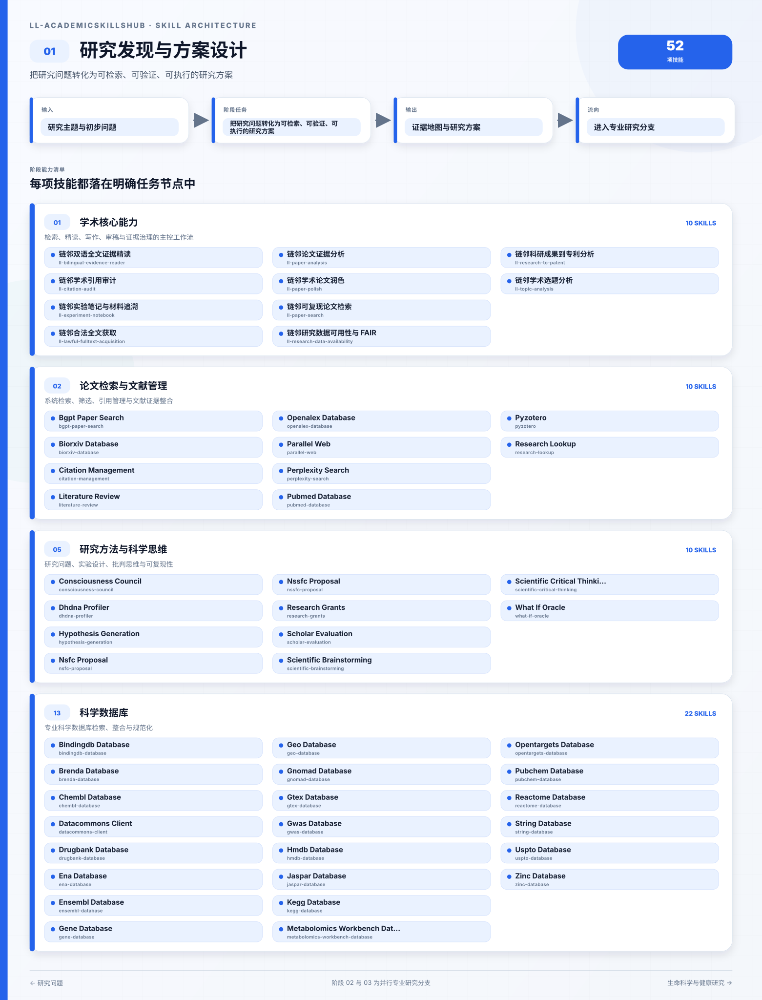
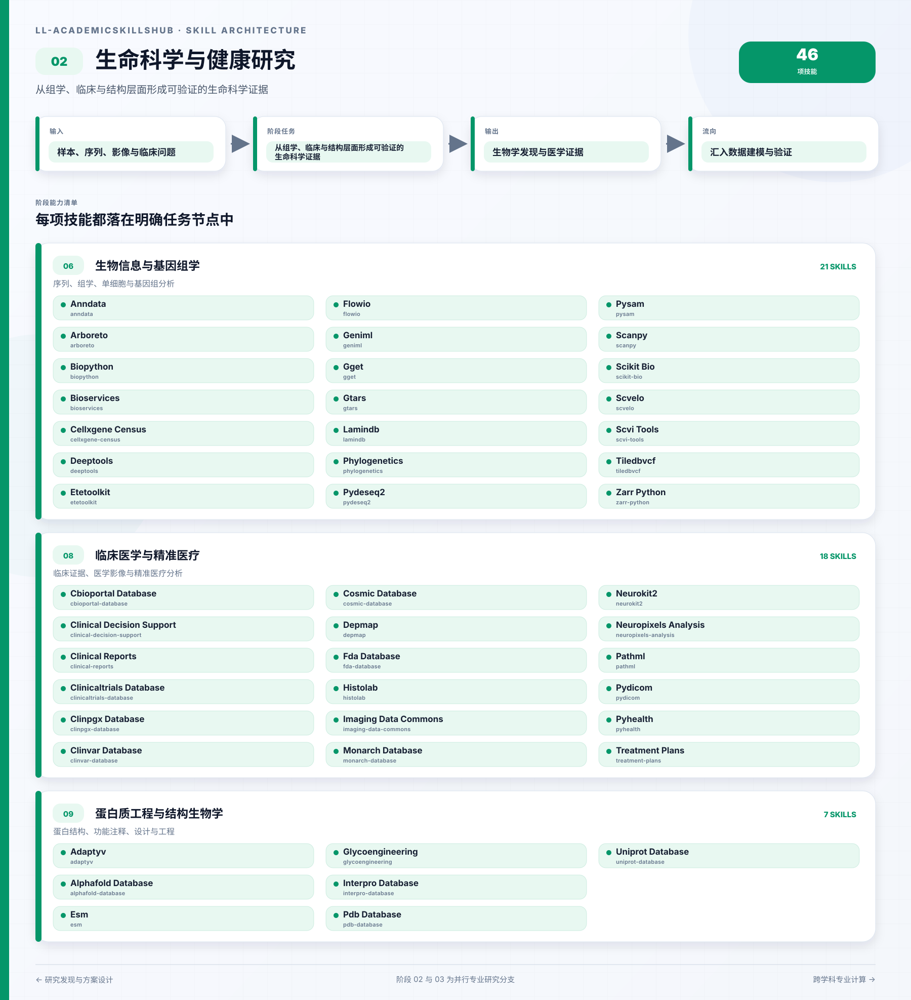
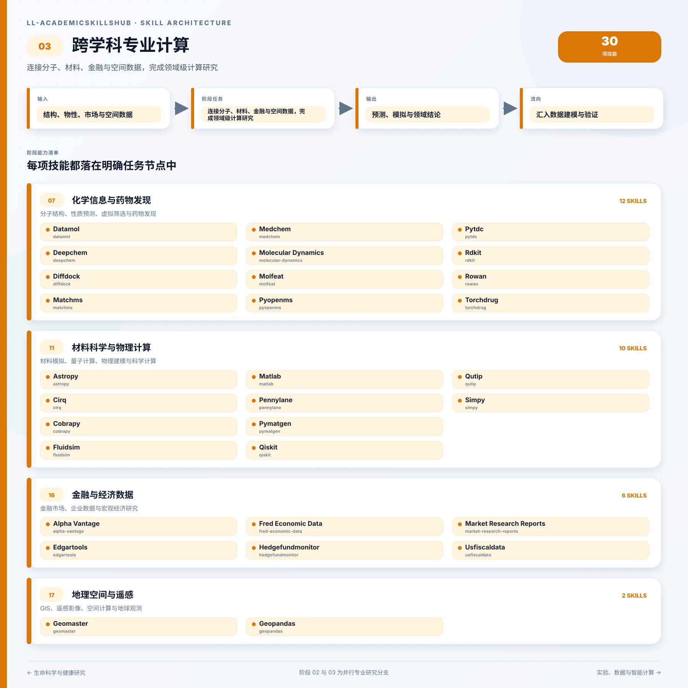
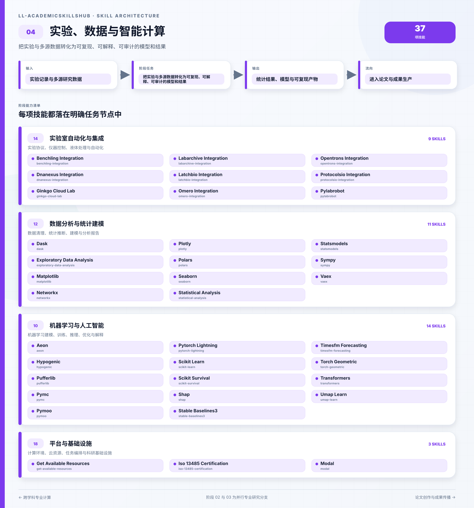
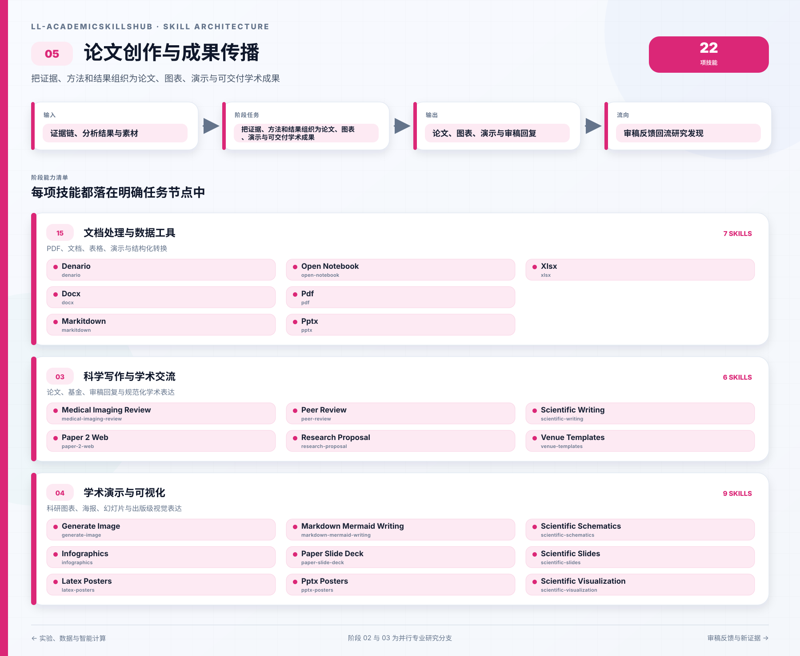

<p align="center">
  
</p>

<p align="center">
  <strong>本地优先、中英双语、分级审计的学术 AI 技能仓库</strong><br>
  <a href="./README.en.md">English</a> ·
  <a href="#18-大分类--187-项技能完整能力清单">全部技能</a> ·
  <a href="./docs/deployment.zh-CN.md">本地部署</a> ·
  <a href="https://github.com/ss8875/LL-AcademicSkillsHub/releases/download/lianlin-ai-v0.3.18/Lianlin-Research-AI-Platform-Setup-0.3.18.exe">下载科研 AI 平台</a> ·
  <a href="./docs/quality-model.zh-CN.md">质量模型</a> ·
  <a href="https://github.com/ss8875/LL-AcademicSkillsHub/actions">质量流水线</a>
</p>

# 链邻学术技能仓库

LL-AcademicSkillsHub 将科研技能按任务体系，分门别类全流程完成科研论文创作，共**187 项技能**、**18 个类别**。

## 你可以做什么

- 从[全部技能与功能目录](./docs/skills.zh-CN.md)按科研任务找到合适能力；
- 查看每项技能的输入、输出、环境、网络、凭据、风险、来源与质量状态；
- 在 Windows、macOS 或 Linux 上使用 Python 标准库启动本地可搜索站点；
- 不想逐项配置技能时，选择链邻科研 AI 平台的一体化使用方式。

## 技能架构图

<p align="center">
  <a href="./assets/brand/skill-architecture-map.svg">
    
  </a>
</p>

<p align="center"><sub>阅读路线：研究发现 → 生命健康 / 跨学科专业计算（并行）→ 实验、数据与智能计算 → 论文创作与成果传播 → 审稿反馈回流。点击任意图片查看全尺寸。</sub></p>

### 01 · 研究发现与方案设计

从研究问题出发，完成检索、证据整合、方法设计与数据库发现。

<p align="center">
  <a href="./assets/brand/skill-architecture/01-discovery.zh-CN.svg">
    
  </a>
</p>

### 02 · 生命科学与健康研究

围绕组学、临床与蛋白结构形成生命健康研究证据。

<p align="center">
  <a href="./assets/brand/skill-architecture/02-life-health.zh-CN.svg">
    
  </a>
</p>

### 03 · 跨学科专业计算

连接分子、材料、金融和空间数据，完成领域模拟与预测。

<p align="center">
  <a href="./assets/brand/skill-architecture/03-domain-sciences.zh-CN.svg">
    
  </a>
</p>

### 04 · 实验、数据与智能计算

把实验和多源数据转化为统计结果、模型与可复现产物。

<p align="center">
  <a href="./assets/brand/skill-architecture/04-data-compute.zh-CN.svg">
    
  </a>
</p>

### 05 · 论文创作与成果传播

把证据链组织为论文、图表、演示、审稿回复与最终交付。

<p align="center">
  <a href="./assets/brand/skill-architecture/05-communication.zh-CN.svg">
    
  </a>
</p>

<a id="lianlin-platform"></a>

## 不想本地安装？直接使用链邻科研 AI 平台

<p align="center">
  <a href="https://github.com/ss8875/LL-AcademicSkillsHub/releases/download/lianlin-ai-v0.3.18/Lianlin-Research-AI-Platform-Setup-0.3.18.exe">
    
  </a>
</p>

<p align="center">
  <a href="https://github.com/ss8875/LL-AcademicSkillsHub/releases/download/lianlin-ai-v0.3.18/Lianlin-Research-AI-Platform-Setup-0.3.18.exe"><strong>⬇ 下载链邻科研 AI 平台 0.3.18（Windows 安装版）</strong></a><br>
  <sub>约 116.75 MB · SHA-256：<code>E502A3422E69A015BFBD56B8A1483C5CE4E1663F08C75D9AE0DE2639CAE280F6</code></sub>
</p>

### 18 大分类 · 187 项技能完整能力清单

从选题、检索、精读、实验与数据分析，到论文写作、审稿、可视化和成果传播，下面按科研任务完整展示仓库当前收录的全部技能。每一项都提供功能说明、输入输出、使用入口及运行条件。

<p align="center"><strong>如果这份科研能力地图对你有帮助，欢迎点击右上角 ⭐ Star 收藏，方便随时回来检索，也让更多研究者发现它。</strong></p>

| # | 分类 | 技能数 | 覆盖任务 |
|---:|---|---:|---|
| 01 | [学术核心能力](#category-academic-core) | **10** | 检索、精读、写作、审稿与证据治理工作流 |
| 02 | [论文检索与文献管理](#category-literature-management) | **10** | 论文检索、筛选、引用管理与证据综述 |
| 03 | [科学写作与学术交流](#category-scientific-communication) | **6** | 论文写作、基金申请、同行评审与学术表达 |
| 04 | [学术演示与可视化](#category-presentation-visualization) | **9** | 科研图表、海报、幻灯片与出版级可视化 |
| 05 | [研究方法与科学思维](#category-research-methods) | **10** | 研究问题、实验设计、批判思维与可复现性 |
| 06 | [生物信息与基因组学](#category-bioinformatics-genomics) | **21** | 序列、组学、单细胞与基因组分析 |
| 07 | [化学信息与药物发现](#category-cheminformatics-drug-discovery) | **12** | 分子结构、性质预测、虚拟筛选与药物发现 |
| 08 | [临床医学与精准医疗](#category-clinical-precision-medicine) | **18** | 临床证据、医学影像与精准医疗分析 |
| 09 | [蛋白质工程与结构生物学](#category-protein-structural-biology) | **7** | 蛋白结构、功能注释、设计与工程 |
| 10 | [机器学习与人工智能](#category-machine-learning-ai) | **14** | 机器学习建模、训练、推理、优化与解释 |
| 11 | [材料科学与物理计算](#category-materials-physics) | **10** | 材料模拟、量子计算、物理建模与科学计算 |
| 12 | [数据分析与统计建模](#category-data-analysis-statistics) | **11** | 数据清理、统计推断、建模与分析报告 |
| 13 | [科学数据库](#category-scientific-databases) | **22** | 专业科学数据库检索、整合与规范化 |
| 14 | [实验室自动化与集成](#category-lab-automation) | **9** | 实验协议、仪器控制、液体处理与自动化 |
| 15 | [文档处理与数据工具](#category-document-data-tools) | **7** | PDF、文档、表格、演示文件与结构化转换 |
| 16 | [金融与经济数据](#category-finance-economics) | **6** | 金融市场、企业数据与宏观经济研究 |
| 17 | [地理空间与遥感](#category-geospatial-remote-sensing) | **2** | GIS、遥感影像、空间计算与地球观测 |
| 18 | [平台与基础设施](#category-platform-infrastructure) | **3** | 计算环境、云资源、任务编排与科研基础设施 |

<a id="category-academic-core"></a>

#### 01. 学术核心能力 · 10 项

> 检索、精读、写作、审稿与证据治理工作流

| 技能 | 能做什么 | 怎么使用 |
|---|---|---|
| **[链邻双语全文证据精读](./skills/academic-core/ll-bilingual-evidence-reader/locales/zh-CN.md)**<br><sub>链邻原创</sub> | 跨中英文全文进行术语对齐、逐项证据定位、方法比较与不确定性标注。<br>**核心能力：**确认文本版本、语言和可用范围；建立中英文术语对照表并保留原词；按问题、方法、数据、结果和限制抽取证据；为事实与引文记录页码或结构定位；区分直译、意译、领域约定与不可等价术语；输出双语证据矩阵和差异说明 | [详细用法](./skills/academic-core/ll-bilingual-evidence-reader/locales/zh-CN.md) |
| **[链邻学术引用审计](./skills/academic-core/ll-citation-audit/locales/zh-CN.md)**<br><sub>链邻原创</sub> | 核验 DOI、作者、期刊、年份、卷期页码及正文引文与参考文献的一致性。<br>**核心能力：**解析正文引文与参考文献列表；按 DOI、题名和作者匹配权威元数据；区分已核验、部分匹配、冲突和无法核验；检查漏引、多引、重复、顺序及格式规则；不为无法确认的条目补造字段；输出逐条审计表、修复建议和未决项 | [详细用法](./skills/academic-core/ll-citation-audit/locales/zh-CN.md) |
| **[链邻实验笔记与材料追溯](./skills/academic-core/ll-experiment-notebook/locales/zh-CN.md)**<br><sub>链邻原创</sub> | 把实验目的、材料批次、协议偏差、原始数据、环境与结果连接成不可含混的追溯记录。<br>**核心能力：**分配实验、样本、材料和文件的稳定标识；实验前冻结目的、假设、协议与判定标准；记录批次、仪器、校准、环境、操作者和时间；把偏差、失败和异常与原始数据一起保留；以校验和或版本号连接原始、处理与分析产物；生成可复现实验包和交接摘要 | [详细用法](./skills/academic-core/ll-experiment-notebook/locales/zh-CN.md) |
| **[链邻合法全文获取](./skills/academic-core/ll-lawful-fulltext-acquisition/locales/zh-CN.md)**<br><sub>链邻原创</sub> | 通过开放获取、机构权限、作者存档与馆际服务等合规路径定位论文全文。<br>**核心能力：**规范 DOI、题名、作者和版本信息；优先检索出版社开放版本和可信开放仓储；区分已发表版、作者接收稿、预印本和补充材料；记录许可证、访问日期、版本和稳定链接；遇到付费墙时转向机构图书馆、馆际互借或联系作者；不绕过访问控制、不抓取盗版源、不传播受限全文 | [详细用法](./skills/academic-core/ll-lawful-fulltext-acquisition/locales/zh-CN.md) |
| **[链邻论文证据分析](./skills/academic-core/ll-paper-analysis/locales/zh-CN.md)**<br><sub>链邻原创</sub> | 从研究问题、理论、方法、数据、结果、创新与限制形成可追溯的论文阅读卡。<br>**核心能力：**记录论文身份、版本与获取方式；分离作者陈述、论文证据与分析者推断；抽取研究设计、样本、变量、方法和主要结果；将每项关键结论定位到页码、图表或章节；评估内部效度、外部效度、统计与报告风险；生成一页阅读卡和跨论文可比较字段 | [详细用法](./skills/academic-core/ll-paper-analysis/locales/zh-CN.md) |
| **[链邻学术论文润色](./skills/academic-core/ll-paper-polish/locales/zh-CN.md)**<br><sub>链邻原创</sub> | 在不改变事实、数据和学术含义的前提下优化逻辑、术语、语气、衔接与语言表达。<br>**核心能力：**确认期刊、读者、语言变体与允许改动范围；锁定数字、单位、引文、专名和关键结论；先处理论证结构与段落功能，再处理句子；标注可能改变含义或需要作者确认的修改；核对术语一致性、时态、语态与缩写；输出修订稿、修改说明和待确认问题 | [详细用法](./skills/academic-core/ll-paper-polish/locales/zh-CN.md) |
| **[链邻可复现论文检索](./skills/academic-core/ll-paper-search/locales/zh-CN.md)**<br><sub>链邻原创</sub> | 设计并执行可复现的多来源论文检索、去重、筛选与证据留存流程。<br>**核心能力：**把研究问题拆为概念块与同义词；选择适配学科的数据库并注明覆盖差异；保存完整检索式、日期、过滤条件与命中数；按 DOI、标题、作者和年份分层去重；以预先定义的纳排标准筛选；输出 PRISMA 风格流转统计与可复现查询记录 | [详细用法](./skills/academic-core/ll-paper-search/locales/zh-CN.md) |
| **[链邻研究数据可用性与 FAIR](./skills/academic-core/ll-research-data-availability/locales/zh-CN.md)**<br><sub>链邻原创</sub> | 审查研究数据的可发现、可访问、可互操作、可复用状态并起草数据可用性声明。<br>**核心能力：**盘点数据集、代码、材料和派生结果；确认隐私、伦理、合同、知识产权和禁运限制；选择领域仓储并规划持久标识符和版本；检查元数据、格式、字典、许可证与复现说明；按 FAIR 原则给出差距和优先修复项；起草与实际访问条件一致的数据可用性声明 | [详细用法](./skills/academic-core/ll-research-data-availability/locales/zh-CN.md) |
| **[链邻科研成果到专利分析](./skills/academic-core/ll-research-to-patent/locales/zh-CN.md)**<br><sub>链邻原创</sub> | 将科研成果拆分为技术特征，开展先前技术检索并形成发明披露与风险清单。<br>**核心能力：**在公开前确认保密状态、作者贡献与时间线；把技术方案拆成必要特征、可选特征和效果；构造关键词、分类号、申请人和引证检索策略；将文献逐项映射到技术特征并标注公开日期；区分新颖性线索、创造性线索、实施支持和权属问题；输出发明披露草案并建议由专利专业人士复核 | [详细用法](./skills/academic-core/ll-research-to-patent/locales/zh-CN.md) |
| **[链邻学术选题分析](./skills/academic-core/ll-topic-analysis/locales/zh-CN.md)**<br><sub>链邻原创</sub> | 以可追溯文献证据评估研究趋势、缺口、创新性、理论价值、实践价值与可行性。<br>**核心能力：**明确研究对象、范围、时间窗与判定标准；构造多组同义词和排除词并记录检索式；建立代表性文献与近年文献证据表；区分“尚未发现”与“证据证明不存在”；按新颖性、价值、数据、方法、伦理和资源评分；输出候选题目、证据、不确定性与下一步验证 | [详细用法](./skills/academic-core/ll-topic-analysis/locales/zh-CN.md) |

[↑ 返回分类总览](#18-大分类--187-项技能完整能力清单)

<a id="category-literature-management"></a>

#### 02. 论文检索与文献管理 · 10 项

> 论文检索、筛选、引用管理与证据综述

| 技能 | 能做什么 | 怎么使用 |
|---|---|---|
| **[Bgpt Paper Search](./skills/literature-management/bgpt-paper-search/locales/zh-CN.md)** | **核心能力：**检索与筛选学术文献；整理元数据与引用信息；保存可复核的检索证据<br><strong>能力说明：</strong>通过 BGPT MCP 服务器搜索科学论文并检索从全文研究中提取的结构化实验数据。每篇论文返回 25 个以上字段，包括方法、结果、样本量、质量分数和结论。用于文献综述、证据综合以及查找仅在摘要中无法获得的实验细节。 | [详细用法](./skills/literature-management/bgpt-paper-search/locales/zh-CN.md) |
| **[Biorxiv Database](./skills/literature-management/biorxiv-database/locales/zh-CN.md)** | **核心能力：**检索与筛选学术文献；整理元数据与引用信息；保存可复核的检索证据<br><strong>能力说明：</strong>bioRxiv 预印本服务器的高效数据库搜索工具。在按关键字、作者、日期范围或类别搜索生命科学预印本、检索论文元数据、下载 PDF 或进行文献综述时，请使用此技能。 | [详细用法](./skills/literature-management/biorxiv-database/locales/zh-CN.md) |
| **[Citation Management](./skills/literature-management/citation-management/locales/zh-CN.md)** | **核心能力：**检索与筛选学术文献；整理元数据与引用信息；保存可复核的检索证据<br><strong>能力说明：</strong>学术研究的综合引文管理。在 Google Scholar 和 PubMed 中搜索论文、提取准确的元数据、验证引文并生成格式正确的 BibTeX 条目。当您需要查找论文、验证引文信息、将 DOI 转换为 BibTeX 或确保科学写作中的参考准确性时，应该使用此技能。 | [详细用法](./skills/literature-management/citation-management/locales/zh-CN.md) |
| **[Literature Review](./skills/literature-management/literature-review/locales/zh-CN.md)** | **核心能力：**检索与筛选学术文献；整理元数据与引用信息；保存可复核的检索证据<br><strong>能力说明：</strong>使用多个学术数据库（PubMed、arXiv、bioRxiv、Semantic Scholar 等）开展全面、系统的文献综述。适用于跨生物医学、自然科学和技术领域的系统综述、荟萃分析、研究综合及大规模文献检索，并可生成带有已核验引文、符合 APA、Nature、Vancouver 等格式的 Markdown 文档和 PDF。 | [详细用法](./skills/literature-management/literature-review/locales/zh-CN.md) |
| **[Openalex Database](./skills/literature-management/openalex-database/locales/zh-CN.md)** | **核心能力：**检索与筛选学术文献；整理元数据与引用信息；保存可复核的检索证据<br><strong>能力说明：</strong>使用 OpenAlex 数据库查询和分析学术文献。在搜索学术论文、分析研究趋势、查找作者或机构的作品、跟踪引用、发现开放获取出版物或对 2.4 亿多篇学术作品进行文献计量分析时，应该使用此技能。用于文献检索、研究成果分析、引文分析和学术数据库查询。 | [详细用法](./skills/literature-management/openalex-database/locales/zh-CN.md) |
| **[Parallel Web](./skills/literature-management/parallel-web/locales/zh-CN.md)** | **核心能力：**检索与筛选学术文献；整理元数据与引用信息；保存可复核的检索证据<br><strong>能力说明：</strong>使用 Parallel Chat API 和 Extract API 搜索网络、提取 URL 内容并进行深入研究。用于所有网络搜索、研究查询和一般信息收集。提供带有引文的综合摘要。 | [详细用法](./skills/literature-management/parallel-web/locales/zh-CN.md) |
| **[Perplexity Search](./skills/literature-management/perplexity-search/locales/zh-CN.md)** | **核心能力：**检索与筛选学术文献；整理元数据与引用信息；保存可复核的检索证据<br><strong>能力说明：</strong>通过 LiteLLM 和 OpenRouter 使用 Perplexity 模型执行基于 AI 的网络搜索和实时信息。在对当前信息进行网络搜索、查找最新的科学文献、通过来源引用获得有根据的答案或访问超出模型知识截止范围的信息时，应该使用此技能。通过单个 OpenRouter API 密钥提供对多个 Perplexity 模型的访问，包括 Sonar Pro、Sonar Pro Search（高级代理搜索）和 Sonar Reasoning Pro。 | [详细用法](./skills/literature-management/perplexity-search/locales/zh-CN.md) |
| **[Pubmed Database](./skills/literature-management/pubmed-database/locales/zh-CN.md)** | **核心能力：**检索与筛选学术文献；整理元数据与引用信息；保存可复核的检索证据<br><strong>能力说明：</strong>通过 REST API 直接访问 PubMed，支持高级布尔与 MeSH 查询、E-utilities API、批处理和引文管理。Python 工作流通常建议使用 Biopython（Bio.Entrez）；本技能适合直接 HTTP/REST 调用或自定义 API 实现。 | [详细用法](./skills/literature-management/pubmed-database/locales/zh-CN.md) |
| **[Pyzotero](./skills/literature-management/pyzotero/locales/zh-CN.md)** | **核心能力：**检索与筛选学术文献；整理元数据与引用信息；保存可复核的检索证据<br><strong>能力说明：</strong>使用 pyzotero Python 客户端与 Zotero 参考管理库交互。通过 Zotero Web API v3 检索、创建、更新和删除项目、集合、标签和附件。以编程方式使用 Zotero 图书馆、管理书目参考、导出引文、搜索图书馆内容、上传 PDF 附件或构建与 Zotero 集成的研究自动化工作流程时，请使用此技能。 | [详细用法](./skills/literature-management/pyzotero/locales/zh-CN.md) |
| **[Research Lookup](./skills/literature-management/research-lookup/locales/zh-CN.md)** | **核心能力：**检索与筛选学术文献；整理元数据与引用信息；保存可复核的检索证据<br><strong>能力说明：</strong>使用 Parallel Chat API（主要）或 Perplexity sonar-pro-search（学术论文搜索）查找当前研究信息。自动将查询路由到最佳后端。用于查找论文、收集研究数据和验证科学信息。 | [详细用法](./skills/literature-management/research-lookup/locales/zh-CN.md) |

[↑ 返回分类总览](#18-大分类--187-项技能完整能力清单)

<a id="category-scientific-communication"></a>

#### 03. 科学写作与学术交流 · 6 项

> 论文写作、基金申请、同行评审与学术表达

| 技能 | 能做什么 | 怎么使用 |
|---|---|---|
| **[Medical Imaging Review](./skills/scientific-communication/medical-imaging-review/locales/zh-CN.md)** | **核心能力：**组织学术论证；改善科学表达；按受众和体裁调整内容<br><strong>能力说明：</strong>为医学影像人工智能研究撰写综合文献综述。适用于 CT、MRI、X 射线、超声、病理成像等方向的综述论文、系统综述和文献分析，尤其适合深度学习在分割、检测、分类等医学影像任务中的研究梳理。 | [详细用法](./skills/scientific-communication/medical-imaging-review/locales/zh-CN.md) |
| **[Paper 2 Web](./skills/scientific-communication/paper-2-web/locales/zh-CN.md)** | **核心能力：**组织学术论证；改善科学表达；按受众和体裁调整内容<br><strong>能力说明：</strong>将学术论文转换为宣传和演示格式（包括交互式网站 (Paper2Web)、演示视频 (Paper2Video) 和会议海报 (Paper2Poster) 时，应使用此技能。使用此技能来完成涉及论文传播、会议准备、创建可探索的学术主页、生成视频摘要或从 LaTeX 或 PDF 源生成可打印海报的任务。 | [详细用法](./skills/scientific-communication/paper-2-web/locales/zh-CN.md) |
| **[Peer Review](./skills/scientific-communication/peer-review/locales/zh-CN.md)** | **核心能力：**组织学术论证；改善科学表达；按受众和体裁调整内容<br><strong>能力说明：</strong>采用结构化清单评审学术稿件或基金申请，覆盖研究方法、统计有效性、CONSORT/STROBE 等报告规范及建设性反馈。适合撰写正式同行评审意见和辅助稿件修订；若重点是主张与证据质量，可结合科学批判性思维技能；若需要量化评分，可结合学术评价技能。 | [详细用法](./skills/scientific-communication/peer-review/locales/zh-CN.md) |
| **[Research Proposal](./skills/scientific-communication/research-proposal/locales/zh-CN.md)** | **核心能力：**组织学术论证；改善科学表达；按受众和体裁调整内容<br><strong>能力说明：</strong>为博士申请生成学术研究计划或研究提案，支持 STEM、人文与社会科学等不同领域，并能根据具体研究主题调整结构与论证方式。遵循严谨、凝练的学术写作规范，可按用户需要输出中文或英文版本。 | [详细用法](./skills/scientific-communication/research-proposal/locales/zh-CN.md) |
| **[Scientific Writing](./skills/scientific-communication/scientific-writing/locales/zh-CN.md)** | **核心能力：**组织学术论证；改善科学表达；按受众和体裁调整内容<br><strong>能力说明：</strong>深度研究和写作工具的核心技能。用完整的段落撰写科学手稿（不要要点）。使用两阶段过程：(1) 使用研究查找列出带有要点的章节大纲，然后 (2) 转换为流畅的散文。 IMRAD 结构、引文（APA/AMA/温哥华）、图表、报告指南（CONSORT/STROBE/PRISMA），用于研究论文和期刊提交。 | [详细用法](./skills/scientific-communication/scientific-writing/locales/zh-CN.md) |
| **[Venue Templates](./skills/scientific-communication/venue-templates/locales/zh-CN.md)** | **核心能力：**组织学术论证；改善科学表达；按受众和体裁调整内容<br><strong>能力说明：</strong>提供 Nature、Science、PLOS、IEEE、ACM 等期刊，NeurIPS、ICML、CVPR、CHI 等会议，以及研究海报和 NSF、NIH、DOE、DARPA 基金申请所需的 LaTeX 模板、格式要求与投稿指南。适合准备期刊论文、会议论文、研究海报或基金申请材料时使用。 | [详细用法](./skills/scientific-communication/venue-templates/locales/zh-CN.md) |

[↑ 返回分类总览](#18-大分类--187-项技能完整能力清单)

<a id="category-presentation-visualization"></a>

#### 04. 学术演示与可视化 · 9 项

> 科研图表、海报、幻灯片与出版级可视化

| 技能 | 能做什么 | 怎么使用 |
|---|---|---|
| **[Generate Image](./skills/presentation-visualization/generate-image/locales/zh-CN.md)** | **核心能力：**设计学术图表与版式；把数据转化为可读视觉；输出演示或出版素材<br><strong>能力说明：</strong>使用 AI 模型（FLUX、Nano Banana 2）生成或编辑图像。用于生成通用图像，包括照片、插图、艺术作品、视觉资产、概念艺术以及任何非技术图表或原理图的图像。对于流程图、电路、路径和技术图表，请使用科学原理图技能。 | [详细用法](./skills/presentation-visualization/generate-image/locales/zh-CN.md) |
| **[Infographics](./skills/presentation-visualization/infographics/locales/zh-CN.md)** | **核心能力：**设计学术图表与版式；把数据转化为可读视觉；输出演示或出版素材<br><strong>能力说明：</strong>使用 Nano Banana Pro AI 和智能迭代细化创建专业的信息图表。使用 Gemini 3 Pro 进行质量审核。集成研究查找和网络搜索以获取准确的数据。支持 10 种信息图表类型、8 种行业样式和色盲安全调色板。 | [详细用法](./skills/presentation-visualization/infographics/locales/zh-CN.md) |
| **[Latex Posters](./skills/presentation-visualization/latex-posters/locales/zh-CN.md)** | **核心能力：**设计学术图表与版式；把数据转化为可读视觉；输出演示或出版素材<br><strong>能力说明：</strong>使用 beamerposter、tikzposter 或 baposter 在 LaTeX 中创建专业研究海报。支持会议演示、学术海报和科学传播。包括布局设计、配色方案、多栏格式、图形集成以及针对视觉传达的海报特定最佳实践。 | [详细用法](./skills/presentation-visualization/latex-posters/locales/zh-CN.md) |
| **[Markdown Mermaid Writing](./skills/presentation-visualization/markdown-mermaid-writing/locales/zh-CN.md)** | **核心能力：**设计学术图表与版式；把数据转化为可读视觉；输出演示或出版素材<br><strong>能力说明：</strong>全面的 Markdown 与 Mermaid 图表写作技能，适用于科学文档、研究报告、分析材料和可视化内容。以文本化图表作为可维护的文档标准，提供 Markdown/Mermaid 样式指南、24 类图表参考和 9 套文档模板。 | [详细用法](./skills/presentation-visualization/markdown-mermaid-writing/locales/zh-CN.md) |
| **[Paper Slide Deck](./skills/presentation-visualization/paper-slide-deck/locales/zh-CN.md)** | **核心能力：**设计学术图表与版式；把数据转化为可读视觉；输出演示或出版素材<br><strong>能力说明：</strong>从学术论文和内容生成专业的幻灯片图像。使用样式说明创建全面的轮廓，自动检测 PDF 中的图形，然后生成单独的幻灯片图像。当用户要求“创建幻灯片”、“进行演示”、“生成幻灯片”或“幻灯片”时使用。 | [详细用法](./skills/presentation-visualization/paper-slide-deck/locales/zh-CN.md) |
| **[Pptx Posters](./skills/presentation-visualization/pptx-posters/locales/zh-CN.md)** | **核心能力：**设计学术图表与版式；把数据转化为可读视觉；输出演示或出版素材<br><strong>能力说明：</strong>使用 HTML/CSS 创建可导出为 PDF 或 PPTX 的研究海报，仅在明确需要 PowerPoint/PPTX 海报格式时使用；标准学术海报可优先选择 LaTeX Posters。支持现代网页式版面、响应式布局和可视化素材集成。 | [详细用法](./skills/presentation-visualization/pptx-posters/locales/zh-CN.md) |
| **[Scientific Schematics](./skills/presentation-visualization/scientific-schematics/locales/zh-CN.md)** | **核心能力：**设计学术图表与版式；把数据转化为可读视觉；输出演示或出版素材<br><strong>能力说明：</strong>使用 Nano Banana 2 AI 和智能迭代细化创建出版质量的科学图表。使用 Gemini 3.1 Pro Preview 进行质量审查。仅当质量低于文档类型的阈值时才重新生成。专注于神经网络架构、系统图、流程图、生物路径和复杂的科学可视化。 | [详细用法](./skills/presentation-visualization/scientific-schematics/locales/zh-CN.md) |
| **[Scientific Slides](./skills/presentation-visualization/scientific-slides/locales/zh-CN.md)** | **核心能力：**设计学术图表与版式；把数据转化为可读视觉；输出演示或出版素材<br><strong>能力说明：</strong>为研究演讲构建幻灯片和演示文稿。使用它来制作 PowerPoint 幻灯片、会议演示、研讨会演讲、研究演示、论文答辩幻灯片或任何科学演讲。提供幻灯片结构、设计模板、计时指导和视觉验证。适用于 PowerPoint 和 LaTeX Beamer。 | [详细用法](./skills/presentation-visualization/scientific-slides/locales/zh-CN.md) |
| **[Scientific Visualization](./skills/presentation-visualization/scientific-visualization/locales/zh-CN.md)** | **核心能力：**设计学术图表与版式；把数据转化为可读视觉；输出演示或出版素材<br><strong>能力说明：</strong>用于准备发表的人物的元技能。在创建需要多面板布局、重要性注释、错误栏、色盲安全调色板和特定期刊格式（《自然》、《科学》、《细胞》）的期刊提交图表时使用。使用发布样式协调 matplotlib/seaborn/plotly。为了快速探索，直接使用seaborn或plotly。 | [详细用法](./skills/presentation-visualization/scientific-visualization/locales/zh-CN.md) |

[↑ 返回分类总览](#18-大分类--187-项技能完整能力清单)

<a id="category-research-methods"></a>

#### 05. 研究方法与科学思维 · 10 项

> 研究问题、实验设计、批判思维与可复现性

| 技能 | 能做什么 | 怎么使用 |
|---|---|---|
| **[Consciousness Council](./skills/research-methods/consciousness-council/locales/zh-CN.md)** | **核心能力：**明确研究问题与假设；设计可复现研究流程；识别偏倚、限制与核验点<br><strong>能力说明：</strong>对任何问题、决定或创造性挑战进行多角度的思想委员会审议。每当用户想要不同的观点，需要帮助做出艰难的决定，要求进行理事会/小组/委员会讨论，想要从多个角度探讨问题，要求魔鬼代言人分析，或者说诸如“不同的专家对此有何看法”，“帮助我从各个方面思考这个问题”，“理事会模式”，“心灵理事会”或“对此进行深思熟虑”之类的内容时，请使用此技能。当用户面临困境、权衡或没有明显答案的复杂选择时也会触发。 | [详细用法](./skills/research-methods/consciousness-council/locales/zh-CN.md) |
| **[Dhdna Profiler](./skills/research-methods/dhdna-profiler/locales/zh-CN.md)** | **核心能力：**明确研究问题与假设；设计可复现研究流程；识别偏倚、限制与核验点<br><strong>能力说明：</strong>从任何文本中提取认知模式和思维指纹。当用户想要分析某人的思维方式、了解认知风格、个人资料写作或演讲模式、比较人与人之间的思维方式、询问“我的思维方式是什么”、“分析这个人如何推理”、“认知概况”、“思维模式”、“DHDNA”、“数字 DNA”或想要了解任何文本背后的思想时，可以使用此技能。当用户提供文本并希望更深入地了解作者的推理模式、决策风格或认知特征时也会触发。 | [详细用法](./skills/research-methods/dhdna-profiler/locales/zh-CN.md) |
| **[Hypothesis Generation](./skills/research-methods/hypothesis-generation/locales/zh-CN.md)** | **核心能力：**明确研究问题与假设；设计可复现研究流程；识别偏倚、限制与核验点<br><strong>能力说明：</strong>根据观察形成结构化假设。当您有实验观察或数据并且需要制定可检验的假设和预测、提出机制并设计实验来测试它们时使用。遵循科学方法框架。对于开放式构思，请使用科学头脑风暴法；对于数据集上的自动化 LLM 驱动的假设检验，使用 lowogenic。 | [详细用法](./skills/research-methods/hypothesis-generation/locales/zh-CN.md) |
| **[Nsfc Proposal](./skills/research-methods/nsfc-proposal/locales/zh-CN.md)** | **核心能力：**明确研究问题与假设；设计可复现研究流程；识别偏倚、限制与核验点<br><strong>能力说明：</strong>撰写国家自然科学基金（NSFC）申请书，覆盖青年科学基金（C类）、优秀青年科学基金（B类）、国家杰出青年科学基金（A类）2026年度最新规范。提供分阶段写作工作流：基本信息、摘要、立项依据、研究内容、研究基础、个人简历、伦理与AI辅助声明等模块；内置文献检索策略与质量自查清单。工具中性，适配 Claude Code / Cursor / Codex / OpenClaw / Gemini CLI。触发词：国家自然科学基金、国自然、NSFC、青基、青年基金、优青、杰青、面上项目、natural science foundation of china、nsfc grant、青年科学基金申报 | [详细用法](./skills/research-methods/nsfc-proposal/locales/zh-CN.md) |
| **[Nssfc Proposal](./skills/research-methods/nssfc-proposal/locales/zh-CN.md)** | **核心能力：**明确研究问题与假设；设计可复现研究流程；识别偏倚、限制与核验点<br><strong>能力说明：</strong>撰写国家社会科学基金（NSSFC）年度项目申请书，依据 2025 年全国哲学社会科学工作办公室官方模板，覆盖重点项目（A）、一般项目（B）、青年项目（C）、西部项目（X）四类。提供分阶段写作工作流：数据表、选题说明（300字）、选题依据、研究内容、创新之处、研究基础、经费概算、活页匿名化等模块；内置社科文献检索策略与质量自查清单。工具中性，适配 Claude Code / Cursor / Codex / OpenClaw / Gemini CLI。触发词：国家社会科学基金、国社科、社科基金、NSSFC、哲学社会科学、重点项目、一般项目、青年项目、西部项目、社科申报、活页 | [详细用法](./skills/research-methods/nssfc-proposal/locales/zh-CN.md) |
| **[Research Grants](./skills/research-methods/research-grants/locales/zh-CN.md)** | **核心能力：**明确研究问题与假设；设计可复现研究流程；识别偏倚、限制与核验点<br><strong>能力说明：</strong>为 NSF、NIH、DOE、DARPA 和台湾 NSTC 撰写竞争性研究提案。机构特定的格式、审查标准、预算准备、更广泛的影响、重要性陈述、创新叙述以及遵守提交要求。 | [详细用法](./skills/research-methods/research-grants/locales/zh-CN.md) |
| **[Scholar Evaluation](./skills/research-methods/scholar-evaluation/locales/zh-CN.md)** | **核心能力：**明确研究问题与假设；设计可复现研究流程；识别偏倚、限制与核验点<br><strong>能力说明：</strong>使用 ScholarEval 框架系统地评估学术工作，提供跨研究质量维度的结构化评估，包括问题表述、方法论、分析和写作，并提供定量评分和可行的反馈。 | [详细用法](./skills/research-methods/scholar-evaluation/locales/zh-CN.md) |
| **[Scientific Brainstorming](./skills/research-methods/scientific-brainstorming/locales/zh-CN.md)** | **核心能力：**明确研究问题与假设；设计可复现研究流程；识别偏倚、限制与核验点<br><strong>能力说明：</strong>创造性的研究构思和探索。用于开放式头脑风暴会议、探索跨学科联系、挑战假设或确定研究差距。当您还没有具体的观察结果时，最适合早期研究计划。为了根据数据制定可检验的假设，请使用假设生成。 | [详细用法](./skills/research-methods/scientific-brainstorming/locales/zh-CN.md) |
| **[Scientific Critical Thinking](./skills/research-methods/scientific-critical-thinking/locales/zh-CN.md)** | **核心能力：**明确研究问题与假设；设计可复现研究流程；识别偏倚、限制与核验点<br><strong>能力说明：</strong>评估科学主张和证据质量。用于评估实验设计的有效性、识别偏差和混杂因素、应用证据分级框架（GRADE、Cochrane 偏差风险）或教授批判性分析。最适合了解证据质量、识别缺陷。对于正式的同行评审写作，请使用同行评审。 | [详细用法](./skills/research-methods/scientific-critical-thinking/locales/zh-CN.md) |
| **[What If Oracle](./skills/research-methods/what-if-oracle/locales/zh-CN.md)** | **核心能力：**明确研究问题与假设；设计可复现研究流程；识别偏倚、限制与核验点<br><strong>能力说明：</strong>通过多分支可能性探索运行结构化假设场景分析。当用户提出诸如“如果……会怎样”、“如果……会发生什么”、“可能性是什么”、“探索场景”、“场景分析”、“可能性空间”、“可能出错的地方”、“最好情况/最坏情况”、“风险分析”、“应急计划”、“战略选择”或任何有关不确定未来的问题等推测性问题时，请使用此技能。当用户面临岔路口决策、想要对想法进行压力测试或需要在做出决定之前考虑后果时也会触发。 | [详细用法](./skills/research-methods/what-if-oracle/locales/zh-CN.md) |

[↑ 返回分类总览](#18-大分类--187-项技能完整能力清单)

<a id="category-bioinformatics-genomics"></a>

#### 06. 生物信息与基因组学 · 21 项

> 序列、组学、单细胞与基因组分析

| 技能 | 能做什么 | 怎么使用 |
|---|---|---|
| **[Anndata](./skills/bioinformatics-genomics/anndata/locales/zh-CN.md)** | **核心能力：**处理生物序列与组学数据；调用领域数据库和分析工具；形成可复现生信结果<br><strong>能力说明：</strong>单细胞分析中带注释矩阵的数据结构。在处理 .h5ad 文件或与 scverse 生态系统集成时使用。这是数据格式技巧——分析工作流程使用scanpy；对于概率模型，使用 scvi-tools；对于人口规模查询，请使用 cellxgene-census。 | [详细用法](./skills/bioinformatics-genomics/anndata/locales/zh-CN.md) |
| **[Arboreto](./skills/bioinformatics-genomics/arboreto/locales/zh-CN.md)** | **核心能力：**处理生物序列与组学数据；调用领域数据库和分析工具；形成可复现生信结果<br><strong>能力说明：</strong>使用可扩展算法（GRNBoost2、GENIE3）从基因表达数据推断基因调控网络 (GRN)。在分析转录组学数据（批量 RNA-seq、单细胞 RNA-seq）时使用，以识别转录因子-靶基因关系和调控相互作用。支持大规模数据集的分布式计算。 | [详细用法](./skills/bioinformatics-genomics/arboreto/locales/zh-CN.md) |
| **[Biopython](./skills/bioinformatics-genomics/biopython/locales/zh-CN.md)** | **核心能力：**处理生物序列与组学数据；调用领域数据库和分析工具；形成可复现生信结果<br><strong>能力说明：</strong>综合分子生物学工具包，支持序列操作、FASTA/GenBank/PDB 文件解析、系统发育分析以及通过 Bio.Entrez 访问 NCBI/PubMed。适合批量处理、自定义生物信息学流程和 BLAST 自动化；快速查询可使用 gget，多服务整合可使用 BioServices。 | [详细用法](./skills/bioinformatics-genomics/biopython/locales/zh-CN.md) |
| **[Bioservices](./skills/bioinformatics-genomics/bioservices/locales/zh-CN.md)** | **核心能力：**处理生物序列与组学数据；调用领域数据库和分析工具；形成可复现生信结果<br><strong>能力说明：</strong>与 40 多种生物信息学服务的统一 Python 接口。在具有一致 API 的单个工作流程中查询多个数据库（UniProt、KEGG、ChEMBL、Reactome）时使用。最适合跨数据库分析、跨服务的 ID 映射。对于快速单数据库查找，请使用 gget；对于序列/文件操作，请使用biopython。 | [详细用法](./skills/bioinformatics-genomics/bioservices/locales/zh-CN.md) |
| **[Cellxgene Census](./skills/bioinformatics-genomics/cellxgene-census/locales/zh-CN.md)** | **核心能力：**处理生物序列与组学数据；调用领域数据库和分析工具；形成可复现生信结果<br><strong>能力说明：</strong>以编程方式查询 CELLxGENE 普查（61M+ 单元）。当您需要来自最大的精选单细胞图谱的跨组织、疾病或细胞类型的表达数据时使用。最适合人口规模查询、参考图集比较。要分析您自己的数据，请使用 scanpy 或 scvi-tools。 | [详细用法](./skills/bioinformatics-genomics/cellxgene-census/locales/zh-CN.md) |
| **[Deeptools](./skills/bioinformatics-genomics/deeptools/locales/zh-CN.md)** | **核心能力：**处理生物序列与组学数据；调用领域数据库和分析工具；形成可复现生信结果<br><strong>能力说明：</strong>NGS 分析工具包。 BAM 到 bigWig 的转换、QC（相关性、PCA、指纹）、热图/概况（TSS、峰值），用于 ChIP-seq、RNA-seq、ATAC-seq 可视化。 | [详细用法](./skills/bioinformatics-genomics/deeptools/locales/zh-CN.md) |
| **[Etetoolkit](./skills/bioinformatics-genomics/etetoolkit/locales/zh-CN.md)** | **核心能力：**处理生物序列与组学数据；调用领域数据库和分析工具；形成可复现生信结果<br><strong>能力说明：</strong>系统发育树工具包（ETE）。树操作 (Newick/NHX)、进化事件检测、直系同源/旁系同源、NCBI 分类、可视化 (PDF/SVG)，用于系统发育学。 | [详细用法](./skills/bioinformatics-genomics/etetoolkit/locales/zh-CN.md) |
| **[Flowio](./skills/bioinformatics-genomics/flowio/locales/zh-CN.md)** | **核心能力：**处理生物序列与组学数据；调用领域数据库和分析工具；形成可复现生信结果<br><strong>能力说明：</strong>解析 FCS（流式细胞术标准）文件 v2.0-3.1。将事件提取为 NumPy 数组，读取元数据/通道，转换为 CSV/DataFrame，用于流式细胞术数据预处理。 | [详细用法](./skills/bioinformatics-genomics/flowio/locales/zh-CN.md) |
| **[Geniml](./skills/bioinformatics-genomics/geniml/locales/zh-CN.md)** | **核心能力：**处理生物序列与组学数据；调用领域数据库和分析工具；形成可复现生信结果<br><strong>能力说明：</strong>在处理机器学习任务的基因组区间数据（BED 文件）时应使用此技能。用于训练区域嵌入（Region2Vec、BEDspace）、单细胞 ATAC-seq 分析 (scEmbed)、构建共识峰（宇宙）或任何基于 ML 的基因组区域分析。适用于 BED 文件集合、scATAC-seq 数据、染色质可及性数据集和基于区域的基因组特征学习。 | [详细用法](./skills/bioinformatics-genomics/geniml/locales/zh-CN.md) |
| **[Gget](./skills/bioinformatics-genomics/gget/locales/zh-CN.md)** | **核心能力：**处理生物序列与组学数据；调用领域数据库和分析工具；形成可复现生信结果<br><strong>能力说明：</strong>对 20 多个生物信息学数据库进行快速 CLI/Python 查询。用于快速查找：基因信息、BLAST 搜索、AlphaFold 结构、富集分析。最适合交互式探索、简单查询。对于批处理或高级 BLAST，请使用 biopython；对于多数据库Python工作流程，使用bioservices。 | [详细用法](./skills/bioinformatics-genomics/gget/locales/zh-CN.md) |
| **[Gtars](./skills/bioinformatics-genomics/gtars/locales/zh-CN.md)** | **核心能力：**处理生物序列与组学数据；调用领域数据库和分析工具；形成可复现生信结果<br><strong>能力说明：</strong>用于 Rust 与 Python 绑定的基因组区间分析的高性能工具包。在处理基因组区域、BED 文件、覆盖轨迹、重叠检测、ML 模型标记化或计算基因组学和机器学习应用程序中的片段分析时使用。 | [详细用法](./skills/bioinformatics-genomics/gtars/locales/zh-CN.md) |
| **[Lamindb](./skills/bioinformatics-genomics/lamindb/locales/zh-CN.md)** | **核心能力：**处理生物序列与组学数据；调用领域数据库和分析工具；形成可复现生信结果<br><strong>能力说明：</strong>在使用 LaminDB 时应该使用此技能，LaminDB 是一种生物学开源数据框架，使数据可查询、可追踪、可再现且公平。在管理生物数据集（scRNA-seq、空间、流式细胞术等）、跟踪计算工作流程、使用生物本体整理和验证数据、构建数据湖房或确保生物研究中的数据沿袭和可重复性时使用。涵盖数据管理、注释、本体（基因、细胞类型、疾病、组织）、模式验证、与工作流程管理器（Nextflow、Snakemake）和 MLOps 平台（W&amp;B、MLflow）的集成以及部署策略。 | [详细用法](./skills/bioinformatics-genomics/lamindb/locales/zh-CN.md) |
| **[Phylogenetics](./skills/bioinformatics-genomics/phylogenetics/locales/zh-CN.md)** | **核心能力：**处理生物序列与组学数据；调用领域数据库和分析工具；形成可复现生信结果<br><strong>能力说明：</strong>使用 MAFFT（多重比对）、IQ-TREE 2（最大似然）和 FastTree（快速 NJ/ML）构建和分析系统发育树。使用 ETE3 或 FigTree 进行可视化。用于进化分析、微生物基因组学、病毒系统动力学、蛋白质家族分析和分子钟研究。 | [详细用法](./skills/bioinformatics-genomics/phylogenetics/locales/zh-CN.md) |
| **[Pydeseq2](./skills/bioinformatics-genomics/pydeseq2/locales/zh-CN.md)** | **核心能力：**处理生物序列与组学数据；调用领域数据库和分析工具；形成可复现生信结果<br><strong>能力说明：</strong>差异基因表达分析（Python DESeq2）。从批量 RNA-seq 计数、Wald 检验、FDR 校正、火山/MA 图中识别 DE 基因，以进行 RNA-seq 分析。 | [详细用法](./skills/bioinformatics-genomics/pydeseq2/locales/zh-CN.md) |
| **[Pysam](./skills/bioinformatics-genomics/pysam/locales/zh-CN.md)** | **核心能力：**处理生物序列与组学数据；调用领域数据库和分析工具；形成可复现生信结果<br><strong>能力说明：</strong>基因组文件工具包。读/写 SAM/BAM/CRAM 比对、VCF/BCF 变体、FASTA/FASTQ 序列、提取区域、计算覆盖率，用于 NGS 数据处理流程。 | [详细用法](./skills/bioinformatics-genomics/pysam/locales/zh-CN.md) |
| **[Scanpy](./skills/bioinformatics-genomics/scanpy/locales/zh-CN.md)** | **核心能力：**处理生物序列与组学数据；调用领域数据库和分析工具；形成可复现生信结果<br><strong>能力说明：</strong>标准单细胞 RNA-seq 分析流程。用于 QC、归一化、降维 (PCA/UMAP/t-SNE)、聚类、差异表达和可视化。最适合使用已建立的工作流程进行探索性 scRNA-seq 分析。对于深度学习模型，请使用 scvi-tools；对于数据格式问题，请使用 anndata。 | [详细用法](./skills/bioinformatics-genomics/scanpy/locales/zh-CN.md) |
| **[Scikit Bio](./skills/bioinformatics-genomics/scikit-bio/locales/zh-CN.md)** | **核心能力：**处理生物序列与组学数据；调用领域数据库和分析工具；形成可复现生信结果<br><strong>能力说明：</strong>生物数据工具包。序列分析、比对、系统发育树、多样性指标（α/β、UniFrac）、排序（PCoA）、PERMANOVA、FASTA/Newick I/O，用于微生物组分析。 | [详细用法](./skills/bioinformatics-genomics/scikit-bio/locales/zh-CN.md) |
| **[Scvelo](./skills/bioinformatics-genomics/scvelo/locales/zh-CN.md)** | **核心能力：**处理生物序列与组学数据；调用领域数据库和分析工具；形成可复现生信结果<br><strong>能力说明：</strong>使用 scVelo 进行 RNA 速度分析。根据未剪接/剪接 mRNA 动力学估计细胞状态转变，推断轨迹方向，计算潜伏时间，并识别单细胞 RNA-seq 数据中的驱动基因。补充了用于轨迹推断的 Scanpy/scVI 工具。 | [详细用法](./skills/bioinformatics-genomics/scvelo/locales/zh-CN.md) |
| **[Scvi Tools](./skills/bioinformatics-genomics/scvi-tools/locales/zh-CN.md)** | **核心能力：**处理生物序列与组学数据；调用领域数据库和分析工具；形成可复现生信结果<br><strong>能力说明：</strong>单细胞组学的深度生成模型。当您需要概率批量校正 (scVI)、迁移学习、不确定性差异表达或多模态积分（TOTALVI、MultiVI）时使用。最适合高级建模、批量效果、多模式数据。对于标准分析管道，请使用 scanpy。 | [详细用法](./skills/bioinformatics-genomics/scvi-tools/locales/zh-CN.md) |
| **[Tiledbvcf](./skills/bioinformatics-genomics/tiledbvcf/locales/zh-CN.md)** | **核心能力：**处理生物序列与组学数据；调用领域数据库和分析工具；形成可复现生信结果<br><strong>能力说明：</strong>使用 TileDB 高效存储和检索基因组变异数据。可扩展的 VCF/BCF 摄取、增量样本添加、压缩存储、并行查询和群体基因组学导出功能。 | [详细用法](./skills/bioinformatics-genomics/tiledbvcf/locales/zh-CN.md) |
| **[Zarr Python](./skills/bioinformatics-genomics/zarr-python/locales/zh-CN.md)** | **核心能力：**处理生物序列与组学数据；调用领域数据库和分析工具；形成可复现生信结果<br><strong>能力说明：</strong>用于云存储的分块 N 维阵列。压缩数组、并行 I/O、S3/GCS 集成、NumPy/Dask/Xarray 兼容，适用于大规模科学计算管道。 | [详细用法](./skills/bioinformatics-genomics/zarr-python/locales/zh-CN.md) |

[↑ 返回分类总览](#18-大分类--187-项技能完整能力清单)

<a id="category-cheminformatics-drug-discovery"></a>

#### 07. 化学信息与药物发现 · 12 项

> 分子结构、性质预测、虚拟筛选与药物发现

| 技能 | 能做什么 | 怎么使用 |
|---|---|---|
| **[Datamol](./skills/cheminformatics-drug-discovery/datamol/locales/zh-CN.md)** | **核心能力：**分析化学结构与性质；查询化学和药物数据库；支持候选物筛选与评估<br><strong>能力说明：</strong>RDKit 的 Pythonic 包装器，具有简化的界面和合理的默认值。标准药物发现的首选，包括 SMILES 解析、标准化、描述符、指纹、聚类、3D 构象异构体、并行处理。返回本机 rdkit.Chem.Mol 对象。对于高级控制或自定义参数，直接使用rdkit。 | [详细用法](./skills/cheminformatics-drug-discovery/datamol/locales/zh-CN.md) |
| **[Deepchem](./skills/cheminformatics-drug-discovery/deepchem/locales/zh-CN.md)** | **核心能力：**分析化学结构与性质；查询化学和药物数据库；支持候选物筛选与评估<br><strong>能力说明：</strong>具有多种特征器和预构建数据集的分子机器学习。当您需要广泛的特征化选项和 MoleculeNet 基准时，可使用传统 ML 或 GNN 进行属性预测（ADMET、毒性）。最适合使用预先训练的模型、不同的分子表示进行快速实验。对于图优先的 PyTorch 工作流程，请使用 torchdrug；对于基准数据集，请使用 pytdc。 | [详细用法](./skills/cheminformatics-drug-discovery/deepchem/locales/zh-CN.md) |
| **[Diffdock](./skills/cheminformatics-drug-discovery/diffdock/locales/zh-CN.md)** | **核心能力：**分析化学结构与性质；查询化学和药物数据库；支持候选物筛选与评估<br><strong>能力说明：</strong>基于扩散的分子对接。通过 PDB/SMILES、置信度评分、虚拟筛选预测蛋白质-配体结合姿势，以进行基于结构的药物设计。不适用于亲和力预测。 | [详细用法](./skills/cheminformatics-drug-discovery/diffdock/locales/zh-CN.md) |
| **[Matchms](./skills/cheminformatics-drug-discovery/matchms/locales/zh-CN.md)** | **核心能力：**分析化学结构与性质；查询化学和药物数据库；支持候选物筛选与评估<br><strong>能力说明：</strong>代谢组学的光谱相似性和化合物鉴定。用于比较质谱、计算相似性分数（余弦、修正余弦）以及从谱库中识别未知化合物。最适合代谢物鉴定、光谱匹配、库搜索。对于完整的 LC-MS/MS 蛋白质组学流程，请使用 pyopenms。 | [详细用法](./skills/cheminformatics-drug-discovery/matchms/locales/zh-CN.md) |
| **[Medchem](./skills/cheminformatics-drug-discovery/medchem/locales/zh-CN.md)** | **核心能力：**分析化学结构与性质；查询化学和药物数据库；支持候选物筛选与评估<br><strong>能力说明：</strong>药物化学过滤器。应用药物相似性规则（Lipinski、Veber）、PAINS 过滤器、结构警报、复杂性指标，以进行化合物优先级排序和库过滤。 | [详细用法](./skills/cheminformatics-drug-discovery/medchem/locales/zh-CN.md) |
| **[Molecular Dynamics](./skills/cheminformatics-drug-discovery/molecular-dynamics/locales/zh-CN.md)** | **核心能力：**分析化学结构与性质；查询化学和药物数据库；支持候选物筛选与评估<br><strong>能力说明：</strong>使用 OpenMM 和 MDAnalysis 运行和分析分子动力学模拟。设置蛋白质/小分子系统，定义力场，运行能量最小化和生产MD，分析轨迹（RMSD、RMSF、接触图、自由能表面）。用于结构生物学、药物结合和生物物理学。 | [详细用法](./skills/cheminformatics-drug-discovery/molecular-dynamics/locales/zh-CN.md) |
| **[Molfeat](./skills/cheminformatics-drug-discovery/molfeat/locales/zh-CN.md)** | **核心能力：**分析化学结构与性质；查询化学和药物数据库；支持候选物筛选与评估<br><strong>能力说明：</strong>ML 的分子特征化（100 多个特征化器）。 ECFP、MACCS、描述符、预训练模型 (ChemBERTa)、将 SMILES 转换为特征，用于 QSAR 和分子 ML。 | [详细用法](./skills/cheminformatics-drug-discovery/molfeat/locales/zh-CN.md) |
| **[Pyopenms](./skills/cheminformatics-drug-discovery/pyopenms/locales/zh-CN.md)** | **核心能力：**分析化学结构与性质；查询化学和药物数据库；支持候选物筛选与评估<br><strong>能力说明：</strong>完整的质谱分析平台。用于蛋白质组学工作流程，包括检测、肽鉴定、蛋白质定量和复杂的 LC-MS/MS 流程。支持广泛的文件格式和算法。最适合蛋白质组学、全面的 MS 数据处理。对于简单的光谱比较和代谢物 ID，请使用 matchms。 | [详细用法](./skills/cheminformatics-drug-discovery/pyopenms/locales/zh-CN.md) |
| **[Pytdc](./skills/cheminformatics-drug-discovery/pytdc/locales/zh-CN.md)** | **核心能力：**分析化学结构与性质；查询化学和药物数据库；支持候选物筛选与评估<br><strong>能力说明：</strong>治疗数据共享。 AI 就绪药物发现数据集（ADME、毒性、DTI）、基准、支架分割、分子预言，用于治疗性 ML 和药理学预测。 | [详细用法](./skills/cheminformatics-drug-discovery/pytdc/locales/zh-CN.md) |
| **[Rdkit](./skills/cheminformatics-drug-discovery/rdkit/locales/zh-CN.md)** | **核心能力：**分析化学结构与性质；查询化学和药物数据库；支持候选物筛选与评估<br><strong>能力说明：</strong>用于细粒度分子控制的化学信息学工具包。 SMILES/SDF 解析、描述符（MW、LogP、TPSA）、指纹、子结构搜索、2D/3D 生成、相似性、反应。对于具有更简单界面的标准工作流程，请使用 datamol（RDKit 的包装器）。使用 rdkit 进行高级控制、自定义清理和专用算法。 | [详细用法](./skills/cheminformatics-drug-discovery/rdkit/locales/zh-CN.md) |
| **[Rowan](./skills/cheminformatics-drug-discovery/rowan/locales/zh-CN.md)** | **核心能力：**分析化学结构与性质；查询化学和药物数据库；支持候选物筛选与评估<br><strong>能力说明：</strong>具有 Python API 的基于云的量子化学平台。优选计算化学工作流程，包括 pKa 预测、几何优化、构象异构体搜索、分子特性计算、蛋白质配体对接 (AutoDock Vina) 和 AI 蛋白质共折叠 (Chai-1、Boltz-1/2)。当任务涉及量子化学计算、分子特性预测、DFT 或半经验方法、神经网络势 (AIMNet2)、蛋白质-配体结合预测或自动计算化学管道时使用。提供云计算资源，无需本地设置。 | [详细用法](./skills/cheminformatics-drug-discovery/rowan/locales/zh-CN.md) |
| **[Torchdrug](./skills/cheminformatics-drug-discovery/torchdrug/locales/zh-CN.md)** | **核心能力：**分析化学结构与性质；查询化学和药物数据库；支持候选物筛选与评估<br><strong>能力说明：</strong>PyTorch-分子和蛋白质的原生图神经网络。在构建用于药物发现、蛋白质建模或知识图推理的自定义 GNN 架构时使用。最适合定制模型开发、蛋白质特性预测、逆合成。对于预先训练的模型和不同的特征器，使用 deepchem；对于基准数据集，请使用 pytdc。 | [详细用法](./skills/cheminformatics-drug-discovery/torchdrug/locales/zh-CN.md) |

[↑ 返回分类总览](#18-大分类--187-项技能完整能力清单)

<a id="category-clinical-precision-medicine"></a>

#### 08. 临床医学与精准医疗 · 18 项

> 临床证据、医学影像与精准医疗分析

| 技能 | 能做什么 | 怎么使用 |
|---|---|---|
| **[Cbioportal Database](./skills/clinical-precision-medicine/cbioportal-database/locales/zh-CN.md)** | **核心能力：**整理临床与精准医学证据；处理受控医学数据；标注适用边界与风险<br><strong>能力说明：</strong>查询 cBioPortal 的癌症基因组学数据，包括数百项癌症研究的体细胞突变、拷贝数改变、基因表达和生存数据。对于癌症靶标验证、癌基因/肿瘤抑制基因分析和患者水平基因组分析至关重要。 | [详细用法](./skills/clinical-precision-medicine/cbioportal-database/locales/zh-CN.md) |
| **[Clinical Decision Support](./skills/clinical-precision-medicine/clinical-decision-support/locales/zh-CN.md)** | **核心能力：**整理临床与精准医学证据；处理受控医学数据；标注适用边界与风险<br><strong>能力说明：</strong>为制药和临床研究环境生成专业的临床决策支持 (CDS) 文件，包括患者队列分析（根据结果进行生物标志物分层）和治疗推荐报告（带有决策算法的循证指南）。支持 GRADE 证据分级、统计分析（风险比、生存曲线、瀑布图）、生物标志物集成和法规遵从性。输出针对药物开发、临床研究和证据合成进行优化的可发布 LaTeX/PDF 格式。 | [详细用法](./skills/clinical-precision-medicine/clinical-decision-support/locales/zh-CN.md) |
| **[Clinical Reports](./skills/clinical-precision-medicine/clinical-reports/locales/zh-CN.md)** | **核心能力：**整理临床与精准医学证据；处理受控医学数据；标注适用边界与风险<br><strong>能力说明：</strong>撰写全面的临床报告，包括病例报告（CARE 指南）、诊断报告（放射学/病理学/实验室）、临床试验报告（ICH-E3、SAE、CSR）和患者文件（SOAP、H&amp;P、出院小结）。全面支持模板、法规遵从性（HIPAA、FDA、ICH-GCP）和验证工具。 | [详细用法](./skills/clinical-precision-medicine/clinical-reports/locales/zh-CN.md) |
| **[Clinicaltrials Database](./skills/clinical-precision-medicine/clinicaltrials-database/locales/zh-CN.md)** | **核心能力：**整理临床与精准医学证据；处理受控医学数据；标注适用边界与风险<br><strong>能力说明：</strong>通过 API v2 查询 ClinicalTrials.gov。按条件、药物、地点、状态或阶段搜索试验。通过 NCT ID 检索试验详细信息，导出数据，用于临床研究和患者匹配。 | [详细用法](./skills/clinical-precision-medicine/clinicaltrials-database/locales/zh-CN.md) |
| **[Clinpgx Database](./skills/clinical-precision-medicine/clinpgx-database/locales/zh-CN.md)** | **核心能力：**整理临床与精准医学证据；处理受控医学数据；标注适用边界与风险<br><strong>能力说明：</strong>访问 ClinPGx 药物基因组学数据（PharmGKB 的后继者）。查询基因-药物相互作用、CPIC 指南、等位基因功能，以进行精准医疗和基因型指导的剂量决策。 | [详细用法](./skills/clinical-precision-medicine/clinpgx-database/locales/zh-CN.md) |
| **[Clinvar Database](./skills/clinical-precision-medicine/clinvar-database/locales/zh-CN.md)** | **核心能力：**整理临床与精准医学证据；处理受控医学数据；标注适用边界与风险<br><strong>能力说明：</strong>查询 NCBI ClinVar 中的变异临床意义，支持按基因或位置检索、解释致病性分类、通过 E-utilities API 或 FTP 获取数据，并可注释 VCF，适用于基因组医学研究。 | [详细用法](./skills/clinical-precision-medicine/clinvar-database/locales/zh-CN.md) |
| **[Cosmic Database](./skills/clinical-precision-medicine/cosmic-database/locales/zh-CN.md)** | **核心能力：**整理临床与精准医学证据；处理受控医学数据；标注适用边界与风险<br><strong>能力说明：</strong>访问 COSMIC 癌症突变数据库。查询体细胞突变、癌症基因普查、突变特征、基因融合，用于癌症研究和精准肿瘤学。需要身份验证。 | [详细用法](./skills/clinical-precision-medicine/cosmic-database/locales/zh-CN.md) |
| **[Depmap](./skills/clinical-precision-medicine/depmap/locales/zh-CN.md)** | **核心能力：**整理临床与精准医学证据；处理受控医学数据；标注适用边界与风险<br><strong>能力说明：</strong>查询癌症依赖性图谱 (DepMap)，了解癌细胞系基因依赖性评分 (CRISPR Chronos)、药物敏感性数据和基因效应概况。用于识别癌症特定的脆弱性、合成致死相互作用以及验证肿瘤药物靶点。 | [详细用法](./skills/clinical-precision-medicine/depmap/locales/zh-CN.md) |
| **[Fda Database](./skills/clinical-precision-medicine/fda-database/locales/zh-CN.md)** | **核心能力：**整理临床与精准医学证据；处理受控医学数据；标注适用边界与风险<br><strong>能力说明：</strong>查询 openFDA API 的药物、设备、不良事件、召回、监管提交（510k、PMA）、物质识别（UNII），用于 FDA 监管数据分析和安全研究。 | [详细用法](./skills/clinical-precision-medicine/fda-database/locales/zh-CN.md) |
| **[Histolab](./skills/clinical-precision-medicine/histolab/locales/zh-CN.md)** | **核心能力：**整理临床与精准医学证据；处理受控医学数据；标注适用边界与风险<br><strong>能力说明：</strong>轻量级 WSI 切片提取和预处理。用于 H&amp;E 图像的基本载玻片处理组织检测、平铺提取、染色归一化。最适合简单的管道、数据集准备、基于图块的快速分析。对于高级空间蛋白质组学、多重成像或深度学习管道，请使用 pathml。 | [详细用法](./skills/clinical-precision-medicine/histolab/locales/zh-CN.md) |
| **[Imaging Data Commons](./skills/clinical-precision-medicine/imaging-data-commons/locales/zh-CN.md)** | **核心能力：**整理临床与精准医学证据；处理受控医学数据；标注适用边界与风险<br><strong>能力说明：</strong>使用 idc-index 从 NCI Imaging Data Commons 查询和下载公共癌症成像数据。用于访问大规模放射学（CT、MR、PET）和病理学数据集以进行 AI 培训或研究。无需身份验证。按元数据查询、在浏览器中可视化、检查许可证。 | [详细用法](./skills/clinical-precision-medicine/imaging-data-commons/locales/zh-CN.md) |
| **[Monarch Database](./skills/clinical-precision-medicine/monarch-database/locales/zh-CN.md)** | **核心能力：**整理临床与精准医学证据；处理受控医学数据；标注适用边界与风险<br><strong>能力说明：</strong>查询 Monarch Initiative 知识图谱，了解跨物种的疾病-基因-表型关联。集成 OMIM、ORPHANET、HPO、ClinVar 和模型生物数据库。用于罕见疾病基因发现、表型到基因图谱、跨物种疾病建模和 HPO 术语查找。 | [详细用法](./skills/clinical-precision-medicine/monarch-database/locales/zh-CN.md) |
| **[Neurokit2](./skills/clinical-precision-medicine/neurokit2/locales/zh-CN.md)** | **核心能力：**整理临床与精准医学证据；处理受控医学数据；标注适用边界与风险<br><strong>能力说明：</strong>用于分析生理数据的综合生物信号处理工具包，包括 ECG、EEG、EDA、RSP、PPG、EMG 和 EOG 信号。在处理心血管信号、大脑活动、皮肤电反应、呼吸模式、肌肉活动或眼球运动时使用此技能。适用于心率变异性分析、事件相关电位、复杂性测量、自主神经系统评估、心理生理学研究和多模态生理信号集成。 | [详细用法](./skills/clinical-precision-medicine/neurokit2/locales/zh-CN.md) |
| **[Neuropixels Analysis](./skills/clinical-precision-medicine/neuropixels-analysis/locales/zh-CN.md)** | **核心能力：**整理临床与精准医学证据；处理受控医学数据；标注适用边界与风险<br><strong>能力说明：</strong>Neuropixels 神经记录分析。加载 SpikeGLX/OpenEphys 数据、预处理、运动校正、Kilosort4 尖峰排序、质量指标、Allen/IBL 管理、AI 辅助视觉分析，适用于 Neuropixels 1.0/2.0 细胞外电生理学。当处理神经记录、尖峰排序、细胞外电生理学时，或者当用户提到 Neuropixels、SpikeGLX、Open Ephys、Kilosort、质量指标或单位管理时使用。 | [详细用法](./skills/clinical-precision-medicine/neuropixels-analysis/locales/zh-CN.md) |
| **[Pathml](./skills/clinical-precision-medicine/pathml/locales/zh-CN.md)** | **核心能力：**整理临床与精准医学证据；处理受控医学数据；标注适用边界与风险<br><strong>能力说明：</strong>全功能的计算病理学工具包。用于高级 WSI 分析，包括多重免疫荧光（CODEX、Vectra）、细胞核分割、组织图构建和病理数据的 ML 模型训练。支持 160 多种幻灯片格式。对于从 H&amp;E 载玻片中进行简单的切片提取，histolab 可能更简单。 | [详细用法](./skills/clinical-precision-medicine/pathml/locales/zh-CN.md) |
| **[Pydicom](./skills/clinical-precision-medicine/pydicom/locales/zh-CN.md)** | **核心能力：**整理临床与精准医学证据；处理受控医学数据；标注适用边界与风险<br><strong>能力说明：</strong>用于处理 DICOM（医学数字成像和通信）文件的 Python 库。在读取、写入或修改 DICOM 格式的医学成像数据、从医学图像（CT、MRI、X 射线、超声）中提取像素数据、匿名 DICOM 文件、使用 DICOM 元数据和标签、将 DICOM 图像转换为其他格式、处理压缩的 DICOM 数据或处理医学成像数据集时，请使用此技能。适用于涉及医学图像分析、PACS 系统、放射学工作流程和医疗保健成像应用程序的任务。 | [详细用法](./skills/clinical-precision-medicine/pydicom/locales/zh-CN.md) |
| **[Pyhealth](./skills/clinical-precision-medicine/pyhealth/locales/zh-CN.md)** | **核心能力：**整理临床与精准医学证据；处理受控医学数据；标注适用边界与风险<br><strong>能力说明：</strong>全面的医疗保健人工智能工具包，用于使用临床数据开发、测试和部署机器学习模型。在处理电子健康记录 (EHR)、临床预测任务（死亡率、再入院、药物推荐）、医疗编码系统（ICD、NDC、ATC）、生理信号（EEG、ECG）、医疗数据集（MIMIC-III/IV、eICU、OMOP）或为医疗保健应用实施深度学习模型（RETAIN、SafeDrug、Transformer、GNN）时，应使用此技能。 | [详细用法](./skills/clinical-precision-medicine/pyhealth/locales/zh-CN.md) |
| **[Treatment Plans](./skills/clinical-precision-medicine/treatment-plans/locales/zh-CN.md)** | **核心能力：**整理临床与精准医学证据；处理受控医学数据；标注适用边界与风险<br><strong>能力说明：</strong>以 LaTeX/PDF 格式为所有临床专业生成简洁（3-4 页）、重点突出的医疗计划。支持一般医疗、康复治疗、心理保健、慢性病管理、围手术期护理和疼痛管理。包括 SMART 目标框架、以最少文本引用的循证干预措施、法规遵从性 (HIPAA) 和专业格式。优先考虑简洁性和临床可操作性。 | [详细用法](./skills/clinical-precision-medicine/treatment-plans/locales/zh-CN.md) |

[↑ 返回分类总览](#18-大分类--187-项技能完整能力清单)

<a id="category-protein-structural-biology"></a>

#### 09. 蛋白质工程与结构生物学 · 7 项

> 蛋白结构、功能注释、设计与工程

| 技能 | 能做什么 | 怎么使用 |
|---|---|---|
| **[Adaptyv](./skills/protein-structural-biology/adaptyv/locales/zh-CN.md)** | **核心能力：**分析蛋白序列与结构；运行结构生物学工作流；评估设计结果与不确定性<br><strong>能力说明：</strong>用于自动化蛋白质测试和验证的云实验室平台。在设计蛋白质并需要实验验证（包括结合测定、表达测试、热稳定性测量、酶活性测定或蛋白质序列优化）时使用。还可用于通过 API 提交实验、跟踪实验状态、下载结果、使用计算工具（NetSolP、SoluProt、SolubleMPNN、ESM）优化蛋白质序列以获得更好的表达，或通过湿实验室验证管理蛋白质设计工作流程。 | [详细用法](./skills/protein-structural-biology/adaptyv/locales/zh-CN.md) |
| **[Alphafold Database](./skills/protein-structural-biology/alphafold-database/locales/zh-CN.md)** | **核心能力：**分析蛋白序列与结构；运行结构生物学工作流；评估设计结果与不确定性<br><strong>能力说明：</strong>访问 AlphaFold 200M+ AI 预测的蛋白质结构。通过 UniProt ID 检索结构、下载 PDB/mmCIF 文件、分析置信度指标（pLDDT、PAE），用于药物发现和结构生物学。 | [详细用法](./skills/protein-structural-biology/alphafold-database/locales/zh-CN.md) |
| **[Esm](./skills/protein-structural-biology/esm/locales/zh-CN.md)** | **核心能力：**分析蛋白序列与结构；运行结构生物学工作流；评估设计结果与不确定性<br><strong>能力说明：</strong>用于蛋白质语言模型的综合工具包，包括 ESM3（跨序列、结构和功能的生成多模式蛋白质设计）和 ESM C（高效蛋白质嵌入和表示）。在处理蛋白质序列、结构或功能预测时使用此技能；设计新型蛋白质；生成蛋白质嵌入；进行反向折叠；或进行蛋白质工程任务。支持本地模型使用和基于云的 Forge API 以进行可扩展推理。 | [详细用法](./skills/protein-structural-biology/esm/locales/zh-CN.md) |
| **[Glycoengineering](./skills/protein-structural-biology/glycoengineering/locales/zh-CN.md)** | **核心能力：**分析蛋白序列与结构；运行结构生物学工作流；评估设计结果与不确定性<br><strong>能力说明：</strong>分析和设计蛋白质糖基化。扫描 N-糖基化序列 (N-X-S/T) 的序列，预测 O-糖基化热点，并访问精选的糖工程工具（NetOGlyc、GlycoShield、GlycoWorkbench）。用于糖蛋白工程、治疗性抗体优化和疫苗设计。 | [详细用法](./skills/protein-structural-biology/glycoengineering/locales/zh-CN.md) |
| **[Interpro Database](./skills/protein-structural-biology/interpro-database/locales/zh-CN.md)** | **核心能力：**分析蛋白序列与结构；运行结构生物学工作流；评估设计结果与不确定性<br><strong>能力说明：</strong>查询 InterPro 的蛋白质家族、结构域和功能位点注释。集成了 Pfam、PANTHER、PRINTS、SMART、SUPERFAMILY 和其他 11 个成员数据库。用于蛋白质功能预测、域结构分析、进化分类和 GO 术语映射。 | [详细用法](./skills/protein-structural-biology/interpro-database/locales/zh-CN.md) |
| **[Pdb Database](./skills/protein-structural-biology/pdb-database/locales/zh-CN.md)** | **核心能力：**分析蛋白序列与结构；运行结构生物学工作流；评估设计结果与不确定性<br><strong>能力说明：</strong>访问 RCSB PDB 以获取 3D 蛋白质/核酸结构。按文本/序列/结构搜索、下载坐标 (PDB/mmCIF)、检索元数据，用于结构生物学和药物发现。 | [详细用法](./skills/protein-structural-biology/pdb-database/locales/zh-CN.md) |
| **[Uniprot Database](./skills/protein-structural-biology/uniprot-database/locales/zh-CN.md)** | **核心能力：**分析蛋白序列与结构；运行结构生物学工作流；评估设计结果与不确定性<br><strong>能力说明：</strong>通过 REST API 直接访问 UniProt，支持蛋白质检索、FASTA 获取、ID 映射以及 Swiss-Prot/TrEMBL 查询。多数据库 Python 工作流可优先使用 BioServices；本技能适合直接 HTTP/REST 调用或需要 UniProt 专项控制的场景。 | [详细用法](./skills/protein-structural-biology/uniprot-database/locales/zh-CN.md) |

[↑ 返回分类总览](#18-大分类--187-项技能完整能力清单)

<a id="category-machine-learning-ai"></a>

#### 10. 机器学习与人工智能 · 14 项

> 机器学习建模、训练、推理、优化与解释

| 技能 | 能做什么 | 怎么使用 |
|---|---|---|
| **[Aeon](./skills/machine-learning-ai/aeon/locales/zh-CN.md)** | **核心能力：**准备数据与建模流程；训练或调用机器学习模型；评估性能、偏差与复现条件<br><strong>能力说明：</strong>该技能应用于时间序列机器学习任务，包括分类、回归、聚类、预测、异常检测、分割和相似性搜索。当处理时态数据、顺序模式或时间索引观察需要标准 ML 方法之外的专用算法时使用。特别适合使用 scikit-learn 兼容 API 进行单变量和多变量时间序列分析。 | [详细用法](./skills/machine-learning-ai/aeon/locales/zh-CN.md) |
| **[Hypogenic](./skills/machine-learning-ai/hypogenic/locales/zh-CN.md)** | **核心能力：**准备数据与建模流程；训练或调用机器学习模型；评估性能、偏差与复现条件<br><strong>能力说明：</strong>自动生成 LLM 驱动的假设并在表格数据集上进行测试。当您想要系统地探索有关经验数据模式的假设（例如，欺骗检测、内容分析）时使用。将文献见解与数据驱动的假设检验相结合。对于手动假设制定，请使用假设生成；对于创意构思，请使用科学头脑风暴法。 | [详细用法](./skills/machine-learning-ai/hypogenic/locales/zh-CN.md) |
| **[Pufferlib](./skills/machine-learning-ai/pufferlib/locales/zh-CN.md)** | **核心能力：**准备数据与建模流程；训练或调用机器学习模型；评估性能、偏差与复现条件<br><strong>能力说明：</strong>针对速度和规模进行优化的高性能强化学习框架。当您需要快速并行训练、矢量化环境、多代理系统或与游戏环境（Atari、Procgen、NetHack）集成时使用。与标准实现相比，速度提高了 2-10 倍。对于快速原型设计或具有大量文档的标准算法实现，请使用 stable-baselines3。 | [详细用法](./skills/machine-learning-ai/pufferlib/locales/zh-CN.md) |
| **[Pymc](./skills/machine-learning-ai/pymc/locales/zh-CN.md)** | **核心能力：**准备数据与建模流程；训练或调用机器学习模型；评估性能、偏差与复现条件<br><strong>能力说明：</strong>使用 PyMC 进行贝叶斯建模。构建分层模型、MCMC (NUTS)、变分推理、LOO/WAIC 比较、后验检查，用于概率编程和推理。 | [详细用法](./skills/machine-learning-ai/pymc/locales/zh-CN.md) |
| **[Pymoo](./skills/machine-learning-ai/pymoo/locales/zh-CN.md)** | **核心能力：**准备数据与建模流程；训练或调用机器学习模型；评估性能、偏差与复现条件<br><strong>能力说明：</strong>多目标优化框架。 NSGA-II、NSGA-III、MOEA/D、帕累托前沿、约束处理、基准（ZDT、DTLZ），用于工程设计和优化问题。 | [详细用法](./skills/machine-learning-ai/pymoo/locales/zh-CN.md) |
| **[Pytorch Lightning](./skills/machine-learning-ai/pytorch-lightning/locales/zh-CN.md)** | **核心能力：**准备数据与建模流程；训练或调用机器学习模型；评估性能、偏差与复现条件<br><strong>能力说明：</strong>深度学习框架（PyTorch Lightning）。将 PyTorch 代码组织到 LightningModules 中，为多 GPU/TPU 配置训练器，实现数据管道、回调、日志记录（W&amp;B、TensorBoard）、分布式训练（DDP、FSDP、DeepSpeed），以进行可扩展的神经网络训练。 | [详细用法](./skills/machine-learning-ai/pytorch-lightning/locales/zh-CN.md) |
| **[Scikit Learn](./skills/machine-learning-ai/scikit-learn/locales/zh-CN.md)** | **核心能力：**准备数据与建模流程；训练或调用机器学习模型；评估性能、偏差与复现条件<br><strong>能力说明：</strong>使用 scikit-learn 使用 Python 进行机器学习。在处理监督学习（分类、回归）、无监督学习（聚类、降维）、模型评估、超参数调整、预处理或构建 ML 管道时使用。提供有关算法、预处理技术、管道和最佳实践的全面参考文档。 | [详细用法](./skills/machine-learning-ai/scikit-learn/locales/zh-CN.md) |
| **[Scikit Survival](./skills/machine-learning-ai/scikit-survival/locales/zh-CN.md)** | **核心能力：**准备数据与建模流程；训练或调用机器学习模型；评估性能、偏差与复现条件<br><strong>能力说明：</strong>使用 scikit-survival 在 Python 中进行生存分析和事件时间建模的综合工具包。在处理经过审查的生存数据、执行事件时间分析、拟合 Cox 模型、随机生存森林、梯度提升模型或生存 SVM、使用一致性指数或 Brier 评分评估生存预测、处理竞争风险或使用 scikit-survival 库实施任何生存分析工作流程时，可以使用此技能。 | [详细用法](./skills/machine-learning-ai/scikit-survival/locales/zh-CN.md) |
| **[Shap](./skills/machine-learning-ai/shap/locales/zh-CN.md)** | **核心能力：**准备数据与建模流程；训练或调用机器学习模型；评估性能、偏差与复现条件<br><strong>能力说明：</strong>使用 SHAP（SHapley Additive exPlanations）建立模型的可解释性和可解释性。在解释机器学习模型预测、计算特征重要性、生成 SHAP 图（瀑布图、蜂群图、条形图、散点图、力图、热图）、调试模型、分析模型偏差或公平性、比较模型或实现可解释的 AI 时，请使用此技能。适用于基于树的模型（XGBoost、LightGBM、随机森林）、深度学习（TensorFlow、PyTorch）、线性模型和任何黑盒模型。 | [详细用法](./skills/machine-learning-ai/shap/locales/zh-CN.md) |
| **[Stable Baselines3](./skills/machine-learning-ai/stable-baselines3/locales/zh-CN.md)** | **核心能力：**准备数据与建模流程；训练或调用机器学习模型；评估性能、偏差与复现条件<br><strong>能力说明：</strong>具有类似 scikit-learn 的 API 的可用于生产的强化学习算法（PPO、SAC、DQN、TD3、DDPG、A2C）。用于标准 RL 实验、快速原型设计和记录良好的算法实现。最适合在 Gymnasium 环境中进行单智能体强化学习。对于高性能并行训练、多代理系统或自定义矢量化环境，请改用 pufferlib。 | [详细用法](./skills/machine-learning-ai/stable-baselines3/locales/zh-CN.md) |
| **[Timesfm Forecasting](./skills/machine-learning-ai/timesfm-forecasting/locales/zh-CN.md)** | **核心能力：**准备数据与建模流程；训练或调用机器学习模型；评估性能、偏差与复现条件<br><strong>能力说明：</strong>使用 Google TimesFM 基础模型进行零样本时间序列预测。适用于任何单变量时间序列（销售、传感器、能源、生命体征、天气），无需训练自定义模型。支持带有点预测和预测间隔的 CSV/DataFrame/array 输入。包括预检系统检查器脚本，用于在首次使用前验证 RAM/GPU。 | [详细用法](./skills/machine-learning-ai/timesfm-forecasting/locales/zh-CN.md) |
| **[Torch Geometric](./skills/machine-learning-ai/torch-geometric/locales/zh-CN.md)** | **核心能力：**准备数据与建模流程；训练或调用机器学习模型；评估性能、偏差与复现条件<br><strong>能力说明：</strong>图神经网络（PyG）。节点/图分类、链接预测、GCN、GAT、GraphSAGE、异构图、分子属性预测、用于几何深度学习。 | [详细用法](./skills/machine-learning-ai/torch-geometric/locales/zh-CN.md) |
| **[Transformers](./skills/machine-learning-ai/transformers/locales/zh-CN.md)** | **核心能力：**准备数据与建模流程；训练或调用机器学习模型；评估性能、偏差与复现条件<br><strong>能力说明：</strong>当使用预训练的 Transformer 模型进行自然语言处理、计算机视觉、音频或多模式任务时，应使用此技能。用于文本生成、分类、问答、翻译、摘要、图像分类、对象检测、语音识别以及自定义数据集上的模型微调。 | [详细用法](./skills/machine-learning-ai/transformers/locales/zh-CN.md) |
| **[Umap Learn](./skills/machine-learning-ai/umap-learn/locales/zh-CN.md)** | **核心能力：**准备数据与建模流程；训练或调用机器学习模型；评估性能、偏差与复现条件<br><strong>能力说明：</strong>UMAP 降维。针对高维数据的 2D/3D 可视化、聚类预处理 (HDBSCAN)、监督/参数 UMAP 的快速非线性流形学习。 | [详细用法](./skills/machine-learning-ai/umap-learn/locales/zh-CN.md) |

[↑ 返回分类总览](#18-大分类--187-项技能完整能力清单)

<a id="category-materials-physics"></a>

#### 11. 材料科学与物理计算 · 10 项

> 材料模拟、量子计算、物理建模与科学计算

| 技能 | 能做什么 | 怎么使用 |
|---|---|---|
| **[Astropy](./skills/materials-physics/astropy/locales/zh-CN.md)** | **核心能力：**执行材料与物理计算；组织模拟输入和参数；解析结果并记录计算条件<br><strong>能力说明：</strong>用于天文学和天体物理学的综合 Python 库。在处理天文数据（包括天体坐标、物理单位、FITS 文件、宇宙学计算、时间系统、表格、世界坐标系 (WCS) 和天文数据分析）时，应使用此技能。当任务涉及坐标变换、单位转换、FITS 文件操作、宇宙距离计算、时间尺度转换或天文数据处理时使用。 | [详细用法](./skills/materials-physics/astropy/locales/zh-CN.md) |
| **[Cirq](./skills/materials-physics/cirq/locales/zh-CN.md)** | **核心能力：**执行材料与物理计算；组织模拟输入和参数；解析结果并记录计算条件<br><strong>能力说明：</strong>谷歌量子计算框架。在针对 Google Quantum AI 硬件、设计噪声感知电路或运行量子表征实验时使用。最适合 Google 硬件、噪声建模和低级电路设计。对于 IBM 硬件，请使用 qiskit；对于具有自动差分功能的量子 ML，请使用 pennylane；对于物理模拟，请使用 qutip。 | [详细用法](./skills/materials-physics/cirq/locales/zh-CN.md) |
| **[Cobrapy](./skills/materials-physics/cobrapy/locales/zh-CN.md)** | **核心能力：**执行材料与物理计算；组织模拟输入和参数；解析结果并记录计算条件<br><strong>能力说明：</strong>基于约束的代谢模型（COBRA）。 FBA、FVA、基因敲除、通量采样、SBML 模型，用于系统生物学和代谢工程分析。 | [详细用法](./skills/materials-physics/cobrapy/locales/zh-CN.md) |
| **[Fluidsim](./skills/materials-physics/fluidsim/locales/zh-CN.md)** | **核心能力：**执行材料与物理计算；组织模拟输入和参数；解析结果并记录计算条件<br><strong>能力说明：</strong>使用 Python 进行计算流体动力学模拟的框架。在运行流体动力学模拟（包括纳维-斯托克斯方程 (2D/3D)、浅水方程、分层流）或分析湍流、涡动力学或地球物理流时使用。提供具有 FFT、HPC 支持和全面输出分析的伪谱方法。 | [详细用法](./skills/materials-physics/fluidsim/locales/zh-CN.md) |
| **[Matlab](./skills/materials-physics/matlab/locales/zh-CN.md)** | **核心能力：**执行材料与物理计算；组织模拟输入和参数；解析结果并记录计算条件<br><strong>能力说明：</strong>MATLAB 和 GNU Octave 数值计算，用于矩阵运算、数据分析、可视化和科学计算。在编写用于线性代数、信号处理、图像处理、微分方程、优化、统计或创建科学可视化的 MATLAB/Octave 脚本时使用。当用户需要有关 MATLAB 语法、函数的帮助或想要在 MATLAB 和 Python 代码之间进行转换时，也可使用。脚本可以使用 MATLAB 或开源 GNU Octave 解释器执行。 | [详细用法](./skills/materials-physics/matlab/locales/zh-CN.md) |
| **[Pennylane](./skills/materials-physics/pennylane/locales/zh-CN.md)** | **核心能力：**执行材料与物理计算；组织模拟输入和参数；解析结果并记录计算条件<br><strong>能力说明：</strong>具有自动微分功能的与硬件无关的量子机器学习框架。当通过梯度训练量子电路、构建混合量子经典模型或需要跨 IBM/Google/Rigetti/IonQ 的设备可移植性时使用。最适合变分算法（VQE、QAOA）、量子神经网络以及与 PyTorch/JAX/TensorFlow 的集成。对于特定于硬件的优化，请使用 qiskit (IBM) 或 cirq (Google)；对于开放量子系统，请使用 qutip。 | [详细用法](./skills/materials-physics/pennylane/locales/zh-CN.md) |
| **[Pymatgen](./skills/materials-physics/pymatgen/locales/zh-CN.md)** | **核心能力：**执行材料与物理计算；组织模拟输入和参数；解析结果并记录计算条件<br><strong>能力说明：</strong>材料科学工具包。晶体结构（CIF、POSCAR）、相图、能带结构、DOS、材料项目集成、格式转换，用于计算材料科学。 | [详细用法](./skills/materials-physics/pymatgen/locales/zh-CN.md) |
| **[Qiskit](./skills/materials-physics/qiskit/locales/zh-CN.md)** | **核心能力：**执行材料与物理计算；组织模拟输入和参数；解析结果并记录计算条件<br><strong>能力说明：</strong>IBM 量子计算框架。当针对 IBM Quantum 硬件、使用 Qiskit Runtime 处理生产工作负载或需要 IBM 优化工具时使用。最适合 IBM 硬件执行、量子错误缓解和企业量子计算。对于 Google 硬件，请使用 cirq；对于基于梯度的量子机器学习，使用 pennylane；对于开放量子系统模拟，请使用 qutip。 | [详细用法](./skills/materials-physics/qiskit/locales/zh-CN.md) |
| **[Qutip](./skills/materials-physics/qutip/locales/zh-CN.md)** | **核心能力：**执行材料与物理计算；组织模拟输入和参数；解析结果并记录计算条件<br><strong>能力说明：</strong>开放量子系统的量子物理模拟库。在研究主方程、Lindblad 动力学、退相干、量子光学或腔 QED 时使用。最适合物理研究、开放系统动力学和教育模拟。不适用于基于电路的量子计算 - 使用 qiskit、cirq 或 pennylane 进行量子算法和硬件执行。 | [详细用法](./skills/materials-physics/qutip/locales/zh-CN.md) |
| **[Simpy](./skills/materials-physics/simpy/locales/zh-CN.md)** | **核心能力：**执行材料与物理计算；组织模拟输入和参数；解析结果并记录计算条件<br><strong>能力说明：</strong>Python 中基于过程的离散事件仿真框架。在构建具有流程、队列、资源和基于时间的事件的系统（例如制造系统、服务运营、网络流量、物流或实体随时间与共享资源交互的任何系统）的模拟时，请使用此技能。 | [详细用法](./skills/materials-physics/simpy/locales/zh-CN.md) |

[↑ 返回分类总览](#18-大分类--187-项技能完整能力清单)

<a id="category-data-analysis-statistics"></a>

#### 12. 数据分析与统计建模 · 11 项

> 数据清理、统计推断、建模与分析报告

| 技能 | 能做什么 | 怎么使用 |
|---|---|---|
| **[Dask](./skills/data-analysis-statistics/dask/locales/zh-CN.md)** | **核心能力：**清理与验证研究数据；实施统计分析和建模；报告效应、不确定性与限制<br><strong>能力说明：</strong>适用于大于 RAM pandas/NumPy 工作流程的分布式计算。当您需要将现有 pandas/NumPy 代码扩展到内存之外或跨集群时使用。最适合并行文件处理、分布式机器学习、与现有 pandas 代码集成。对于单机上的核外分析，请使用 vaex；对于内存速度，请使用极坐标。 | [详细用法](./skills/data-analysis-statistics/dask/locales/zh-CN.md) |
| **[Exploratory Data Analysis](./skills/data-analysis-statistics/exploratory-data-analysis/locales/zh-CN.md)** | **核心能力：**清理与验证研究数据；实施统计分析和建模；报告效应、不确定性与限制<br><strong>能力说明：</strong>对 200 多种文件格式的科学数据文件执行全面的探索性数据分析。在分析任何科学数据文件以了解其结构、内容、质量和特征时，应使用此技能。自动检测文件类型并生成详细的降价报告，其中包含特定格式的分析、质量指标和下游分析建议。涵盖化学、生物信息学、显微镜、光谱学、蛋白质组学、代谢组学和一般科学数据格式。 | [详细用法](./skills/data-analysis-statistics/exploratory-data-analysis/locales/zh-CN.md) |
| **[Matplotlib](./skills/data-analysis-statistics/matplotlib/locales/zh-CN.md)** | **核心能力：**清理与验证研究数据；实施统计分析和建模；报告效应、不确定性与限制<br><strong>能力说明：</strong>用于完全定制的低级绘图库。当您需要对每个绘图元素进行细粒度控制、创建新颖的绘图类型或与特定的科学工作流程集成时使用。导出为 PNG/PDF/SVG 以便发布。对于快速统计图，请使用seaborn；对于交互式绘图，请使用plotly；对于具有期刊样式的可供出版的多面板图形，请使用科学可视化。 | [详细用法](./skills/data-analysis-statistics/matplotlib/locales/zh-CN.md) |
| **[Networkx](./skills/data-analysis-statistics/networkx/locales/zh-CN.md)** | **核心能力：**清理与验证研究数据；实施统计分析和建模；报告效应、不确定性与限制<br><strong>能力说明：</strong>用于在 Python 中创建、分析和可视化复杂网络和图形的综合工具包。在处理网络/图形数据结构、分析实体之间的关系、计算图形算法（最短路径、中心性、聚类）、检测社区、生成合成网络或可视化网络拓扑时使用。适用于社交网络、生物网络、交通系统、引文网络以及任何涉及成对关系的领域。 | [详细用法](./skills/data-analysis-statistics/networkx/locales/zh-CN.md) |
| **[Plotly](./skills/data-analysis-statistics/plotly/locales/zh-CN.md)** | **核心能力：**清理与验证研究数据；实施统计分析和建模；报告效应、不确定性与限制<br><strong>能力说明：</strong>交互式可视化库。当您需要悬停信息、缩放、平移或可嵌入 Web 的图表时使用。最适合仪表板、探索性分析和演示。对于静态出版物数据，请使用 matplotlib 或科学可视化。 | [详细用法](./skills/data-analysis-statistics/plotly/locales/zh-CN.md) |
| **[Polars](./skills/data-analysis-statistics/polars/locales/zh-CN.md)** | **核心能力：**清理与验证研究数据；实施统计分析和建模；报告效应、不确定性与限制<br><strong>能力说明：</strong>用于适合 RAM 的数据集的快速内存中 DataFrame 库。当 pandas 太慢但数据仍然适合内存时使用。惰性求值、并行执行、Apache Arrow 后端。最适合 1-100GB 数据集、ETL 管道、更快的 pandas 替换。对于大于 RAM 的数据，请使用 dask 或 vaex。 | [详细用法](./skills/data-analysis-statistics/polars/locales/zh-CN.md) |
| **[Seaborn](./skills/data-analysis-statistics/seaborn/locales/zh-CN.md)** | **核心能力：**清理与验证研究数据；实施统计分析和建模；报告效应、不确定性与限制<br><strong>能力说明：</strong>与 pandas 集成的统计可视化。用于快速探索分布、关系以及与有吸引力的默认值的分类比较。最适合箱线图、小提琴图、配对图、热图。基于 matplotlib 构建。对于交互式绘图，请使用plotly；对于出版物样式，请使用科学可视化。 | [详细用法](./skills/data-analysis-statistics/seaborn/locales/zh-CN.md) |
| **[Statistical Analysis](./skills/data-analysis-statistics/statistical-analysis/locales/zh-CN.md)** | **核心能力：**清理与验证研究数据；实施统计分析和建模；报告效应、不确定性与限制<br><strong>能力说明：</strong>通过测试选择和报告指导统计分析。当您需要帮助为您的数据选择适当的测试、假设检查、功效分析和 APA 格式的结果时使用。最适合学术研究报告、考试选择指导。要以编程方式实现特定模型，请使用 statsmodels。 | [详细用法](./skills/data-analysis-statistics/statistical-analysis/locales/zh-CN.md) |
| **[Statsmodels](./skills/data-analysis-statistics/statsmodels/locales/zh-CN.md)** | **核心能力：**清理与验证研究数据；实施统计分析和建模；报告效应、不确定性与限制<br><strong>能力说明：</strong>Python的统计模型库。当您需要具有详细诊断、残差和推理的特定模型类（ OLS、GLM、混合模型、ARIMA ）时使用。最适合计量经济学、时间序列、系数表的严格推理。对于具有APA报告的引导统计检验选择，使用统计分析。 | [详细用法](./skills/data-analysis-statistics/statsmodels/locales/zh-CN.md) |
| **[Sympy](./skills/data-analysis-statistics/sympy/locales/zh-CN.md)** | **核心能力：**清理与验证研究数据；实施统计分析和建模；报告效应、不确定性与限制<br><strong>能力说明：</strong>在Python中使用符号数学时使用此技能。此技能应用于符号计算任务，包括代数求解方程、执行微积分运算（导数、积分、极限）、操纵代数表达式、符号处理矩阵、物理计算、数论问题、几何计算以及从数学表达式生成可执行代码。 当用户需要精确的符号结果而不是数值近似值，或者使用包含变量和参数的数学公式时，请应用此技能。 | [详细用法](./skills/data-analysis-statistics/sympy/locales/zh-CN.md) |
| **[Vaex](./skills/data-analysis-statistics/vaex/locales/zh-CN.md)** | **核心能力：**清理与验证研究数据；实施统计分析和建模；报告效应、不确定性与限制<br><strong>能力说明：</strong>使用此技能来处理和分析超出可用RAM的大型表格数据集（数十亿行）。Vaex擅长核心外DataFrame操作、延迟评估、快速聚合、大数据的高效可视化以及大型数据集上的机器学习。当用户需要处理大型CSV/HDF5/Arrow/Parquet文件、对海量数据集执行快速统计、创建大数据可视化、 或构建不适合内存的ML管道。 | [详细用法](./skills/data-analysis-statistics/vaex/locales/zh-CN.md) |

[↑ 返回分类总览](#18-大分类--187-项技能完整能力清单)

<a id="category-scientific-databases"></a>

#### 13. 科学数据库 · 22 项

> 专业科学数据库检索、整合与规范化

| 技能 | 能做什么 | 怎么使用 |
|---|---|---|
| **[Bindingdb Database](./skills/scientific-databases/bindingdb-database/locales/zh-CN.md)** | **核心能力：**查询领域科学数据库；解析并规范化返回记录；保留来源、版本与查询条件<br><strong>能力说明：</strong>查询BindingDB测量的药物靶标结合亲和力（ Ki、Kd、IC50、EC50 ）。按靶标（ UniProt ID ）、化合物（微笑/姓名）或病原体搜索。对于药物发现、潜在客户优化、多药理学分析和结构活性关系（ SAR ）研究至关重要。 | [详细用法](./skills/scientific-databases/bindingdb-database/locales/zh-CN.md) |
| **[Brenda Database](./skills/scientific-databases/brenda-database/locales/zh-CN.md)** | **核心能力：**查询领域科学数据库；解析并规范化返回记录；保留来源、版本与查询条件<br><strong>能力说明：</strong>通过SOAP API访问BRENDA酶数据库。检索动力学参数（ Km、kcat ）、反应方程、生物体数据和底物特异性酶信息，用于生化研究和代谢途径分析。 | [详细用法](./skills/scientific-databases/brenda-database/locales/zh-CN.md) |
| **[Chembl Database](./skills/scientific-databases/chembl-database/locales/zh-CN.md)** | **核心能力：**查询领域科学数据库；解析并规范化返回记录；保留来源、版本与查询条件<br><strong>能力说明：</strong>查询ChEMBL生物活性分子和药物发现数据。按结构/性质搜索化合物，检索生物活性数据（ IC50 ， Ki ） ，找到抑制剂，进行SAR研究，用于药物化学。 | [详细用法](./skills/scientific-databases/chembl-database/locales/zh-CN.md) |
| **[Datacommons Client](./skills/scientific-databases/datacommons-client/locales/zh-CN.md)** | **核心能力：**查询领域科学数据库；解析并规范化返回记录；保留来源、版本与查询条件<br><strong>能力说明：</strong>与Data Commons合作，这是一个提供从全球来源以编程方式访问公共统计数据的平台。在处理人口统计数据、经济指标、健康统计数据、环境数据或通过Data Commons提供的任何公共数据集时，请使用此技能。适用于查询人口统计、GDP数据、失业率、疾病患病率、地理实体分辨率、 并探索统计实体之间的关系。 | [详细用法](./skills/scientific-databases/datacommons-client/locales/zh-CN.md) |
| **[Drugbank Database](./skills/scientific-databases/drugbank-database/locales/zh-CN.md)** | **核心能力：**查询领域科学数据库；解析并规范化返回记录；保留来源、版本与查询条件<br><strong>能力说明：</strong>访问和分析来自DrugBank数据库的综合药物信息，包括药物特性、相互作用、靶点、途径、化学结构和药理学数据。在处理药物数据、药物发现研究、药理学研究、药物相互作用分析、靶标鉴定、化学相似性搜索、ADMET预测、 或需要DrugBank提供详细药物和药物靶标信息的任何任务。 | [详细用法](./skills/scientific-databases/drugbank-database/locales/zh-CN.md) |
| **[Ena Database](./skills/scientific-databases/ena-database/locales/zh-CN.md)** | **核心能力：**查询领域科学数据库；解析并规范化返回记录；保留来源、版本与查询条件<br><strong>能力说明：</strong>通过API/FTP访问欧洲核苷酸存档。通过加入检索DNA/RNA序列、原始读数（ FASTQ ）、基因组组件，用于基因组学和生物信息学管道。支持多种格式。 | [详细用法](./skills/scientific-databases/ena-database/locales/zh-CN.md) |
| **[Ensembl Database](./skills/scientific-databases/ensembl-database/locales/zh-CN.md)** | **核心能力：**查询领域科学数据库；解析并规范化返回记录；保留来源、版本与查询条件<br><strong>能力说明：</strong>查询超过250个物种的Ensembl基因组数据库REST API。基因查找、序列检索、变异分析、比较基因组学、直向同源物、VEP预测，用于基因组研究。 | [详细用法](./skills/scientific-databases/ensembl-database/locales/zh-CN.md) |
| **[Gene Database](./skills/scientific-databases/gene-database/locales/zh-CN.md)** | **核心能力：**查询领域科学数据库；解析并规范化返回记录；保留来源、版本与查询条件<br><strong>能力说明：</strong>通过电子公用事业/数据集API查询NCBI基因。按符号/ID搜索，检索基因信息（ RefSeqs ， GO ，位置，表型） ，批量查找，用于基因注释和功能分析。 | [详细用法](./skills/scientific-databases/gene-database/locales/zh-CN.md) |
| **[Geo Database](./skills/scientific-databases/geo-database/locales/zh-CN.md)** | **核心能力：**查询领域科学数据库；解析并规范化返回记录；保留来源、版本与查询条件<br><strong>能力说明：</strong>访问NCBI GEO以获取基因表达/基因组学数据。搜索/下载微阵列和RNA-seq数据集（ GSE、GSM、GPL ） ，检索SOFT/Matrix文件，用于转录组学和表达分析。 | [详细用法](./skills/scientific-databases/geo-database/locales/zh-CN.md) |
| **[Gnomad Database](./skills/scientific-databases/gnomad-database/locales/zh-CN.md)** | **核心能力：**查询领域科学数据库；解析并规范化返回记录；保留来源、版本与查询条件<br><strong>能力说明：</strong>查询gnomAD （基因组聚合数据库）以了解群体等位基因频率、变异约束评分（ pLI、LOEUF ）和功能丧失不耐受。对于变异致病性解释、罕见病遗传学和识别功能丧失不耐受基因至关重要。 | [详细用法](./skills/scientific-databases/gnomad-database/locales/zh-CN.md) |
| **[Gtex Database](./skills/scientific-databases/gtex-database/locales/zh-CN.md)** | **核心能力：**查询领域科学数据库；解析并规范化返回记录；保留来源、版本与查询条件<br><strong>能力说明：</strong>查询GTEx （基因型-组织表达）门户以了解组织特异性基因表达、eQTL （表达定量性状基因座）和sQTL。对于将GWAS变异与基因调控联系起来、理解组织特异性表达和解释非编码变异效应至关重要。 | [详细用法](./skills/scientific-databases/gtex-database/locales/zh-CN.md) |
| **[Gwas Database](./skills/scientific-databases/gwas-database/locales/zh-CN.md)** | **核心能力：**查询领域科学数据库；解析并规范化返回记录；保留来源、版本与查询条件<br><strong>能力说明：</strong>查询NHGRI-EBI GWAS目录以了解SNP特征关联。按rs ID、疾病/性状、基因搜索变异，检索p值和汇总统计，以了解遗传流行病学和多基因风险评分。 | [详细用法](./skills/scientific-databases/gwas-database/locales/zh-CN.md) |
| **[Hmdb Database](./skills/scientific-databases/hmdb-database/locales/zh-CN.md)** | **核心能力：**查询领域科学数据库；解析并规范化返回记录；保留来源、版本与查询条件<br><strong>能力说明：</strong>访问人体代谢组数据库（ 220K +代谢物）。按名称/ID/结构搜索，检索化学性质，生物标志物数据， NMR/MS光谱，途径，代谢组学和鉴定。 | [详细用法](./skills/scientific-databases/hmdb-database/locales/zh-CN.md) |
| **[Jaspar Database](./skills/scientific-databases/jaspar-database/locales/zh-CN.md)** | **核心能力：**查询领域科学数据库；解析并规范化返回记录；保留来源、版本与查询条件<br><strong>能力说明：</strong>查询JASPAR的转录因子结合位点（ TFBS ）特征（ PWM/PFM ）。按TF名称、物种或类别搜索；扫描TF结合位点的DNA序列；比较基质；对调节基因组学、基序分析和GWAS调节变异解释至关重要。 | [详细用法](./skills/scientific-databases/jaspar-database/locales/zh-CN.md) |
| **[Kegg Database](./skills/scientific-databases/kegg-database/locales/zh-CN.md)** | **核心能力：**查询领域科学数据库；解析并规范化返回记录；保留来源、版本与查询条件<br><strong>能力说明：</strong>通过 REST API 直接访问 KEGG（仅限学术用途），支持通路分析、基因到通路映射、代谢网络、药物相互作用和 ID 转换。多数据库 Python 工作流可优先使用 BioServices；本技能适合直接 HTTP/REST 调用或 KEGG 专项控制。 | [详细用法](./skills/scientific-databases/kegg-database/locales/zh-CN.md) |
| **[Metabolomics Workbench Database](./skills/scientific-databases/metabolomics-workbench-database/locales/zh-CN.md)** | **核心能力：**查询领域科学数据库；解析并规范化返回记录；保留来源、版本与查询条件<br><strong>能力说明：</strong>通过REST API访问NIH代谢组学工作台（ 4200多项研究）。查询代谢物、RefMet命名法、MS/NMR数据、m/z搜索、研究元数据、代谢组学和生物标志物发现。 | [详细用法](./skills/scientific-databases/metabolomics-workbench-database/locales/zh-CN.md) |
| **[Opentargets Database](./skills/scientific-databases/opentargets-database/locales/zh-CN.md)** | **核心能力：**查询领域科学数据库；解析并规范化返回记录；保留来源、版本与查询条件<br><strong>能力说明：</strong>查询开放靶点平台，了解靶点-疾病关联、药物靶点发现、可追溯性/安全性数据、遗传学/组学证据、已知药物，用于治疗靶点鉴定。 | [详细用法](./skills/scientific-databases/opentargets-database/locales/zh-CN.md) |
| **[Pubchem Database](./skills/scientific-databases/pubchem-database/locales/zh-CN.md)** | **核心能力：**查询领域科学数据库；解析并规范化返回记录；保留来源、版本与查询条件<br><strong>能力说明：</strong>通过PUG-REST API/PubChemPy （ 1.1亿+化合物）查询PubChem。按名称/CID/微笑搜索，检索属性，相似性/亚结构搜索，生物活性，化学信息学。 | [详细用法](./skills/scientific-databases/pubchem-database/locales/zh-CN.md) |
| **[Reactome Database](./skills/scientific-databases/reactome-database/locales/zh-CN.md)** | **核心能力：**查询领域科学数据库；解析并规范化返回记录；保留来源、版本与查询条件<br><strong>能力说明：</strong>Query Reactome REST API用于通路分析、富集、基因通路定位、疾病通路、分子相互作用、表达分析，用于系统生物学研究。 | [详细用法](./skills/scientific-databases/reactome-database/locales/zh-CN.md) |
| **[String Database](./skills/scientific-databases/string-database/locales/zh-CN.md)** | **核心能力：**查询领域科学数据库；解析并规范化返回记录；保留来源、版本与查询条件<br><strong>能力说明：</strong>用于蛋白质-蛋白质相互作用的查询字符串API （ 59M个蛋白质， 20B个相互作用）。网络分析， GO/KEGG富集，相互作用发现， 5000多个物种，用于系统生物学。 | [详细用法](./skills/scientific-databases/string-database/locales/zh-CN.md) |
| **[Uspto Database](./skills/scientific-databases/uspto-database/locales/zh-CN.md)** | **核心能力：**查询领域科学数据库；解析并规范化返回记录；保留来源、版本与查询条件<br><strong>能力说明：</strong>访问USPTO API以进行专利/商标检索、审查历史记录（ PEDS ）、作业、引文、办公室行动、TSDR、知识产权分析和现有技术检索。 | [详细用法](./skills/scientific-databases/uspto-database/locales/zh-CN.md) |
| **[Zinc Database](./skills/scientific-databases/zinc-database/locales/zh-CN.md)** | **核心能力：**查询领域科学数据库；解析并规范化返回记录；保留来源、版本与查询条件<br><strong>能力说明：</strong>获取锌（ 2.3亿+可购买的化合物）。通过锌ID/微笑、相似性搜索、用于对接的3D就绪结构、模拟发现、虚拟筛选和药物发现进行搜索。 | [详细用法](./skills/scientific-databases/zinc-database/locales/zh-CN.md) |

[↑ 返回分类总览](#18-大分类--187-项技能完整能力清单)

<a id="category-lab-automation"></a>

#### 14. 实验室自动化与集成 · 9 项

> 实验协议、仪器控制、液体处理与自动化

| 技能 | 能做什么 | 怎么使用 |
|---|---|---|
| **[Benchling Integration](./skills/lab-automation/benchling-integration/locales/zh-CN.md)** | **核心能力：**规划实验自动化步骤；连接仪器、协议或实验数据；记录执行状态与故障边界<br><strong>能力说明：</strong>Benchling研发平台集成。通过API访问注册表（ DNA、蛋白质）、库存、ELN条目、工作流程、构建Benchling应用程序、查询数据仓库，以实现实验室数据管理自动化。 | [详细用法](./skills/lab-automation/benchling-integration/locales/zh-CN.md) |
| **[Dnanexus Integration](./skills/lab-automation/dnanexus-integration/locales/zh-CN.md)** | **核心能力：**规划实验自动化步骤；连接仪器、协议或实验数据；记录执行状态与故障边界<br><strong>能力说明：</strong>DNAnexus云基因组学平台。构建应用程序/小程序，管理数据（上传/下载） ， dxpy Python SDK ，运行工作流程， FASTQ/BAM/VCF ，用于基因组学管道开发和执行。 | [详细用法](./skills/lab-automation/dnanexus-integration/locales/zh-CN.md) |
| **[Ginkgo Cloud Lab](./skills/lab-automation/ginkgo-cloud-lab/locales/zh-CN.md)** | **核心能力：**规划实验自动化步骤；连接仪器、协议或实验数据；记录执行状态与故障边界<br><strong>能力说明：</strong>在Ginkgo Bioworks Cloud Lab （ cloud.ginkgo.bio ）上提交和管理协议，这是一个基于Web的界面，用于在可重新配置的自动化推车（ RAC ）上执行自主实验室。当用户希望运行无细胞蛋白质表达（验证或优化）、生成荧光像素艺术或与Ginkgo Cloud Lab服务交互时使用。涵盖方案选择、输入准备、定价和订购工作流程。 | [详细用法](./skills/lab-automation/ginkgo-cloud-lab/locales/zh-CN.md) |
| **[Labarchive Integration](./skills/lab-automation/labarchive-integration/locales/zh-CN.md)** | **核心能力：**规划实验自动化步骤；连接仪器、协议或实验数据；记录执行状态与故障边界<br><strong>能力说明：</strong>电子实验室笔记本API集成。访问笔记本，管理条目/附件，备份笔记本，与Protocols.io/Jupyter/REDCap集成，以实现编程式ELN工作流程。 | [详细用法](./skills/lab-automation/labarchive-integration/locales/zh-CN.md) |
| **[Latchbio Integration](./skills/lab-automation/latchbio-integration/locales/zh-CN.md)** | **核心能力：**规划实验自动化步骤；连接仪器、协议或实验数据；记录执行状态与故障边界<br><strong>能力说明：</strong>面向生物信息学工作流的 Latch 平台集成。可使用 Latch SDK 和 @workflow/@task 装饰器构建分析管道，部署无服务器工作流，并整合 LatchFile/LatchDir、Nextflow 与 Snakemake。 | [详细用法](./skills/lab-automation/latchbio-integration/locales/zh-CN.md) |
| **[Omero Integration](./skills/lab-automation/omero-integration/locales/zh-CN.md)** | **核心能力：**规划实验自动化步骤；连接仪器、协议或实验数据；记录执行状态与故障边界<br><strong>能力说明：</strong>显微镜数据管理平台。通过Python访问图像、检索数据集、分析像素、管理ROI/注释、批处理，以实现高内容筛选和显微镜工作流程。 | [详细用法](./skills/lab-automation/omero-integration/locales/zh-CN.md) |
| **[Opentrons Integration](./skills/lab-automation/opentrons-integration/locales/zh-CN.md)** | **核心能力：**规划实验自动化步骤；连接仪器、协议或实验数据；记录执行状态与故障边界<br><strong>能力说明：</strong>适用于OT-2和Flex机器人的官方Opentrons协议API。在编写专为Opentrons硬件编写的协议时使用，并具有对协议API v2功能的完全访问权限。最适合生产Opentrons协议，官方API兼容性。对于多供应商自动化或更广泛的设备控制，请使用pylabrobot。 | [详细用法](./skills/lab-automation/opentrons-integration/locales/zh-CN.md) |
| **[Protocolsio Integration](./skills/lab-automation/protocolsio-integration/locales/zh-CN.md)** | **核心能力：**规划实验自动化步骤；连接仪器、协议或实验数据；记录执行状态与故障边界<br><strong>能力说明：</strong>与protocols.io API集成，用于管理科学协议。在使用protocols.io搜索、创建、更新或发布协议时，应使用此技能；管理协议步骤和材料；处理讨论和评论；组织工作区；上传和管理文件；或将protocols.io功能集成到工作流程中。适用于方案发现、协同方案开发、实验跟踪、 实验室方案管理和科学文档。 | [详细用法](./skills/lab-automation/protocolsio-integration/locales/zh-CN.md) |
| **[Pylabrobot](./skills/lab-automation/pylabrobot/locales/zh-CN.md)** | **核心能力：**规划实验自动化步骤；连接仪器、协议或实验数据；记录执行状态与故障边界<br><strong>能力说明：</strong>与供应商无关的实验室自动化框架。用于控制多种设备类型（ Hamilton、Tecan、Opentrons、读版器、泵）或需要跨不同供应商的统一编程。最适合复杂的工作流程、多供应商设置、模拟。对于具有官方API的Opentrons-only协议， opentrons-integration可能更简单。 | [详细用法](./skills/lab-automation/pylabrobot/locales/zh-CN.md) |

[↑ 返回分类总览](#18-大分类--187-项技能完整能力清单)

<a id="category-document-data-tools"></a>

#### 15. 文档处理与数据工具 · 7 项

> PDF、文档、表格、演示文件与结构化转换

| 技能 | 能做什么 | 怎么使用 |
|---|---|---|
| **[Denario](./skills/document-data-tools/denario/locales/zh-CN.md)** | **核心能力：**读取与转换科研文档；提取结构化内容；保持版式、字段与来源可追溯<br><strong>能力说明：</strong>用于科学研究协助的多代理AI系统，可自动执行从数据分析到发表的研究工作流程。在从数据集生成研究想法、开发研究方法、执行计算实验、执行文献搜索或以LaTeX格式生成可供发表的论文时，应使用此技能。通过可定制的代理编排支持端到端的研究管道。 | [详细用法](./skills/document-data-tools/denario/locales/zh-CN.md) |
| **[Docx](./skills/document-data-tools/docx/locales/zh-CN.md)** | **核心能力：**读取与转换科研文档；提取结构化内容；保持版式、字段与来源可追溯<br><strong>能力说明：</strong>每当用户想要创建、读取、编辑或操作Word文档（ .docx文件）时，请使用此技能。触发器包括：任何提及“Word文档”、“Word文档”、“.docx”或要求生成具有目录、标题、页码或信笺抬头等格式的专业文档。也可用于从.docx文件中提取或重新组织内容，在文档中插入或替换图像， 在Word文件中执行查找和替换，处理跟踪的更改或注释，或将内容转换为精美的Word文档。如果用户要求提供“报告”、“备忘录”、“信件”、“模板”或类似的Word或.docx文件，请使用此技能。请勿用于PDF、电子表格、Google文档或与文档生成无关的一般编码任务。 | [详细用法](./skills/document-data-tools/docx/locales/zh-CN.md) |
| **[Markitdown](./skills/document-data-tools/markitdown/locales/zh-CN.md)** | **核心能力：**读取与转换科研文档；提取结构化内容；保持版式、字段与来源可追溯<br><strong>能力说明：</strong>将文件和Office文档转换为Markdown。支持PDF、DOCX、PPTX、XLSX、图像（带OCR ）、音频（带转录）、HTML、CSV、JSON、XML、ZIP、YouTube URL、EPub等。 | [详细用法](./skills/document-data-tools/markitdown/locales/zh-CN.md) |
| **[Open Notebook](./skills/document-data-tools/open-notebook/locales/zh-CN.md)** | **核心能力：**读取与转换科研文档；提取结构化内容；保持版式、字段与来源可追溯<br><strong>能力说明：</strong>Google NotebookLM的自托管开源替代方案，用于人工智能研究和文档分析。用于将研究材料组织到笔记本中，摄取各种内容源（ PDF、视频、音频、网页、Office文档） ，生成AI支持的笔记和摘要，从研究中创建多扬声器播客，使用上下文感知AI与文档聊天， 使用全文和矢量搜索搜索材料，或运行自定义内容转换。支持16家以上的人工智能提供商，包括OpenAI、Anthropic、Google、Ollama、Groq和Mistral ，通过自托管提供完整的数据隐私。 | [详细用法](./skills/document-data-tools/open-notebook/locales/zh-CN.md) |
| **[Pdf](./skills/document-data-tools/pdf/locales/zh-CN.md)** | **核心能力：**读取与转换科研文档；提取结构化内容；保持版式、字段与来源可追溯<br><strong>能力说明：</strong>每当用户想对PDF文件进行任何操作时，请使用此技能。这包括从PDF中读取或提取文本/表格，将多个PDF合并为一个，拆分PDF ，旋转页面，添加水印，创建新PDF ，填写PDF表单，加密/解密PDF ，提取图像以及扫描PDF上的OCR以使其可搜索。如果用户提到.pdf文件或要求生成一个文件，请使用此技能。 | [详细用法](./skills/document-data-tools/pdf/locales/zh-CN.md) |
| **[Pptx](./skills/document-data-tools/pptx/locales/zh-CN.md)** | **核心能力：**读取与转换科研文档；提取结构化内容；保持版式、字段与来源可追溯<br><strong>能力说明：</strong>无论何时以任何方式涉及.pptx文件（作为输入、输出或两者兼而有之） ，都可以使用此技能。这包括：创建幻灯片、幻灯片或演示文稿；从任何.pptx文件中读取、解析或提取文本（即使提取的内容将在其他地方使用，如在电子邮件或摘要中使用） ；编辑、修改或更新现有演示文稿；合并或拆分幻灯片文件；使用模板、布局、演讲者备注， 或注释。每当用户提到“幻灯片”、“幻灯片”、“演示文稿”或引用.pptx文件名时，无论他们计划在之后对内容做什么，都会触发。如果需要打开、创建或触摸.pptx文件，请使用此技能。 | [详细用法](./skills/document-data-tools/pptx/locales/zh-CN.md) |
| **[Xlsx](./skills/document-data-tools/xlsx/locales/zh-CN.md)** | **核心能力：**读取与转换科研文档；提取结构化内容；保持版式、字段与来源可追溯<br><strong>能力说明：</strong>当电子表格是主要输入或输出时使用此技能。支持打开、读取、编辑或修复 .xlsx、.xlsm、.csv、.tsv 文件，包括新增列、计算公式、格式化、制图和清理混乱数据；也可从零创建电子表格、从其他数据源生成工作簿，或在表格格式之间转换。适合按文件名或路径处理电子表格，以及将错位标题、异常行或垃圾数据重构为规范工作簿。最终交付物应为电子表格；如果主要产物是 Word 文档、HTML 报告、独立 Python 脚本、数据库管道或 Google Sheets API 集成，则不使用本技能。 | [详细用法](./skills/document-data-tools/xlsx/locales/zh-CN.md) |

[↑ 返回分类总览](#18-大分类--187-项技能完整能力清单)

<a id="category-finance-economics"></a>

#### 16. 金融与经济数据 · 6 项

> 金融市场、企业数据与宏观经济研究

| 技能 | 能做什么 | 怎么使用 |
|---|---|---|
| **[Alpha Vantage](./skills/finance-economics/alpha-vantage/locales/zh-CN.md)** | **核心能力：**查询金融与宏观经济数据；规范时间序列和指标定义；完成可复核分析<br><strong>能力说明：</strong>通过Alpha Vantage API访问实时和历史股票市场数据、外汇汇率、加密货币价格、商品、经济指标和50多种技术指标。获取股价（ OHLCV ）、公司基本面（利润表、资产负债表、现金流）、收益、期权数据、市场新闻/情绪、内幕交易、GDP、CPI、国债收益率、黄金/白银/油价、比特币/加密货币价格、 外汇汇率，或计算技术指标（ SMA、EMA、MACD、RSI、布林带）。需要来自alphavantage.co的免费API密钥。 | [详细用法](./skills/finance-economics/alpha-vantage/locales/zh-CN.md) |
| **[Edgartools](./skills/finance-economics/edgartools/locales/zh-CN.md)** | **核心能力：**查询金融与宏观经济数据；规范时间序列和指标定义；完成可复核分析<br><strong>能力说明：</strong>用于访问、分析和提取SEC EDGAR文件数据的Python库。在处理SEC备案、财务报表（利润表、资产负债表、现金流）、XBRL财务数据、内幕交易（表格4 ）、机构持股（ 13F ）、公司财务报告、年度/季度报告（ 10-K、10-Q ）、委托书（ DEF 14A ）、8-K时事、公司按股票代码/CIK/行业筛选、 多期财务分析或任何SEC监管文件。 | [详细用法](./skills/finance-economics/edgartools/locales/zh-CN.md) |
| **[Fred Economic Data](./skills/finance-economics/fred-economic-data/locales/zh-CN.md)** | **核心能力：**查询金融与宏观经济数据；规范时间序列和指标定义；完成可复核分析<br><strong>能力说明：</strong>查询FRED （美联储经济数据） API ，获取来自100多个来源的800,000多个经济时间序列。访问GDP、失业、通货膨胀、利率、汇率、住房和区域数据。用于需要美国和国际经济指标的宏观经济分析、金融研究、政策研究、经济预测和学术研究。 | [详细用法](./skills/finance-economics/fred-economic-data/locales/zh-CN.md) |
| **[Hedgefundmonitor](./skills/finance-economics/hedgefundmonitor/locales/zh-CN.md)** | **核心能力：**查询金融与宏观经济数据；规范时间序列和指标定义；完成可复核分析<br><strong>能力说明：</strong>向OFR （金融研究办公室）对冲基金监控API查询对冲基金数据，包括SEC表格PF汇总统计数据、CFTC金融期货交易员、FICC保荐回购量和FRB SCOOS经销商融资条款。访问有关对冲基金规模、杠杆、交易对手、流动性、复杂性和风险管理的时间序列数据。无需API密钥或注册。在处理对冲基金数据时使用， 系统性风险监控、金融稳定性研究、对冲基金杠杆或杠杆比率、交易对手集中度、Form PF统计数据、回购市场数据或OFR金融研究数据。 | [详细用法](./skills/finance-economics/hedgefundmonitor/locales/zh-CN.md) |
| **[Market Research Reports](./skills/finance-economics/market-research-reports/locales/zh-CN.md)** | **核心能力：**查询金融与宏观经济数据；规范时间序列和指标定义；完成可复核分析<br><strong>能力说明：</strong>以顶级咨询公司（麦肯锡、BCG、Gartner ）的风格生成全面的市场研究报告（ 50多页）。采用专业的LaTeX格式，通过科学示意图和生成图像进行广泛的视觉生成，与数据收集的研究查找深度集成，以及包括Porter Five Forces、PESTLE、SWOT、TAM/SAM/SOM和BCG Matrix在内的多框架战略分析。 | [详细用法](./skills/finance-economics/market-research-reports/locales/zh-CN.md) |
| **[Usfiscaldata](./skills/finance-economics/usfiscaldata/locales/zh-CN.md)** | **核心能力：**查询金融与宏观经济数据；规范时间序列和指标定义；完成可复核分析<br><strong>能力说明：</strong>查询美国财政部财政数据API以获取联邦财务数据，包括国债、政府支出、收入、利率、汇率和储蓄债券。无需API密钥即可访问54个数据集和182个数据表。使用美国联邦财政数据、国家债务跟踪（债务对便士）、每日国债报表、每月国债报表、国债证券拍卖、 国库券、外汇汇率、储蓄债券或任何美国政府财政统计数据的利率。 | [详细用法](./skills/finance-economics/usfiscaldata/locales/zh-CN.md) |

[↑ 返回分类总览](#18-大分类--187-项技能完整能力清单)

<a id="category-geospatial-remote-sensing"></a>

#### 17. 地理空间与遥感 · 2 项

> GIS、遥感影像、空间计算与地球观测

| 技能 | 能做什么 | 怎么使用 |
|---|---|---|
| **[Geomaster](./skills/geospatial-remote-sensing/geomaster/locales/zh-CN.md)** | **核心能力：**处理空间与遥感数据；执行坐标、栅格和矢量分析；输出地图与空间统计结果<br><strong>能力说明：</strong>综合地理空间科学技能，涵盖遥感、地理信息系统、空间分析、地球观测机器学习和30多个科学领域。支持卫星图像处理（ Sentinel、Landsat、MODIS、SAR、高光谱）、矢量和光栅数据操作、空间统计、点云处理、网络分析、云原生工作流程（ STAC、COG、行星计算机）和8种编程语言（ Python、R、 Julia、JavaScript、C + +、Java、Go、Rust ） ，包含500多个代码示例。用于遥感工作流程、GIS分析、空间机器学习、地球观测数据处理、地形分析、水文建模、海洋空间分析、大气科学和任何地理空间计算任务。 | [详细用法](./skills/geospatial-remote-sensing/geomaster/locales/zh-CN.md) |
| **[Geopandas](./skills/geospatial-remote-sensing/geopandas/locales/zh-CN.md)** | **核心能力：**处理空间与遥感数据；执行坐标、栅格和矢量分析；输出地图与空间统计结果<br><strong>能力说明：</strong>用于处理 Shapefile、GeoJSON、GeoPackage 等地理空间矢量数据的 Python 库。支持空间分析、几何运算、坐标转换、空间连接、叠加分析、分级统计地图，以及 PostGIS、交互式地图和 matplotlib/folium/cartopy 集成。适用于缓冲区分析、空间连接、边界融合、裁剪、面积或距离计算、坐标系重投影、地图制作和空间文件格式转换。 | [详细用法](./skills/geospatial-remote-sensing/geopandas/locales/zh-CN.md) |

[↑ 返回分类总览](#18-大分类--187-项技能完整能力清单)

<a id="category-platform-infrastructure"></a>

#### 18. 平台与基础设施 · 3 项

> 计算环境、云资源、任务编排与科研基础设施

| 技能 | 能做什么 | 怎么使用 |
|---|---|---|
| **[Get Available Resources](./skills/platform-infrastructure/get-available-resources/locales/zh-CN.md)** | **核心能力：**检查运行资源与依赖；组织计算和平台配置；记录环境限制与可复现条件<br><strong>能力说明：</strong>这项技能应在任何计算密集型科学任务开始时使用，以检测和报告可用的系统资源（ CPU内核、GPU、内存、磁盘空间）。它创建了一个JSON文件，其中包含资源信息和战略建议，为计算方法决策提供信息，例如是否使用并行处理（ joblib ，多处理） ，核心外计算（ Dask ， Zarr ） ， GPU加速（ PyTorch ， JAX ） ， 或内存效率策略。在运行分析、训练模型、处理大型数据集或任何资源限制重要的任务之前，请使用此技能。 | [详细用法](./skills/platform-infrastructure/get-available-resources/locales/zh-CN.md) |
| **[Iso 13485 Certification](./skills/platform-infrastructure/iso-13485-certification/locales/zh-CN.md)** | **核心能力：**检查运行资源与依赖；组织计算和平台配置；记录环境限制与可复现条件<br><strong>能力说明：</strong>用于编制医疗器械质量管理体系ISO 13485认证文件的综合工具包。在用户需要ISO 13485 QMS文档方面的帮助时使用，包括（ 1 ）对现有文档进行差距分析， （ 2 ）创建质量手册， （ 3 ）制定所需的程序和工作说明， （ 4 ）准备医疗器械文件， （ 5 ）了解ISO 13485要求， 或（ 6 ）识别医疗器械认证缺失的文件。当用户提及医疗器械法规、QMS认证、FDA QMSR、EU MDR或在质量体系文档方面需要帮助时，也可使用。 | [详细用法](./skills/platform-infrastructure/iso-13485-certification/locales/zh-CN.md) |
| **[Modal](./skills/platform-infrastructure/modal/locales/zh-CN.md)** | **核心能力：**检查运行资源与依赖；组织计算和平台配置；记录环境限制与可复现条件<br><strong>能力说明：</strong>使用无服务器容器、GPU和自动缩放在云中运行Python代码。在部署ML模型、运行批处理作业、调度计算密集型任务或为需要GPU加速或动态缩放的API提供服务时使用。 | [详细用法](./skills/platform-infrastructure/modal/locales/zh-CN.md) |

[↑ 返回分类总览](#18-大分类--187-项技能完整能力清单)

## 安装说明

LL-AcademicSkillsHub 的本地使用分为两个层次，请先确认自己需要哪一种：

| 你的目的 | 应执行的步骤 | 完成后得到什么 |
|---|---|---|
| 浏览、搜索和阅读全部技能 | 完成“部署本地技能目录” | 一个只在本机运行的技能检索网站，可查看 18 个分类、187 项技能及详细用法 |
| 让本地 Agent 实际调用技能 | 先部署目录，再完成“安装技能到本地 Agent” | 技能目录被复制到 Agent 的技能路径，重启 Agent 后即可按技能名称或自然语言调用 |
| 不想配置本地环境 | 使用上方链邻科研 AI 平台入口 | 通过一体化平台使用科研能力 |

### 1. 准备环境

| 项目 | 最低要求 | 用途 |
|---|---|---|
| 操作系统 | Windows 10/11、macOS 12+ 或常见 Linux 发行版 | 运行本地目录和脚本 |
| Python | 3.10 或更高版本 | 构建、检查并启动本地技能目录 |
| Git | 可选 | 克隆仓库和获取后续更新；没有 Git 也可以下载 ZIP |
| 磁盘空间 | 至少 100 MB | 保存仓库、目录数据和说明文档 |
| Node.js | 18 或更高版本，仅安装 Agent 技能时需要 | 通过 `npx skills` 选择和复制技能 |

先在终端检查已经安装的版本：

```text
python --version
git --version
node --version
npm --version
```

只部署本地技能目录时，**不需要 Node.js、Docker、数据库或额外 Python 包**。如果只缺少 Git，可以在 GitHub 项目页点击 `Code → Download ZIP`，解压后继续下面的步骤。

### 2. 方式一：部署本地技能目录

#### 2.1 下载项目

推荐使用 Git，这样后续可以直接更新：

```powershell
git clone https://github.com/ss8875/LL-AcademicSkillsHub.git
cd LL-AcademicSkillsHub
```

如果下载的是 ZIP，请完整解压，然后在终端进入解压后的 `LL-AcademicSkillsHub` 目录。后续命令必须在项目根目录执行，不要停留在 `C:\Windows\System32` 等系统目录。

#### 2.2 Windows 自动部署

在项目根目录打开 PowerShell：

```powershell
.\scripts\setup.ps1
.\scripts\start.ps1
```

`setup.ps1` 会依次完成四件事：

1. 检查 Python 是否达到 3.10；
2. 首次运行时把 `.env.example` 复制为本机 `.env`；
3. 重新生成中英文目录和 187 项技能说明；
4. 执行仓库审计和本地环境诊断。

出现 `Setup complete` 后再执行 `start.ps1`。如果 PowerShell 提示禁止执行脚本，不需要修改系统策略，直接使用仓库提供的批处理入口：

```bat
scripts\setup.bat
scripts\start.bat
```

#### 2.3 macOS 或 Linux 部署

```bash
git clone https://github.com/ss8875/LL-AcademicSkillsHub.git
cd LL-AcademicSkillsHub
cp .env.example .env
python3 scripts/build_catalog.py
python3 scripts/validate_repo.py
python3 scripts/doctor.py
python3 scripts/serve.py
```

前三个 Python 命令分别负责生成目录、审计仓库和检查环境；最后一个命令启动本地网站。

#### 2.4 打开、停止和重新启动

看到下面的提示说明服务已经启动：

```text
LL-AcademicSkillsHub: http://127.0.0.1:8765/site/
Press Ctrl+C to stop.
```

在浏览器打开：

```text
http://127.0.0.1:8765/
```

根地址会自动跳转到 `/site/`。启动服务的终端窗口需要保持打开；按 `Ctrl+C` 可安全停止，之后再次运行 `scripts\start.ps1` 或 `python3 scripts/serve.py` 即可重新启动。

#### 2.5 修改端口和访问范围

默认配置保存在项目根目录的 `.env`：

```dotenv
LL_HOST=127.0.0.1
LL_PORT=8765
```

端口被占用时，可以把 `LL_PORT` 改为 `9000`，或临时指定：

```powershell
.\scripts\start.ps1 --port 9000
```

`127.0.0.1` 表示只有本机可以访问。除非已经配置防火墙、访问控制、反向代理和 TLS，否则不要把 `LL_HOST` 改成 `0.0.0.0`。

#### 2.6 验证部署是否成功

Windows：

```powershell
python scripts\doctor.py
python -m unittest discover -s tests -v
```

macOS / Linux：

```bash
python3 scripts/doctor.py
python3 -m unittest discover -s tests -v
```

`doctor.py` 输出中的 `"ready": true` 表示目录和站点文件齐全；测试应以 `OK` 结束。浏览器中还应能够搜索技能、切换 18 个分类并打开“详细用法”。

#### 2.7 获取项目更新

使用 Git 安装时：

```powershell
git pull
.\scripts\setup.ps1
```

macOS / Linux 把第二条替换为前面的三个生成与检查命令。使用 ZIP 时，需要重新下载新版并解压；如果修改过 `.env`，更新前请先备份该文件。

### 3. 方式二：安装技能到本地 Agent

仓库中的实际技能位于 `skills/<分类>/<技能名>/`，每个技能以完整的 `SKILL.md` 目录为安装单元。已经实测 `npx skills` 可以从本仓库识别全部 **187 项技能**。

#### 3.1 查看可安装技能

先安装 Node.js 18 或更高版本，然后运行：

```powershell
npx skills add ss8875/LL-AcademicSkillsHub --list
```

正常结果会显示 `Found 187 skills`，并列出 `ll-paper-search`、`ll-paper-analysis`、`scanpy`、`scientific-writing` 等技能名称。

#### 3.2 把全部技能安装到 Codex

```powershell
npx skills add ss8875/LL-AcademicSkillsHub --global --agent codex --skill '*' --yes --copy
```

`--global` 表示所有本地项目都可使用；`--agent codex` 指定目标 Agent；`--skill '*'` 选择全部技能；`--copy` 保留完整技能目录，而不是只复制单个 `SKILL.md`。

#### 3.3 只给当前项目安装一个技能

省略 `--global` 即安装到当前项目。下面示例只安装链邻论文检索技能：

```powershell
npx skills add ss8875/LL-AcademicSkillsHub --agent codex --skill ll-paper-search --yes --copy
```

将 `ll-paper-search` 替换为 `--list` 返回的任意技能名即可。

#### 3.4 一次安装一组科研工作流

例如同时安装论文检索、精读和引用审计：

```powershell
npx skills add ss8875/LL-AcademicSkillsHub --global --agent codex `
  --skill ll-paper-search `
  --skill ll-paper-analysis `
  --skill ll-citation-audit `
  --yes --copy
```

在 macOS / Linux 中把 PowerShell 换行符 `` ` `` 改为反斜杠 `\`，也可以把命令写在同一行。

#### 3.5 检查、更新并让技能生效

```powershell
npx skills list --global --agent codex --json
npx skills update --global --yes
```

安装或更新后需要**完全关闭并重新打开 Agent 会话**，让它重新扫描技能目录。安装工具负责复制技能文件；某些专业技能所需的 Python/R 包、外部程序、模型或 API 凭据，应在真正使用该技能时按“详细用法”配置。

### 4. 常见问题

| 现象 | 原因 | 处理方法 |
|---|---|---|
| `python` 无法识别 | Python 未安装或未加入 PATH | 安装 Python 3.10+，Windows 安装时勾选 `Add Python to PATH`，重开终端 |
| `git` 无法识别 | Git 未安装 | 安装 Git，或直接使用 GitHub 的 `Download ZIP` |
| `winget` 无法识别 | 当前 Windows 没有 Windows 包管理器 | 本项目不依赖 `winget`；从 Python、Git 或 Node.js 官网下载安装即可 |
| PowerShell 禁止运行脚本 | 系统执行策略限制 | 使用 `scripts\setup.bat` 和 `scripts\start.bat` |
| `npx` 无法识别 | Node.js/npm 未安装或终端尚未刷新 | 安装 Node.js 18+，关闭并重新打开终端 |
| 端口 8765 被占用 | 其他程序正在使用该端口 | 运行 `scripts\start.ps1 --port 9000`，或修改 `.env` |
| 浏览器打不开页面 | 服务未启动、终端已关闭或地址错误 | 重新启动服务并打开 `http://127.0.0.1:8765/` |
| Agent 看不到新技能 | Agent 在安装前已经启动 | 完全退出 Agent，重新打开后再检查技能列表 |
| 技能已安装但执行失败 | 缺少该技能的专业运行依赖 | 打开对应“详细用法”，按需安装依赖并配置凭据 |

更完整的系统说明也可查看[本地部署文档](./docs/deployment.zh-CN.md)。


## 质量与来源

`cataloged → beta → tested → verified → gold` 是逐级证据状态；收录不等于验证。第三方固定包保留上游指令，并单独标注来源与许可证复核状态。详见 [质量模型](./docs/quality-model.zh-CN.md)、[第三方声明](./THIRD_PARTY_NOTICES.md)与生成的[审计报告](./reports/audit.zh-CN.md)。

## 许可证

链邻原创代码与文档采用 Apache-2.0。第三方技能继续适用其上游条款，不能因进入本仓库而被自动视为 Apache-2.0。
