# 187 项技能 · 50 个专业协作脑图

这不是把技能名称排列在一起的海报。每张图都描述一个可执行科研任务：明确输入，分配 3–6 项技能的独立职责，标出技能之间交接的中间产物，并以最终产出和质量门收束。

- **50** 个科研组合场景
- **187 / 187** 项技能全覆盖
- **245** 个技能协作席位
- **45** 项枢纽技能跨流程复用
- 每张图同时提供可编辑 SVG 与 1920×1080 PNG

## 系统总览

  <a href="../assets/brand/skill-combinations/index.svg">
    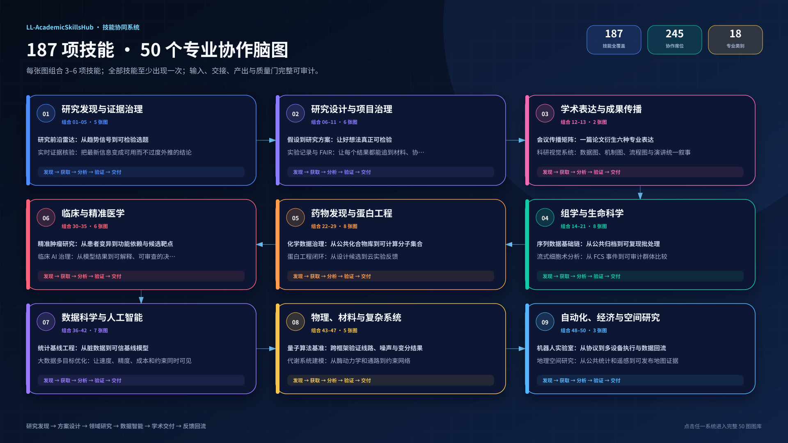
  </a>

## 怎样读一张图

1. 先看顶部的研究目标与协作模式；
2. 按编号和箭头读取技能职责；
3. 查看每个节点底部的“交接”产物；
4. 用底部的研究输入、协同增益、最终产出和质量门判断是否适合你的任务；
5. 点击 SVG 中的技能节点，可以直接进入该技能的中文详细用法。

## 九大协同系统

- [01 · 研究发现与证据治理](#chapter-01)：组合 01–05
- [02 · 研究设计与项目治理](#chapter-02)：组合 06–11
- [03 · 学术表达与成果传播](#chapter-03)：组合 12–13
- [04 · 组学与生命科学](#chapter-04)：组合 14–21
- [05 · 药物发现与蛋白工程](#chapter-05)：组合 22–29
- [06 · 临床与精准医学](#chapter-06)：组合 30–35
- [07 · 数据科学与人工智能](#chapter-07)：组合 36–42
- [08 · 物理、材料与复杂系统](#chapter-08)：组合 43–47
- [09 · 自动化、经济与空间研究](#chapter-09)：组合 48–50

## 01 · 研究发现与证据治理

<strong>01 · 研究前沿雷达：从趋势信号到可检验选题</strong>

> 把分散的新文献、引文网络和跨学科观点收束为有证据支撑的研究机会。

  <a href="../assets/brand/skill-combinations/01-frontier-radar.svg">
    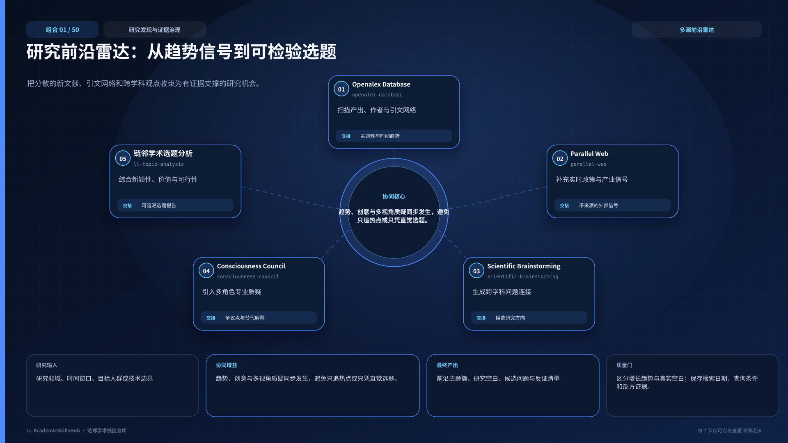
  </a>

**组合使用方式：**先由 **Openalex Database** 扫描产出、作者与引文网络，交付“主题簇与时间趋势”；再由 **Parallel Web** 补充实时政策与产业信号，交付“带来源的外部信号”；再由 **Scientific Brainstorming** 生成跨学科问题连接，交付“候选研究方向”；再由 **Consciousness Council** 引入多角色专业质疑，交付“争议点与替代解释”；最后由 **链邻学术选题分析** 综合新颖性、价值与可行性，交付“可追溯选题报告”。

**输入：**研究领域、时间窗口、目标人群或技术边界 
**产出：**前沿主题簇、研究空白、候选问题与反证清单 
**协同增益：**趋势、创意与多视角质疑同步发生，避免只追热点或只凭直觉选题。 
**质量门：**区分增长趋势与真实空白；保存检索日期、查询条件和反方证据。

**组合技能：**

- [Openalex Database](../skills/literature-management/openalex-database/locales/zh-CN.md)：扫描产出、作者与引文网络 → `主题簇与时间趋势`
- [Parallel Web](../skills/literature-management/parallel-web/locales/zh-CN.md)：补充实时政策与产业信号 → `带来源的外部信号`
- [Scientific Brainstorming](../skills/research-methods/scientific-brainstorming/locales/zh-CN.md)：生成跨学科问题连接 → `候选研究方向`
- [Consciousness Council](../skills/research-methods/consciousness-council/locales/zh-CN.md)：引入多角色专业质疑 → `争议点与替代解释`
- [链邻学术选题分析](../skills/academic-core/ll-topic-analysis/locales/zh-CN.md)：综合新颖性、价值与可行性 → `可追溯选题报告`

[打开可编辑 SVG](../assets/brand/skill-combinations/01-frontier-radar.svg) · [下载高清 PNG](../assets/brand/skill-combinations/png/01-frontier-radar.png)

<strong>02 · 可复现系统检索：从概念块到可审计文献池</strong>

> 把研究问题转化为跨数据库可复查、可去重、可筛选的检索流水线。

  <a href="../assets/brand/skill-combinations/02-reproducible-search.svg">
    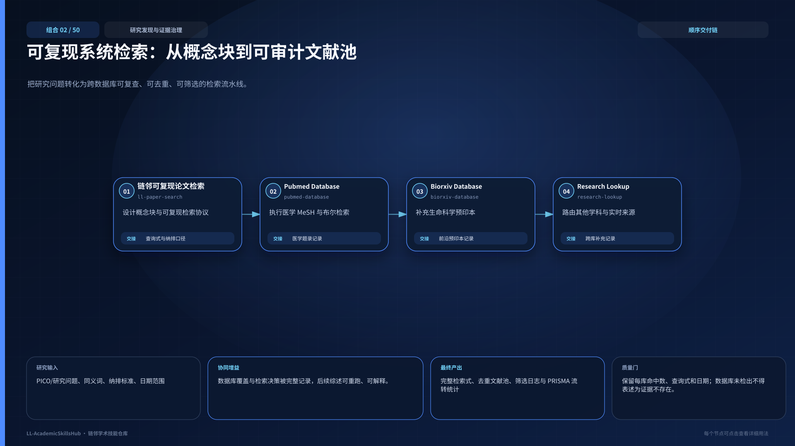
  </a>

**组合使用方式：**先由 **链邻可复现论文检索** 设计概念块与可复现检索协议，交付“查询式与纳排口径”；再由 **Pubmed Database** 执行医学 MeSH 与布尔检索，交付“医学题录记录”；再由 **Biorxiv Database** 补充生命科学预印本，交付“前沿预印本记录”；最后由 **Research Lookup** 路由其他学科与实时来源，交付“跨库补充记录”。

**输入：**PICO/研究问题、同义词、纳排标准、日期范围 
**产出：**完整检索式、去重文献池、筛选日志与 PRISMA 流转统计 
**协同增益：**数据库覆盖与检索决策被完整记录，后续综述可重跑、可解释。 
**质量门：**保留每库命中数、查询式和日期；数据库未检出不得表述为证据不存在。

**组合技能：**

- [链邻可复现论文检索](../skills/academic-core/ll-paper-search/locales/zh-CN.md)：设计概念块与可复现检索协议 → `查询式与纳排口径`
- [Pubmed Database](../skills/literature-management/pubmed-database/locales/zh-CN.md)：执行医学 MeSH 与布尔检索 → `医学题录记录`
- [Biorxiv Database](../skills/literature-management/biorxiv-database/locales/zh-CN.md)：补充生命科学预印本 → `前沿预印本记录`
- [Research Lookup](../skills/literature-management/research-lookup/locales/zh-CN.md)：路由其他学科与实时来源 → `跨库补充记录`

[打开可编辑 SVG](../assets/brand/skill-combinations/02-reproducible-search.svg) · [下载高清 PNG](../assets/brand/skill-combinations/png/02-reproducible-search.png)

<strong>03 · 合法全文精读：从论文定位到双语证据卡</strong>

> 合法获得全文，完成中英文术语对齐和可定位的证据抽取。

  <a href="../assets/brand/skill-combinations/03-fulltext-evidence-reading.svg">
    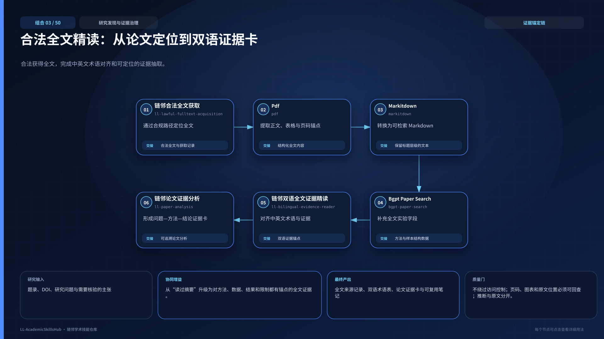
  </a>

**组合使用方式：**先由 **链邻合法全文获取** 通过合规路径定位全文，交付“合法全文与获取记录”；再由 **Pdf** 提取正文、表格与页码锚点，交付“结构化全文内容”；再由 **Markitdown** 转换为可检索 Markdown，交付“保留标题层级的文本”；再由 **Bgpt Paper Search** 补充全文实验字段，交付“方法与样本结构数据”；再由 **链邻双语全文证据精读** 对齐中英文术语与证据，交付“双语证据锚点”；最后由 **链邻论文证据分析** 形成问题—方法—结论证据卡，交付“可追溯论文分析”。

**输入：**题录、DOI、研究问题与需要核验的主张 
**产出：**全文来源记录、双语术语表、论文证据卡与可复用笔记 
**协同增益：**从“读过摘要”升级为对方法、数据、结果和限制都有锚点的全文证据。 
**质量门：**不绕过访问控制；页码、图表和原文位置必须可回查；推断与原文分开。

**组合技能：**

- [链邻合法全文获取](../skills/academic-core/ll-lawful-fulltext-acquisition/locales/zh-CN.md)：通过合规路径定位全文 → `合法全文与获取记录`
- [Pdf](../skills/document-data-tools/pdf/locales/zh-CN.md)：提取正文、表格与页码锚点 → `结构化全文内容`
- [Markitdown](../skills/document-data-tools/markitdown/locales/zh-CN.md)：转换为可检索 Markdown → `保留标题层级的文本`
- [Bgpt Paper Search](../skills/literature-management/bgpt-paper-search/locales/zh-CN.md)：补充全文实验字段 → `方法与样本结构数据`
- [链邻双语全文证据精读](../skills/academic-core/ll-bilingual-evidence-reader/locales/zh-CN.md)：对齐中英文术语与证据 → `双语证据锚点`
- [链邻论文证据分析](../skills/academic-core/ll-paper-analysis/locales/zh-CN.md)：形成问题—方法—结论证据卡 → `可追溯论文分析`

[打开可编辑 SVG](../assets/brand/skill-combinations/03-fulltext-evidence-reading.svg) · [下载高清 PNG](../assets/brand/skill-combinations/png/03-fulltext-evidence-reading.png)

<strong>04 · 综述与引用闭环：从证据综合到零断链参考文献</strong>

> 把系统检索结果组织为主题证据，并保证正文引文与参考文献逐项一致。

  <a href="../assets/brand/skill-combinations/04-review-citation-loop.svg">
    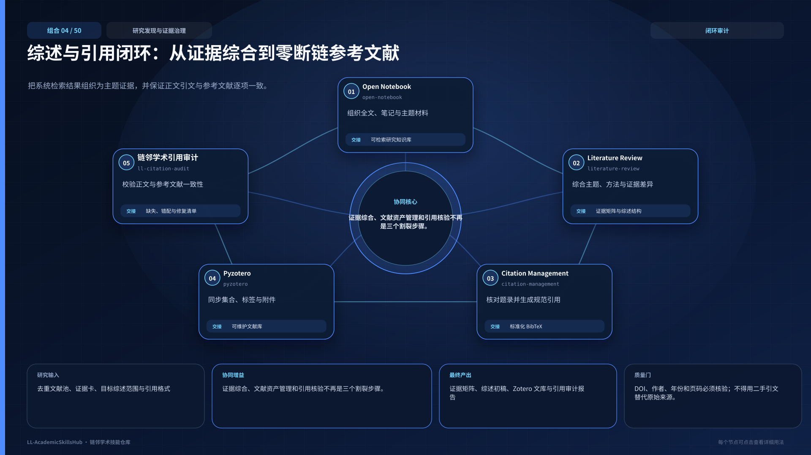
  </a>

**组合使用方式：**先由 **Open Notebook** 组织全文、笔记与主题材料，交付“可检索研究知识库”；再由 **Literature Review** 综合主题、方法与证据差异，交付“证据矩阵与综述结构”；再由 **Citation Management** 核对题录并生成规范引用，交付“标准化 BibTeX”；再由 **Pyzotero** 同步集合、标签与附件，交付“可维护文献库”；最后由 **链邻学术引用审计** 校验正文与参考文献一致性，交付“缺失、错配与修复清单”。

**输入：**去重文献池、证据卡、目标综述范围与引用格式 
**产出：**证据矩阵、综述初稿、Zotero 文库与引用审计报告 
**协同增益：**证据综合、文献资产管理和引用核验不再是三个割裂步骤。 
**质量门：**DOI、作者、年份和页码必须核验；不得用二手引文替代原始来源。

**组合技能：**

- [Open Notebook](../skills/document-data-tools/open-notebook/locales/zh-CN.md)：组织全文、笔记与主题材料 → `可检索研究知识库`
- [Literature Review](../skills/literature-management/literature-review/locales/zh-CN.md)：综合主题、方法与证据差异 → `证据矩阵与综述结构`
- [Citation Management](../skills/literature-management/citation-management/locales/zh-CN.md)：核对题录并生成规范引用 → `标准化 BibTeX`
- [Pyzotero](../skills/literature-management/pyzotero/locales/zh-CN.md)：同步集合、标签与附件 → `可维护文献库`
- [链邻学术引用审计](../skills/academic-core/ll-citation-audit/locales/zh-CN.md)：校验正文与参考文献一致性 → `缺失、错配与修复清单`

[打开可编辑 SVG](../assets/brand/skill-combinations/04-review-citation-loop.svg) · [下载高清 PNG](../assets/brand/skill-combinations/png/04-review-citation-loop.png)

<strong>05 · 实时证据核验：把最新信息变成可用而不过度外推的结论</strong>

> 对快速变化的科研信息进行实时查找、交叉核验和情景压力测试。

  <a href="../assets/brand/skill-combinations/05-live-evidence-verification.svg">
    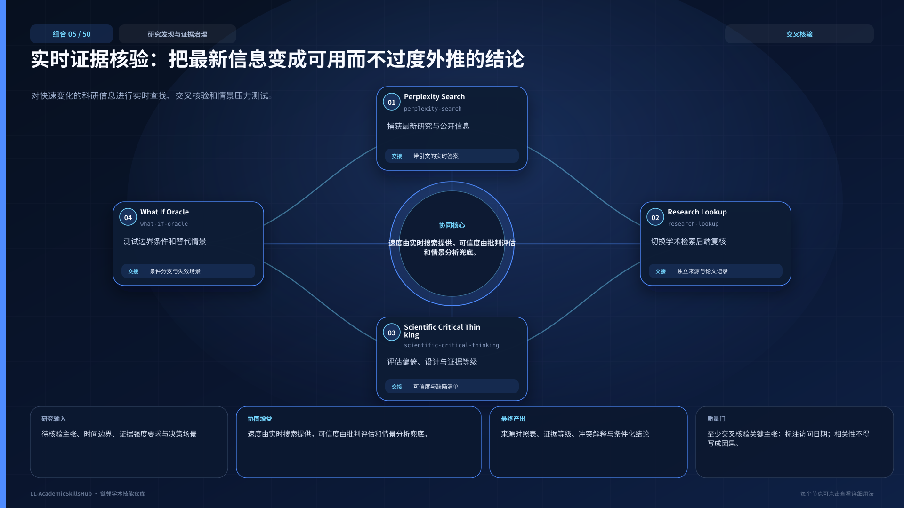
  </a>

**组合使用方式：**先由 **Perplexity Search** 捕获最新研究与公开信息，交付“带引文的实时答案”；再由 **Research Lookup** 切换学术检索后端复核，交付“独立来源与论文记录”；再由 **Scientific Critical Thinking** 评估偏倚、设计与证据等级，交付“可信度与缺陷清单”；最后由 **What If Oracle** 测试边界条件和替代情景，交付“条件分支与失效场景”。

**输入：**待核验主张、时间边界、证据强度要求与决策场景 
**产出：**来源对照表、证据等级、冲突解释与条件化结论 
**协同增益：**速度由实时搜索提供，可信度由批判评估和情景分析兜底。 
**质量门：**至少交叉核验关键主张；标注访问日期；相关性不得写成因果。

**组合技能：**

- [Perplexity Search](../skills/literature-management/perplexity-search/locales/zh-CN.md)：捕获最新研究与公开信息 → `带引文的实时答案`
- [Research Lookup](../skills/literature-management/research-lookup/locales/zh-CN.md)：切换学术检索后端复核 → `独立来源与论文记录`
- [Scientific Critical Thinking](../skills/research-methods/scientific-critical-thinking/locales/zh-CN.md)：评估偏倚、设计与证据等级 → `可信度与缺陷清单`
- [What If Oracle](../skills/research-methods/what-if-oracle/locales/zh-CN.md)：测试边界条件和替代情景 → `条件分支与失效场景`

[打开可编辑 SVG](../assets/brand/skill-combinations/05-live-evidence-verification.svg) · [下载高清 PNG](../assets/brand/skill-combinations/png/05-live-evidence-verification.png)

## 02 · 研究设计与项目治理

<strong>06 · 假设到研究方案：让好想法真正可检验</strong>

> 把观察或创意转化为机制假设、可证伪预测、分析计划和正式方案。

  <a href="../assets/brand/skill-combinations/06-hypothesis-to-study-plan.svg">
    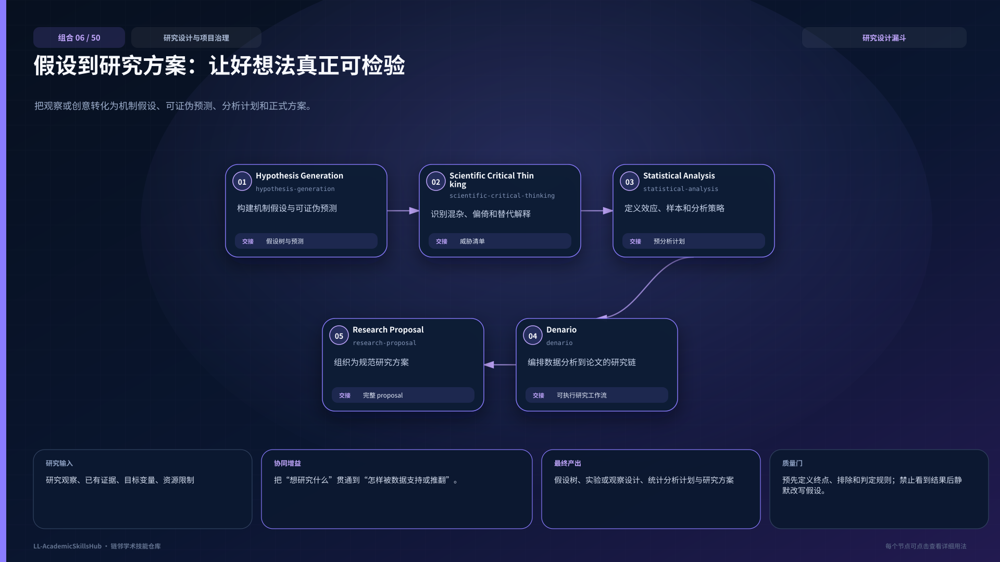
  </a>

**组合使用方式：**先由 **Hypothesis Generation** 构建机制假设与可证伪预测，交付“假设树与预测”；再由 **Scientific Critical Thinking** 识别混杂、偏倚和替代解释，交付“威胁清单”；再由 **Statistical Analysis** 定义效应、样本和分析策略，交付“预分析计划”；再由 **Denario** 编排数据分析到论文的研究链，交付“可执行研究工作流”；最后由 **Research Proposal** 组织为规范研究方案，交付“完整 proposal”。

**输入：**研究观察、已有证据、目标变量、资源限制 
**产出：**假设树、实验或观察设计、统计分析计划与研究方案 
**协同增益：**把“想研究什么”贯通到“怎样被数据支持或推翻”。 
**质量门：**预先定义终点、排除和判定规则；禁止看到结果后静默改写假设。

**组合技能：**

- [Hypothesis Generation](../skills/research-methods/hypothesis-generation/locales/zh-CN.md)：构建机制假设与可证伪预测 → `假设树与预测`
- [Scientific Critical Thinking](../skills/research-methods/scientific-critical-thinking/locales/zh-CN.md)：识别混杂、偏倚和替代解释 → `威胁清单`
- [Statistical Analysis](../skills/data-analysis-statistics/statistical-analysis/locales/zh-CN.md)：定义效应、样本和分析策略 → `预分析计划`
- [Denario](../skills/document-data-tools/denario/locales/zh-CN.md)：编排数据分析到论文的研究链 → `可执行研究工作流`
- [Research Proposal](../skills/scientific-communication/research-proposal/locales/zh-CN.md)：组织为规范研究方案 → `完整 proposal`

[打开可编辑 SVG](../assets/brand/skill-combinations/06-hypothesis-to-study-plan.svg) · [下载高清 PNG](../assets/brand/skill-combinations/png/06-hypothesis-to-study-plan.png)

<strong>07 · 国家自然科学基金：证据、创新链与评审逻辑协同</strong>

> 把科学问题、前期基础、技术路线和申请规范整合为可审查的 NSFC 申请。

  <a href="../assets/brand/skill-combinations/07-nsfc-proposal-engine.svg">
    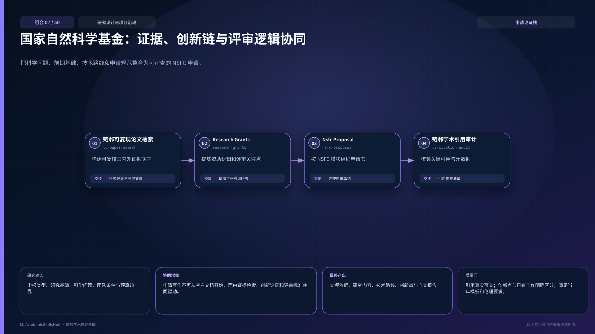
  </a>

**组合使用方式：**先由 **链邻可复现论文检索** 构建可复核国内外证据底座，交付“检索记录与关键文献”；再由 **Research Grants** 提炼资助逻辑和评审关注点，交付“价值主张与风险表”；再由 **Nsfc Proposal** 按 NSFC 模块组织申请书，交付“完整申请草稿”；最后由 **链邻学术引用审计** 核验关键引用与元数据，交付“引用修复清单”。

**输入：**申报类型、研究基础、科学问题、团队条件与预算边界 
**产出：**立项依据、研究内容、技术路线、创新点与自查报告 
**协同增益：**申请写作不再从空白文档开始，而由证据检索、创新论证和评审标准共同驱动。 
**质量门：**引用真实可查；创新点与已有工作明确区分；满足当年模板和伦理要求。

**组合技能：**

- [链邻可复现论文检索](../skills/academic-core/ll-paper-search/locales/zh-CN.md)：构建可复核国内外证据底座 → `检索记录与关键文献`
- [Research Grants](../skills/research-methods/research-grants/locales/zh-CN.md)：提炼资助逻辑和评审关注点 → `价值主张与风险表`
- [Nsfc Proposal](../skills/research-methods/nsfc-proposal/locales/zh-CN.md)：按 NSFC 模块组织申请书 → `完整申请草稿`
- [链邻学术引用审计](../skills/academic-core/ll-citation-audit/locales/zh-CN.md)：核验关键引用与元数据 → `引用修复清单`

[打开可编辑 SVG](../assets/brand/skill-combinations/07-nsfc-proposal-engine.svg) · [下载高清 PNG](../assets/brand/skill-combinations/png/07-nsfc-proposal-engine.png)

<strong>08 · 国家社科基金：从社会事实到理论问题与规范活页</strong>

> 连接公共统计、文本认知模式和社科文献，形成理论清楚、材料可靠的 NSSFC 方案。

  <a href="../assets/brand/skill-combinations/08-nssfc-humanities-engine.svg">
    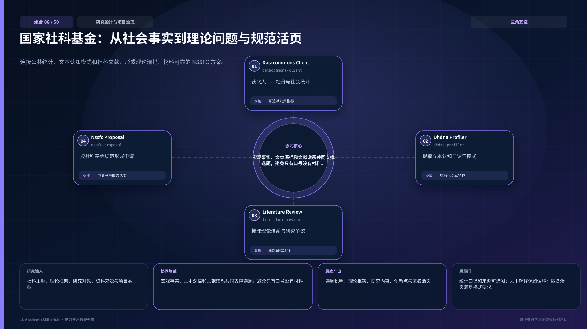
  </a>

**组合使用方式：**先由 **Datacommons Client** 获取人口、经济与社会统计，交付“可追溯公共指标”；再由 **Dhdna Profiler** 提取文本认知与论证模式，交付“结构化文本特征”；再由 **Literature Review** 梳理理论谱系与研究争议，交付“主题证据矩阵”；最后由 **Nssfc Proposal** 按社科基金规范形成申请，交付“申请书与匿名活页”。

**输入：**社科主题、理论框架、研究对象、资料来源与项目类型 
**产出：**选题说明、理论框架、研究内容、创新点与匿名活页 
**协同增益：**宏观事实、文本深描和文献谱系共同支撑选题，避免只有口号没有材料。 
**质量门：**统计口径和来源可追溯；文本解释保留语境；匿名活页满足格式要求。

**组合技能：**

- [Datacommons Client](../skills/scientific-databases/datacommons-client/locales/zh-CN.md)：获取人口、经济与社会统计 → `可追溯公共指标`
- [Dhdna Profiler](../skills/research-methods/dhdna-profiler/locales/zh-CN.md)：提取文本认知与论证模式 → `结构化文本特征`
- [Literature Review](../skills/literature-management/literature-review/locales/zh-CN.md)：梳理理论谱系与研究争议 → `主题证据矩阵`
- [Nssfc Proposal](../skills/research-methods/nssfc-proposal/locales/zh-CN.md)：按社科基金规范形成申请 → `申请书与匿名活页`

[打开可编辑 SVG](../assets/brand/skill-combinations/08-nssfc-humanities-engine.svg) · [下载高清 PNG](../assets/brand/skill-combinations/png/08-nssfc-humanities-engine.png)

<strong>09 · 科研成果到专利：从技术特征到可防守权利边界</strong>

> 把论文或实验成果拆解为技术特征，检索现有技术并评估转化路径。

  <a href="../assets/brand/skill-combinations/09-research-to-patent.svg">
    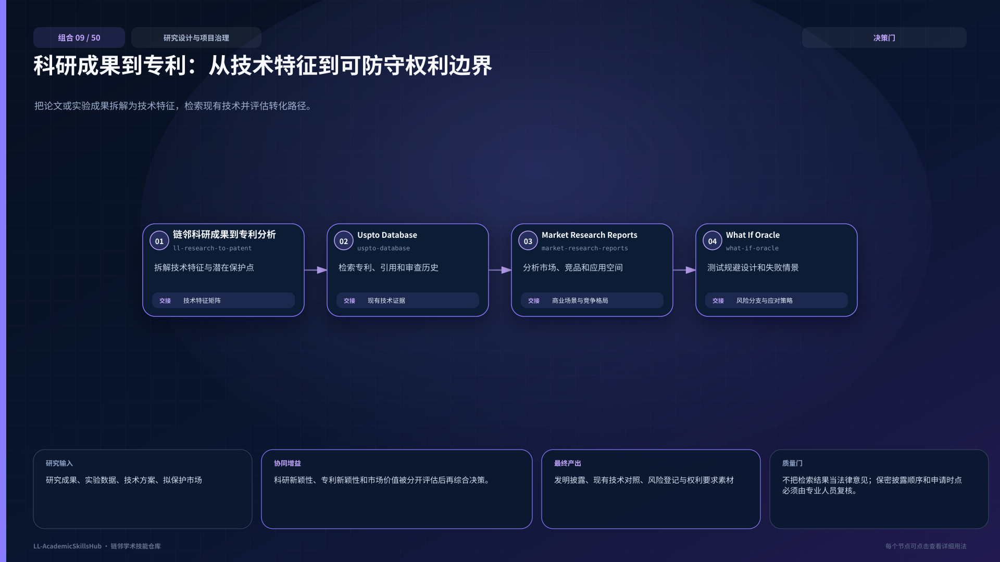
  </a>

**组合使用方式：**先由 **链邻科研成果到专利分析** 拆解技术特征与潜在保护点，交付“技术特征矩阵”；再由 **Uspto Database** 检索专利、引用和审查历史，交付“现有技术证据”；再由 **Market Research Reports** 分析市场、竞品和应用空间，交付“商业场景与竞争格局”；最后由 **What If Oracle** 测试规避设计和失败情景，交付“风险分支与应对策略”。

**输入：**研究成果、实验数据、技术方案、拟保护市场 
**产出：**发明披露、现有技术对照、风险登记与权利要求素材 
**协同增益：**科研新颖性、专利新颖性和市场价值被分开评估后再综合决策。 
**质量门：**不把检索结果当法律意见；保密披露顺序和申请时点必须由专业人员复核。

**组合技能：**

- [链邻科研成果到专利分析](../skills/academic-core/ll-research-to-patent/locales/zh-CN.md)：拆解技术特征与潜在保护点 → `技术特征矩阵`
- [Uspto Database](../skills/scientific-databases/uspto-database/locales/zh-CN.md)：检索专利、引用和审查历史 → `现有技术证据`
- [Market Research Reports](../skills/finance-economics/market-research-reports/locales/zh-CN.md)：分析市场、竞品和应用空间 → `商业场景与竞争格局`
- [What If Oracle](../skills/research-methods/what-if-oracle/locales/zh-CN.md)：测试规避设计和失败情景 → `风险分支与应对策略`

[打开可编辑 SVG](../assets/brand/skill-combinations/09-research-to-patent.svg) · [下载高清 PNG](../assets/brand/skill-combinations/png/09-research-to-patent.png)

<strong>10 · 投稿质量闭环：从证据写作到模拟审稿与格式落地</strong>

> 让论文在逻辑、语言、证据、评审和投稿格式五个层面连续过关。

  <a href="../assets/brand/skill-combinations/10-manuscript-quality-loop.svg">
    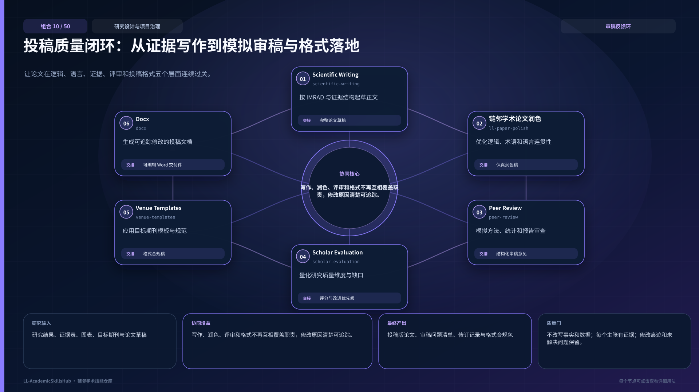
  </a>

**组合使用方式：**先由 **Scientific Writing** 按 IMRAD 与证据结构起草正文，交付“完整论文草稿”；再由 **链邻学术论文润色** 优化逻辑、术语和语言连贯性，交付“保真润色稿”；再由 **Peer Review** 模拟方法、统计和报告审查，交付“结构化审稿意见”；再由 **Scholar Evaluation** 量化研究质量维度与缺口，交付“评分与改进优先级”；再由 **Venue Templates** 应用目标期刊模板与规范，交付“格式合规稿”；最后由 **Docx** 生成可追踪修改的投稿文档，交付“可编辑 Word 交付件”。

**输入：**研究结果、证据表、图表、目标期刊与论文草稿 
**产出：**投稿版论文、审稿问题清单、修订记录与格式合规包 
**协同增益：**写作、润色、评审和格式不再互相覆盖职责，修改原因清楚可追踪。 
**质量门：**不改写事实和数据；每个主张有证据；修改痕迹和未解决问题保留。

**组合技能：**

- [Scientific Writing](../skills/scientific-communication/scientific-writing/locales/zh-CN.md)：按 IMRAD 与证据结构起草正文 → `完整论文草稿`
- [链邻学术论文润色](../skills/academic-core/ll-paper-polish/locales/zh-CN.md)：优化逻辑、术语和语言连贯性 → `保真润色稿`
- [Peer Review](../skills/scientific-communication/peer-review/locales/zh-CN.md)：模拟方法、统计和报告审查 → `结构化审稿意见`
- [Scholar Evaluation](../skills/research-methods/scholar-evaluation/locales/zh-CN.md)：量化研究质量维度与缺口 → `评分与改进优先级`
- [Venue Templates](../skills/scientific-communication/venue-templates/locales/zh-CN.md)：应用目标期刊模板与规范 → `格式合规稿`
- [Docx](../skills/document-data-tools/docx/locales/zh-CN.md)：生成可追踪修改的投稿文档 → `可编辑 Word 交付件`

[打开可编辑 SVG](../assets/brand/skill-combinations/10-manuscript-quality-loop.svg) · [下载高清 PNG](../assets/brand/skill-combinations/png/10-manuscript-quality-loop.png)

<strong>11 · 实验记录与 FAIR：让每个结果都能追到材料、协议和原始数据</strong>

> 把实验目标、材料批次、协议偏差、原始数据和数据可用性连成审计链。

  <a href="../assets/brand/skill-combinations/11-fair-experiment-record.svg">
    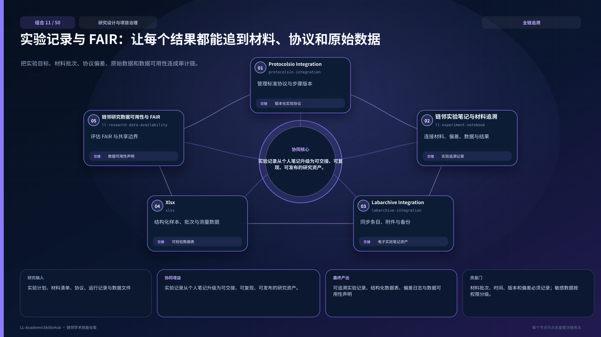
  </a>

**组合使用方式：**先由 **Protocolsio Integration** 管理标准协议与步骤版本，交付“版本化实验协议”；再由 **链邻实验笔记与材料追溯** 连接材料、偏差、数据与结果，交付“实验追溯记录”；再由 **Labarchive Integration** 同步条目、附件与备份，交付“电子实验笔记资产”；再由 **Xlsx** 结构化样本、批次与测量数据，交付“可校验数据表”；最后由 **链邻研究数据可用性与 FAIR** 评估 FAIR 与共享边界，交付“数据可用性声明”。

**输入：**实验计划、材料清单、协议、运行记录与数据文件 
**产出：**可追溯实验记录、结构化数据表、偏差日志与数据可用性声明 
**协同增益：**实验记录从个人笔记升级为可交接、可复现、可发布的研究资产。 
**质量门：**材料批次、时间、版本和偏差必须记录；敏感数据按权限分级。

**组合技能：**

- [Protocolsio Integration](../skills/lab-automation/protocolsio-integration/locales/zh-CN.md)：管理标准协议与步骤版本 → `版本化实验协议`
- [链邻实验笔记与材料追溯](../skills/academic-core/ll-experiment-notebook/locales/zh-CN.md)：连接材料、偏差、数据与结果 → `实验追溯记录`
- [Labarchive Integration](../skills/lab-automation/labarchive-integration/locales/zh-CN.md)：同步条目、附件与备份 → `电子实验笔记资产`
- [Xlsx](../skills/document-data-tools/xlsx/locales/zh-CN.md)：结构化样本、批次与测量数据 → `可校验数据表`
- [链邻研究数据可用性与 FAIR](../skills/academic-core/ll-research-data-availability/locales/zh-CN.md)：评估 FAIR 与共享边界 → `数据可用性声明`

[打开可编辑 SVG](../assets/brand/skill-combinations/11-fair-experiment-record.svg) · [下载高清 PNG](../assets/brand/skill-combinations/png/11-fair-experiment-record.png)

## 03 · 学术表达与成果传播

<strong>12 · 会议传播矩阵：一篇论文衍生六种专业表达</strong>

> 把论文核心结论转化为演讲、海报、幻灯片和在线传播材料。

  <a href="../assets/brand/skill-combinations/12-conference-dissemination.svg">
    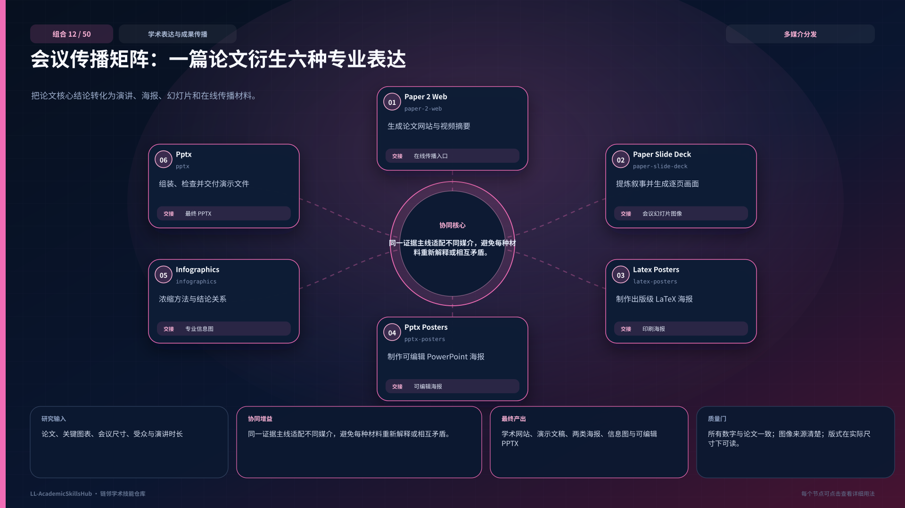
  </a>

**组合使用方式：**先由 **Paper 2 Web** 生成论文网站与视频摘要，交付“在线传播入口”；再由 **Paper Slide Deck** 提炼叙事并生成逐页画面，交付“会议幻灯片图像”；再由 **Latex Posters** 制作出版级 LaTeX 海报，交付“印刷海报”；再由 **Pptx Posters** 制作可编辑 PowerPoint 海报，交付“可编辑海报”；再由 **Infographics** 浓缩方法与结论关系，交付“专业信息图”；最后由 **Pptx** 组装、检查并交付演示文件，交付“最终 PPTX”。

**输入：**论文、关键图表、会议尺寸、受众与演讲时长 
**产出：**学术网站、演示文稿、两类海报、信息图与可编辑 PPTX 
**协同增益：**同一证据主线适配不同媒介，避免每种材料重新解释或相互矛盾。 
**质量门：**所有数字与论文一致；图像来源清楚；版式在实际尺寸下可读。

**组合技能：**

- [Paper 2 Web](../skills/scientific-communication/paper-2-web/locales/zh-CN.md)：生成论文网站与视频摘要 → `在线传播入口`
- [Paper Slide Deck](../skills/presentation-visualization/paper-slide-deck/locales/zh-CN.md)：提炼叙事并生成逐页画面 → `会议幻灯片图像`
- [Latex Posters](../skills/presentation-visualization/latex-posters/locales/zh-CN.md)：制作出版级 LaTeX 海报 → `印刷海报`
- [Pptx Posters](../skills/presentation-visualization/pptx-posters/locales/zh-CN.md)：制作可编辑 PowerPoint 海报 → `可编辑海报`
- [Infographics](../skills/presentation-visualization/infographics/locales/zh-CN.md)：浓缩方法与结论关系 → `专业信息图`
- [Pptx](../skills/document-data-tools/pptx/locales/zh-CN.md)：组装、检查并交付演示文件 → `最终 PPTX`

[打开可编辑 SVG](../assets/brand/skill-combinations/12-conference-dissemination.svg) · [下载高清 PNG](../assets/brand/skill-combinations/png/12-conference-dissemination.png)

<strong>13 · 科研视觉系统：数据图、机制图、流程图与演讲统一叙事</strong>

> 根据证据类型选择正确视觉媒介，并保持论文、答辩和传播版本一致。

  <a href="../assets/brand/skill-combinations/13-scientific-visual-system.svg">
    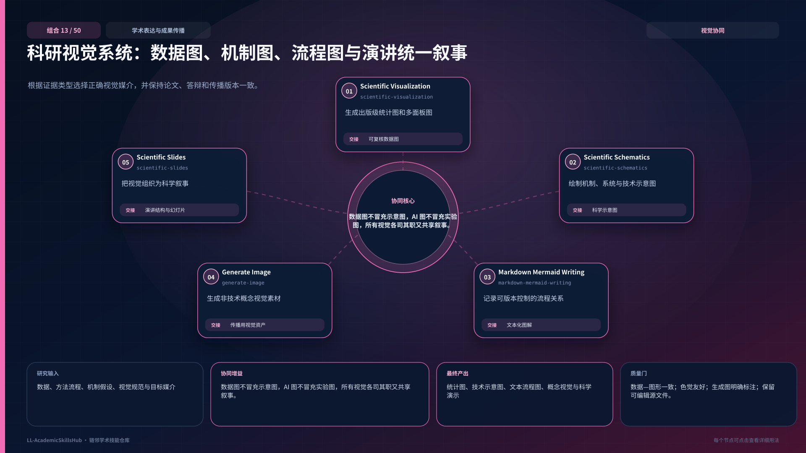
  </a>

**组合使用方式：**先由 **Scientific Visualization** 生成出版级统计图和多面板图，交付“可复核数据图”；再由 **Scientific Schematics** 绘制机制、系统与技术示意图，交付“科学示意图”；再由 **Markdown Mermaid Writing** 记录可版本控制的流程关系，交付“文本化图解”；再由 **Generate Image** 生成非技术概念视觉素材，交付“传播用视觉资产”；最后由 **Scientific Slides** 把视觉组织为科学叙事，交付“演讲结构与幻灯片”。

**输入：**数据、方法流程、机制假设、视觉规范与目标媒介 
**产出：**统计图、技术示意图、文本流程图、概念视觉与科学演示 
**协同增益：**数据图不冒充示意图，AI 图不冒充实验图，所有视觉各司其职又共享叙事。 
**质量门：**数据—图形一致；色觉友好；生成图明确标注；保留可编辑源文件。

**组合技能：**

- [Scientific Visualization](../skills/presentation-visualization/scientific-visualization/locales/zh-CN.md)：生成出版级统计图和多面板图 → `可复核数据图`
- [Scientific Schematics](../skills/presentation-visualization/scientific-schematics/locales/zh-CN.md)：绘制机制、系统与技术示意图 → `科学示意图`
- [Markdown Mermaid Writing](../skills/presentation-visualization/markdown-mermaid-writing/locales/zh-CN.md)：记录可版本控制的流程关系 → `文本化图解`
- [Generate Image](../skills/presentation-visualization/generate-image/locales/zh-CN.md)：生成非技术概念视觉素材 → `传播用视觉资产`
- [Scientific Slides](../skills/presentation-visualization/scientific-slides/locales/zh-CN.md)：把视觉组织为科学叙事 → `演讲结构与幻灯片`

[打开可编辑 SVG](../assets/brand/skill-combinations/13-scientific-visual-system.svg) · [下载高清 PNG](../assets/brand/skill-combinations/png/13-scientific-visual-system.png)

## 04 · 组学与生命科学

<strong>14 · 序列数据基础链：从公共归档到可复现批处理</strong>

> 可靠获取 DNA/RNA 数据，解析格式、核对标识并形成批量分析输入。

  <a href="../assets/brand/skill-combinations/14-sequence-data-foundation.svg">
    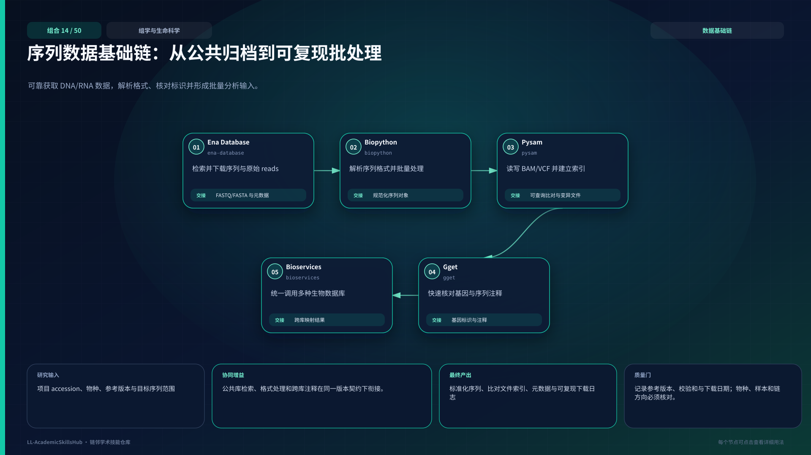
  </a>

**组合使用方式：**先由 **Ena Database** 检索并下载序列与原始 reads，交付“FASTQ/FASTA 与元数据”；再由 **Biopython** 解析序列格式并批量处理，交付“规范化序列对象”；再由 **Pysam** 读写 BAM/VCF 并建立索引，交付“可查询比对与变异文件”；再由 **Gget** 快速核对基因与序列注释，交付“基因标识与注释”；最后由 **Bioservices** 统一调用多种生物数据库，交付“跨库映射结果”。

**输入：**项目 accession、物种、参考版本与目标序列范围 
**产出：**标准化序列、比对文件索引、元数据与可复现下载日志 
**协同增益：**公共库检索、格式处理和跨库注释在同一版本契约下衔接。 
**质量门：**记录参考版本、校验和与下载日期；物种、样本和链方向必须核对。

**组合技能：**

- [Ena Database](../skills/scientific-databases/ena-database/locales/zh-CN.md)：检索并下载序列与原始 reads → `FASTQ/FASTA 与元数据`
- [Biopython](../skills/bioinformatics-genomics/biopython/locales/zh-CN.md)：解析序列格式并批量处理 → `规范化序列对象`
- [Pysam](../skills/bioinformatics-genomics/pysam/locales/zh-CN.md)：读写 BAM/VCF 并建立索引 → `可查询比对与变异文件`
- [Gget](../skills/bioinformatics-genomics/gget/locales/zh-CN.md)：快速核对基因与序列注释 → `基因标识与注释`
- [Bioservices](../skills/bioinformatics-genomics/bioservices/locales/zh-CN.md)：统一调用多种生物数据库 → `跨库映射结果`

[打开可编辑 SVG](../assets/brand/skill-combinations/14-sequence-data-foundation.svg) · [下载高清 PNG](../assets/brand/skill-combinations/png/14-sequence-data-foundation.png)

<strong>15 · 单细胞图谱：从参考细胞库到批次校正与细胞状态</strong>

> 把公共参考图谱和自有单细胞数据统一到可解释的细胞状态空间。

  <a href="../assets/brand/skill-combinations/15-single-cell-atlas.svg">
    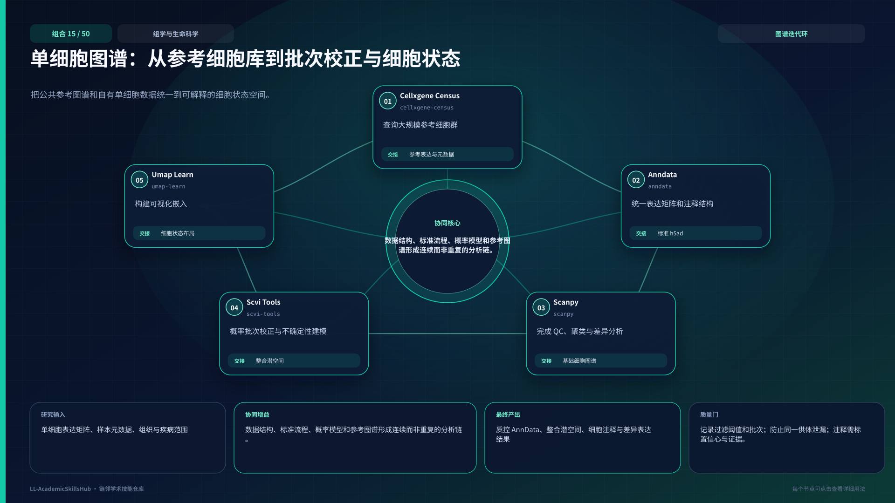
  </a>

**组合使用方式：**先由 **Cellxgene Census** 查询大规模参考细胞群，交付“参考表达与元数据”；再由 **Anndata** 统一表达矩阵和注释结构，交付“标准 h5ad”；再由 **Scanpy** 完成 QC、聚类与差异分析，交付“基础细胞图谱”；再由 **Scvi Tools** 概率批次校正与不确定性建模，交付“整合潜空间”；最后由 **Umap Learn** 构建可视化嵌入，交付“细胞状态布局”。

**输入：**单细胞表达矩阵、样本元数据、组织与疾病范围 
**产出：**质控 AnnData、整合潜空间、细胞注释与差异表达结果 
**协同增益：**数据结构、标准流程、概率模型和参考图谱形成连续而非重复的分析链。 
**质量门：**记录过滤阈值和批次；防止同一供体泄漏；注释需标置信心与证据。

**组合技能：**

- [Cellxgene Census](../skills/bioinformatics-genomics/cellxgene-census/locales/zh-CN.md)：查询大规模参考细胞群 → `参考表达与元数据`
- [Anndata](../skills/bioinformatics-genomics/anndata/locales/zh-CN.md)：统一表达矩阵和注释结构 → `标准 h5ad`
- [Scanpy](../skills/bioinformatics-genomics/scanpy/locales/zh-CN.md)：完成 QC、聚类与差异分析 → `基础细胞图谱`
- [Scvi Tools](../skills/bioinformatics-genomics/scvi-tools/locales/zh-CN.md)：概率批次校正与不确定性建模 → `整合潜空间`
- [Umap Learn](../skills/machine-learning-ai/umap-learn/locales/zh-CN.md)：构建可视化嵌入 → `细胞状态布局`

[打开可编辑 SVG](../assets/brand/skill-combinations/15-single-cell-atlas.svg) · [下载高清 PNG](../assets/brand/skill-combinations/png/15-single-cell-atlas.png)

<strong>16 · 表达调控动力学：从公共转录组到基因调控网络</strong>

> 连接差异表达、单细胞速度和调控网络，解释细胞状态如何变化。

  <a href="../assets/brand/skill-combinations/16-transcriptome-dynamics.svg">
    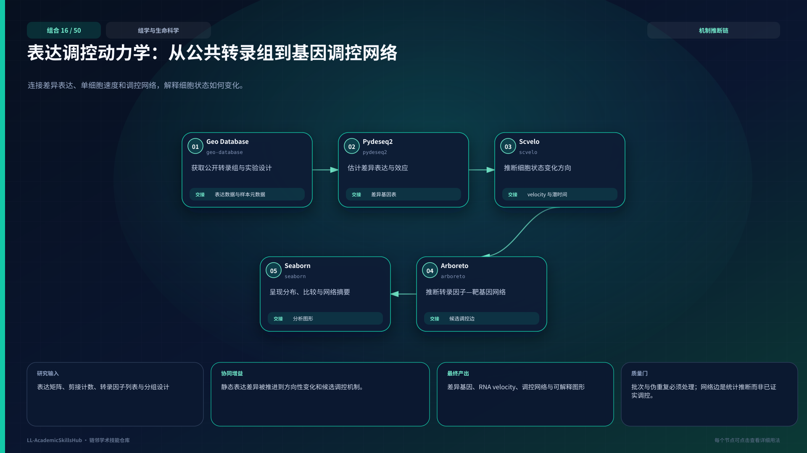
  </a>

**组合使用方式：**先由 **Geo Database** 获取公开转录组与实验设计，交付“表达数据与样本元数据”；再由 **Pydeseq2** 估计差异表达与效应，交付“差异基因表”；再由 **Scvelo** 推断细胞状态变化方向，交付“velocity 与潜时间”；再由 **Arboreto** 推断转录因子—靶基因网络，交付“候选调控边”；最后由 **Seaborn** 呈现分布、比较与网络摘要，交付“分析图形”。

**输入：**表达矩阵、剪接计数、转录因子列表与分组设计 
**产出：**差异基因、RNA velocity、调控网络与可解释图形 
**协同增益：**静态表达差异被推进到方向性变化和候选调控机制。 
**质量门：**批次与伪重复必须处理；网络边是统计推断而非已证实调控。

**组合技能：**

- [Geo Database](../skills/scientific-databases/geo-database/locales/zh-CN.md)：获取公开转录组与实验设计 → `表达数据与样本元数据`
- [Pydeseq2](../skills/bioinformatics-genomics/pydeseq2/locales/zh-CN.md)：估计差异表达与效应 → `差异基因表`
- [Scvelo](../skills/bioinformatics-genomics/scvelo/locales/zh-CN.md)：推断细胞状态变化方向 → `velocity 与潜时间`
- [Arboreto](../skills/bioinformatics-genomics/arboreto/locales/zh-CN.md)：推断转录因子—靶基因网络 → `候选调控边`
- [Seaborn](../skills/data-analysis-statistics/seaborn/locales/zh-CN.md)：呈现分布、比较与网络摘要 → `分析图形`

[打开可编辑 SVG](../assets/brand/skill-combinations/16-transcriptome-dynamics.svg) · [下载高清 PNG](../assets/brand/skill-combinations/png/16-transcriptome-dynamics.png)

<strong>17 · 表观基因组区间学习：从峰图谱到调控元件表征</strong>

> 对 ATAC/ChIP 区间进行质量控制、统一表示和机器学习嵌入。

  <a href="../assets/brand/skill-combinations/17-epigenomic-interval-ml.svg">
    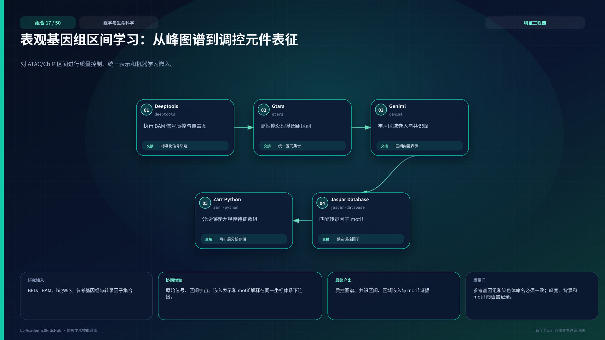
  </a>

**组合使用方式：**先由 **Deeptools** 执行 BAM 信号质控与覆盖图，交付“标准化信号轨迹”；再由 **Gtars** 高性能处理基因组区间，交付“统一区间集合”；再由 **Geniml** 学习区域嵌入与共识峰，交付“区间向量表示”；再由 **Jaspar Database** 匹配转录因子 motif，交付“候选调控因子”；最后由 **Zarr Python** 分块保存大规模特征数组，交付“可扩展分析存储”。

**输入：**BED、BAM、bigWig、参考基因组与转录因子集合 
**产出：**质控图谱、共识区间、区域嵌入与 motif 证据 
**协同增益：**原始信号、区间宇宙、嵌入表示和 motif 解释在同一坐标体系下连接。 
**质量门：**参考基因组和染色体命名必须一致；峰宽、背景和 motif 阈值需记录。

**组合技能：**

- [Deeptools](../skills/bioinformatics-genomics/deeptools/locales/zh-CN.md)：执行 BAM 信号质控与覆盖图 → `标准化信号轨迹`
- [Gtars](../skills/bioinformatics-genomics/gtars/locales/zh-CN.md)：高性能处理基因组区间 → `统一区间集合`
- [Geniml](../skills/bioinformatics-genomics/geniml/locales/zh-CN.md)：学习区域嵌入与共识峰 → `区间向量表示`
- [Jaspar Database](../skills/scientific-databases/jaspar-database/locales/zh-CN.md)：匹配转录因子 motif → `候选调控因子`
- [Zarr Python](../skills/bioinformatics-genomics/zarr-python/locales/zh-CN.md)：分块保存大规模特征数组 → `可扩展分析存储`

[打开可编辑 SVG](../assets/brand/skill-combinations/17-epigenomic-interval-ml.svg) · [下载高清 PNG](../assets/brand/skill-combinations/png/17-epigenomic-interval-ml.png)

<strong>18 · 系统发育基因组学：从基因标识到可解释演化树</strong>

> 将可靠序列、分类信息和距离模型整合为可复核的演化关系。

  <a href="../assets/brand/skill-combinations/18-phylogenomics.svg">
    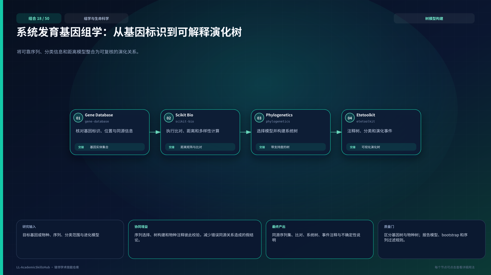
  </a>

**组合使用方式：**先由 **Gene Database** 核对基因标识、位置与同源信息，交付“基因实体集合”；再由 **Scikit Bio** 执行比对、距离和多样性计算，交付“距离矩阵与比对”；再由 **Phylogenetics** 选择模型并构建系统树，交付“带支持度的树”；最后由 **Etetoolkit** 注释树、分类和演化事件，交付“可视化演化树”。

**输入：**目标基因或物种、序列、分类范围与进化模型 
**产出：**同源序列集、比对、系统树、事件注释与不确定性说明 
**协同增益：**序列选择、树构建和物种注释彼此校验，减少错误同源关系造成的假结论。 
**质量门：**区分基因树与物种树；报告模型、bootstrap 和序列过滤规则。

**组合技能：**

- [Gene Database](../skills/scientific-databases/gene-database/locales/zh-CN.md)：核对基因标识、位置与同源信息 → `基因实体集合`
- [Scikit Bio](../skills/bioinformatics-genomics/scikit-bio/locales/zh-CN.md)：执行比对、距离和多样性计算 → `距离矩阵与比对`
- [Phylogenetics](../skills/bioinformatics-genomics/phylogenetics/locales/zh-CN.md)：选择模型并构建系统树 → `带支持度的树`
- [Etetoolkit](../skills/bioinformatics-genomics/etetoolkit/locales/zh-CN.md)：注释树、分类和演化事件 → `可视化演化树`

[打开可编辑 SVG](../assets/brand/skill-combinations/18-phylogenomics.svg) · [下载高清 PNG](../assets/brand/skill-combinations/png/18-phylogenomics.png)

<strong>19 · 群体变异解释：从大规模 VCF 到组织机制和临床证据</strong>

> 在群体频率、基因组注释、组织表达和 GWAS 证据之间解释候选变异。

  <a href="../assets/brand/skill-combinations/19-population-variant-interpretation.svg">
    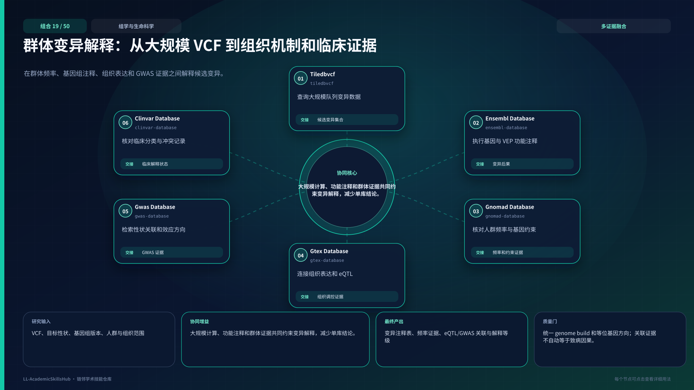
  </a>

**组合使用方式：**先由 **Tiledbvcf** 查询大规模队列变异数据，交付“候选变异集合”；再由 **Ensembl Database** 执行基因与 VEP 功能注释，交付“变异后果”；再由 **Gnomad Database** 核对人群频率与基因约束，交付“频率和约束证据”；再由 **Gtex Database** 连接组织表达和 eQTL，交付“组织调控证据”；再由 **Gwas Database** 检索性状关联和效应方向，交付“GWAS 证据”；最后由 **Clinvar Database** 核对临床分类与冲突记录，交付“临床解释状态”。

**输入：**VCF、目标性状、基因组版本、人群与组织范围 
**产出：**变异注释表、频率证据、eQTL/GWAS 关联与解释等级 
**协同增益：**大规模计算、功能注释和群体证据共同约束变异解释，减少单库结论。 
**质量门：**统一 genome build 和等位基因方向；关联证据不自动等于致病因果。

**组合技能：**

- [Tiledbvcf](../skills/bioinformatics-genomics/tiledbvcf/locales/zh-CN.md)：查询大规模队列变异数据 → `候选变异集合`
- [Ensembl Database](../skills/scientific-databases/ensembl-database/locales/zh-CN.md)：执行基因与 VEP 功能注释 → `变异后果`
- [Gnomad Database](../skills/scientific-databases/gnomad-database/locales/zh-CN.md)：核对人群频率与基因约束 → `频率和约束证据`
- [Gtex Database](../skills/scientific-databases/gtex-database/locales/zh-CN.md)：连接组织表达和 eQTL → `组织调控证据`
- [Gwas Database](../skills/scientific-databases/gwas-database/locales/zh-CN.md)：检索性状关联和效应方向 → `GWAS 证据`
- [Clinvar Database](../skills/clinical-precision-medicine/clinvar-database/locales/zh-CN.md)：核对临床分类与冲突记录 → `临床解释状态`

[打开可编辑 SVG](../assets/brand/skill-combinations/19-population-variant-interpretation.svg) · [下载高清 PNG](../assets/brand/skill-combinations/png/19-population-variant-interpretation.png)

<strong>20 · 组学云计算平台：从数据资产到可扩展工作流</strong>

> 管理大规模组学数据、固定数据谱系并按资源需求在云端执行。

  <a href="../assets/brand/skill-combinations/20-omics-cloud-platform.svg">
    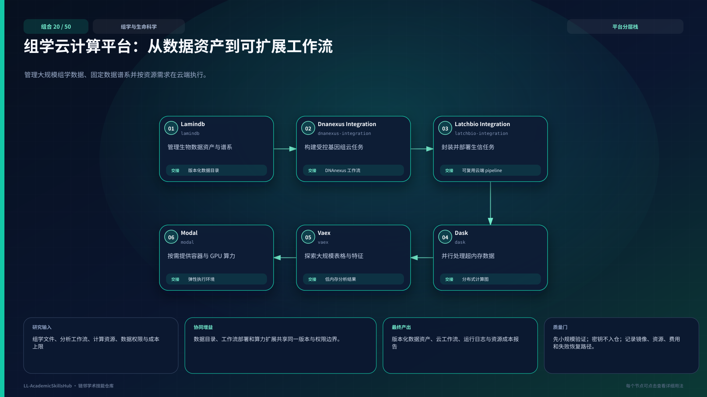
  </a>

**组合使用方式：**先由 **Lamindb** 管理生物数据资产与谱系，交付“版本化数据目录”；再由 **Dnanexus Integration** 构建受控基因组云任务，交付“DNAnexus 工作流”；再由 **Latchbio Integration** 封装并部署生信任务，交付“可复用云端 pipeline”；再由 **Dask** 并行处理超内存数据，交付“分布式计算图”；再由 **Vaex** 探索大规模表格与特征，交付“低内存分析结果”；最后由 **Modal** 按需提供容器与 GPU 算力，交付“弹性执行环境”。

**输入：**组学文件、分析工作流、计算资源、数据权限与成本上限 
**产出：**版本化数据资产、云工作流、运行日志与资源成本报告 
**协同增益：**数据目录、工作流部署和算力扩展共享同一版本与权限边界。 
**质量门：**先小规模验证；密钥不入仓；记录镜像、资源、费用和失败恢复路径。

**组合技能：**

- [Lamindb](../skills/bioinformatics-genomics/lamindb/locales/zh-CN.md)：管理生物数据资产与谱系 → `版本化数据目录`
- [Dnanexus Integration](../skills/lab-automation/dnanexus-integration/locales/zh-CN.md)：构建受控基因组云任务 → `DNAnexus 工作流`
- [Latchbio Integration](../skills/lab-automation/latchbio-integration/locales/zh-CN.md)：封装并部署生信任务 → `可复用云端 pipeline`
- [Dask](../skills/data-analysis-statistics/dask/locales/zh-CN.md)：并行处理超内存数据 → `分布式计算图`
- [Vaex](../skills/data-analysis-statistics/vaex/locales/zh-CN.md)：探索大规模表格与特征 → `低内存分析结果`
- [Modal](../skills/platform-infrastructure/modal/locales/zh-CN.md)：按需提供容器与 GPU 算力 → `弹性执行环境`

[打开可编辑 SVG](../assets/brand/skill-combinations/20-omics-cloud-platform.svg) · [下载高清 PNG](../assets/brand/skill-combinations/png/20-omics-cloud-platform.png)

<strong>21 · 流式细胞术分析：从 FCS 事件到可审计群体比较</strong>

> 解析流式数据、记录门控和批次，并完成统计比较与可视化。

  <a href="../assets/brand/skill-combinations/21-flow-cytometry-analysis.svg">
    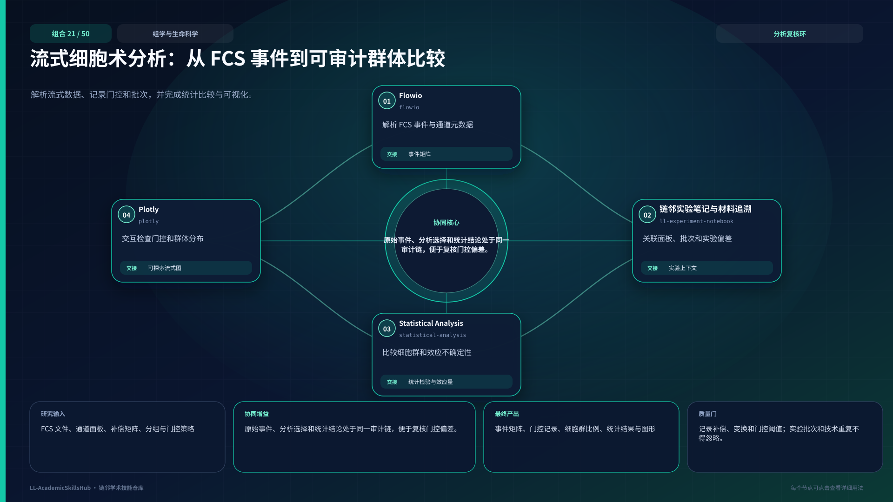
  </a>

**组合使用方式：**先由 **Flowio** 解析 FCS 事件与通道元数据，交付“事件矩阵”；再由 **链邻实验笔记与材料追溯** 关联面板、批次和实验偏差，交付“实验上下文”；再由 **Statistical Analysis** 比较细胞群和效应不确定性，交付“统计检验与效应量”；最后由 **Plotly** 交互检查门控和群体分布，交付“可探索流式图”。

**输入：**FCS 文件、通道面板、补偿矩阵、分组与门控策略 
**产出：**事件矩阵、门控记录、细胞群比例、统计结果与图形 
**协同增益：**原始事件、分析选择和统计结论处于同一审计链，便于复核门控偏差。 
**质量门：**记录补偿、变换和门控阈值；实验批次和技术重复不得忽略。

**组合技能：**

- [Flowio](../skills/bioinformatics-genomics/flowio/locales/zh-CN.md)：解析 FCS 事件与通道元数据 → `事件矩阵`
- [链邻实验笔记与材料追溯](../skills/academic-core/ll-experiment-notebook/locales/zh-CN.md)：关联面板、批次和实验偏差 → `实验上下文`
- [Statistical Analysis](../skills/data-analysis-statistics/statistical-analysis/locales/zh-CN.md)：比较细胞群和效应不确定性 → `统计检验与效应量`
- [Plotly](../skills/data-analysis-statistics/plotly/locales/zh-CN.md)：交互检查门控和群体分布 → `可探索流式图`

[打开可编辑 SVG](../assets/brand/skill-combinations/21-flow-cytometry-analysis.svg) · [下载高清 PNG](../assets/brand/skill-combinations/png/21-flow-cytometry-analysis.png)

## 05 · 药物发现与蛋白工程

<strong>22 · 化学数据治理：从公共化合物库到可计算分子集合</strong>

> 获取结构和活性数据，完成分子规范化、去重、药化过滤与版本记录。

  <a href="../assets/brand/skill-combinations/22-chemical-data-curation.svg">
    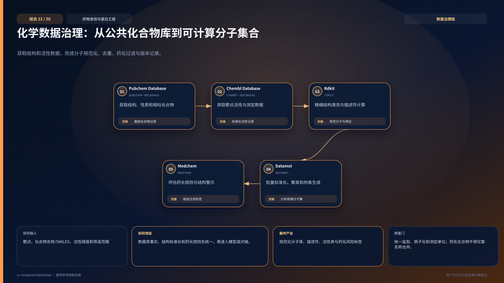
  </a>

**组合使用方式：**先由 **Pubchem Database** 获取结构、性质和相似化合物，交付“基础化合物记录”；再由 **Chembl Database** 获取靶点活性与测定数据，交付“标准化活性记录”；再由 **Rdkit** 精细结构清洗与描述符计算，交付“规范分子与特征”；再由 **Datamol** 批量标准化、聚类和构象生成，交付“分析就绪分子集”；最后由 **Medchem** 评估药化规则与结构警示，交付“候选过滤标签”。

**输入：**靶点、化合物名称/SMILES、活性阈值和筛选范围 
**产出：**规范化分子库、描述符、活性表与药化风险标签 
**协同增益：**数据库事实、结构标准化和药化规则先统一，再进入模型或对接。 
**质量门：**统一盐型、质子化和测定单位；同名化合物不得仅靠名称合并。

**组合技能：**

- [Pubchem Database](../skills/scientific-databases/pubchem-database/locales/zh-CN.md)：获取结构、性质和相似化合物 → `基础化合物记录`
- [Chembl Database](../skills/scientific-databases/chembl-database/locales/zh-CN.md)：获取靶点活性与测定数据 → `标准化活性记录`
- [Rdkit](../skills/cheminformatics-drug-discovery/rdkit/locales/zh-CN.md)：精细结构清洗与描述符计算 → `规范分子与特征`
- [Datamol](../skills/cheminformatics-drug-discovery/datamol/locales/zh-CN.md)：批量标准化、聚类和构象生成 → `分析就绪分子集`
- [Medchem](../skills/cheminformatics-drug-discovery/medchem/locales/zh-CN.md)：评估药化规则与结构警示 → `候选过滤标签`

[打开可编辑 SVG](../assets/brand/skill-combinations/22-chemical-data-curation.svg) · [下载高清 PNG](../assets/brand/skill-combinations/png/22-chemical-data-curation.png)

<strong>23 · 分子机器学习：从表示学习到可解释候选排序</strong>

> 构建分子特征和预测模型，并用适用域与解释约束候选优先级。

  <a href="../assets/brand/skill-combinations/23-molecular-machine-learning.svg">
    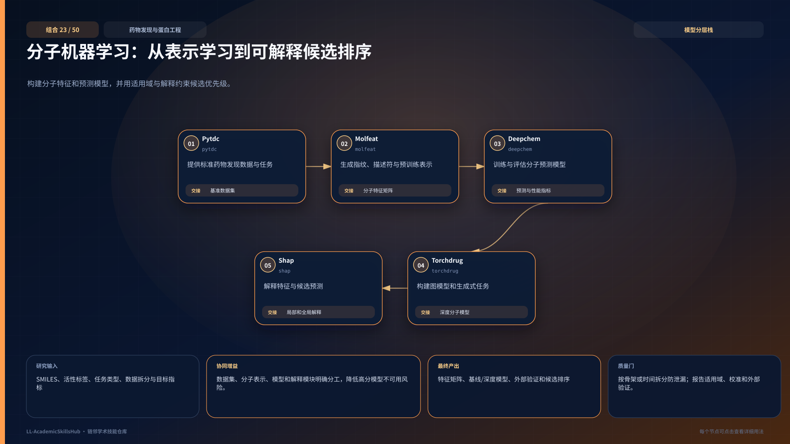
  </a>

**组合使用方式：**先由 **Pytdc** 提供标准药物发现数据与任务，交付“基准数据集”；再由 **Molfeat** 生成指纹、描述符与预训练表示，交付“分子特征矩阵”；再由 **Deepchem** 训练与评估分子预测模型，交付“预测与性能指标”；再由 **Torchdrug** 构建图模型和生成式任务，交付“深度分子模型”；最后由 **Shap** 解释特征与候选预测，交付“局部和全局解释”。

**输入：**SMILES、活性标签、任务类型、数据拆分与目标指标 
**产出：**特征矩阵、基线/深度模型、外部验证和候选排序 
**协同增益：**数据集、分子表示、模型和解释模块明确分工，降低高分模型不可用风险。 
**质量门：**按骨架或时间拆分防泄漏；报告适用域、校准和外部验证。

**组合技能：**

- [Pytdc](../skills/cheminformatics-drug-discovery/pytdc/locales/zh-CN.md)：提供标准药物发现数据与任务 → `基准数据集`
- [Molfeat](../skills/cheminformatics-drug-discovery/molfeat/locales/zh-CN.md)：生成指纹、描述符与预训练表示 → `分子特征矩阵`
- [Deepchem](../skills/cheminformatics-drug-discovery/deepchem/locales/zh-CN.md)：训练与评估分子预测模型 → `预测与性能指标`
- [Torchdrug](../skills/cheminformatics-drug-discovery/torchdrug/locales/zh-CN.md)：构建图模型和生成式任务 → `深度分子模型`
- [Shap](../skills/machine-learning-ai/shap/locales/zh-CN.md)：解释特征与候选预测 → `局部和全局解释`

[打开可编辑 SVG](../assets/brand/skill-combinations/23-molecular-machine-learning.svg) · [下载高清 PNG](../assets/brand/skill-combinations/png/23-molecular-machine-learning.png)

<strong>24 · 结构虚拟筛选：从蛋白结构到可实验验证的结合姿势</strong>

> 构建可信靶点结构和配体集合，完成对接、亲和证据整合与动力学复核。

  <a href="../assets/brand/skill-combinations/24-structure-based-screening.svg">
    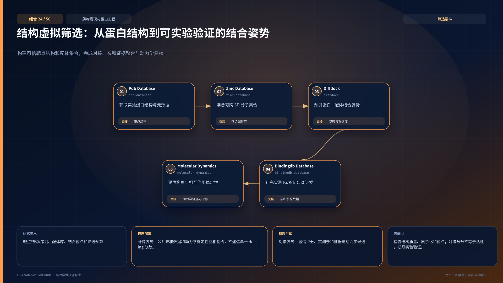
  </a>

**组合使用方式：**先由 **Pdb Database** 获取实验蛋白结构与元数据，交付“靶点结构”；再由 **Zinc Database** 准备可购 3D 分子集合，交付“筛选配体库”；再由 **Diffdock** 预测蛋白—配体结合姿势，交付“姿势与置信度”；再由 **Bindingdb Database** 补充实测 Ki/Kd/IC50 证据，交付“亲和参照数据”；最后由 **Molecular Dynamics** 评估构象与相互作用稳定性，交付“动力学轨迹与指标”。

**输入：**靶点结构/序列、配体库、结合位点和筛选预算 
**产出：**对接姿势、置信评分、实测亲和证据与动力学候选 
**协同增益：**计算姿势、公共亲和数据和动力学稳定性互相制约，不迷信单一 docking 分数。 
**质量门：**检查结构质量、质子化和位点；对接分数不等于活性，必须实验验证。

**组合技能：**

- [Pdb Database](../skills/protein-structural-biology/pdb-database/locales/zh-CN.md)：获取实验蛋白结构与元数据 → `靶点结构`
- [Zinc Database](../skills/scientific-databases/zinc-database/locales/zh-CN.md)：准备可购 3D 分子集合 → `筛选配体库`
- [Diffdock](../skills/cheminformatics-drug-discovery/diffdock/locales/zh-CN.md)：预测蛋白—配体结合姿势 → `姿势与置信度`
- [Bindingdb Database](../skills/scientific-databases/bindingdb-database/locales/zh-CN.md)：补充实测 Ki/Kd/IC50 证据 → `亲和参照数据`
- [Molecular Dynamics](../skills/cheminformatics-drug-discovery/molecular-dynamics/locales/zh-CN.md)：评估构象与相互作用稳定性 → `动力学轨迹与指标`

[打开可编辑 SVG](../assets/brand/skill-combinations/24-structure-based-screening.svg) · [下载高清 PNG](../assets/brand/skill-combinations/png/24-structure-based-screening.png)

<strong>25 · 代谢组鉴定：从原始质谱峰到通路和酶动力学解释</strong>

> 处理质谱数据、匹配谱图、核对代谢物并连接生化反应证据。

  <a href="../assets/brand/skill-combinations/25-metabolomics-identification.svg">
    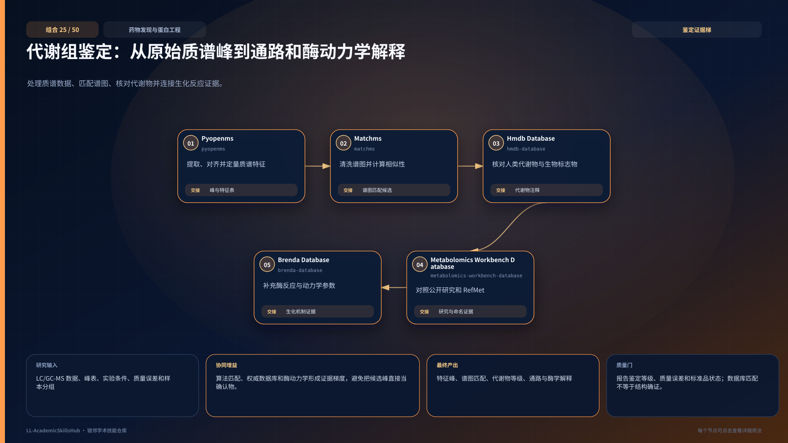
  </a>

**组合使用方式：**先由 **Pyopenms** 提取、对齐并定量质谱特征，交付“峰与特征表”；再由 **Matchms** 清洗谱图并计算相似性，交付“谱图匹配候选”；再由 **Hmdb Database** 核对人类代谢物与生物标志物，交付“代谢物注释”；再由 **Metabolomics Workbench Database** 对照公开研究和 RefMet，交付“研究与命名证据”；最后由 **Brenda Database** 补充酶反应与动力学参数，交付“生化机制证据”。

**输入：**LC/GC-MS 数据、峰表、实验条件、质量误差和样本分组 
**产出：**特征峰、谱图匹配、代谢物等级、通路与酶学解释 
**协同增益：**算法匹配、权威数据库和酶动力学形成证据梯度，避免把候选峰直接当确认物。 
**质量门：**报告鉴定等级、质量误差和标准品状态；数据库匹配不等于结构确证。

**组合技能：**

- [Pyopenms](../skills/cheminformatics-drug-discovery/pyopenms/locales/zh-CN.md)：提取、对齐并定量质谱特征 → `峰与特征表`
- [Matchms](../skills/cheminformatics-drug-discovery/matchms/locales/zh-CN.md)：清洗谱图并计算相似性 → `谱图匹配候选`
- [Hmdb Database](../skills/scientific-databases/hmdb-database/locales/zh-CN.md)：核对人类代谢物与生物标志物 → `代谢物注释`
- [Metabolomics Workbench Database](../skills/scientific-databases/metabolomics-workbench-database/locales/zh-CN.md)：对照公开研究和 RefMet → `研究与命名证据`
- [Brenda Database](../skills/scientific-databases/brenda-database/locales/zh-CN.md)：补充酶反应与动力学参数 → `生化机制证据`

[打开可编辑 SVG](../assets/brand/skill-combinations/25-metabolomics-identification.svg) · [下载高清 PNG](../assets/brand/skill-combinations/png/25-metabolomics-identification.png)

<strong>26 · 量子化学到材料结构：从分子计算任务到可比较性质</strong>

> 在受控计算环境中执行量子化学任务，并把结果映射到结构—性质比较。

  <a href="../assets/brand/skill-combinations/26-quantum-chemistry-to-material.svg">
    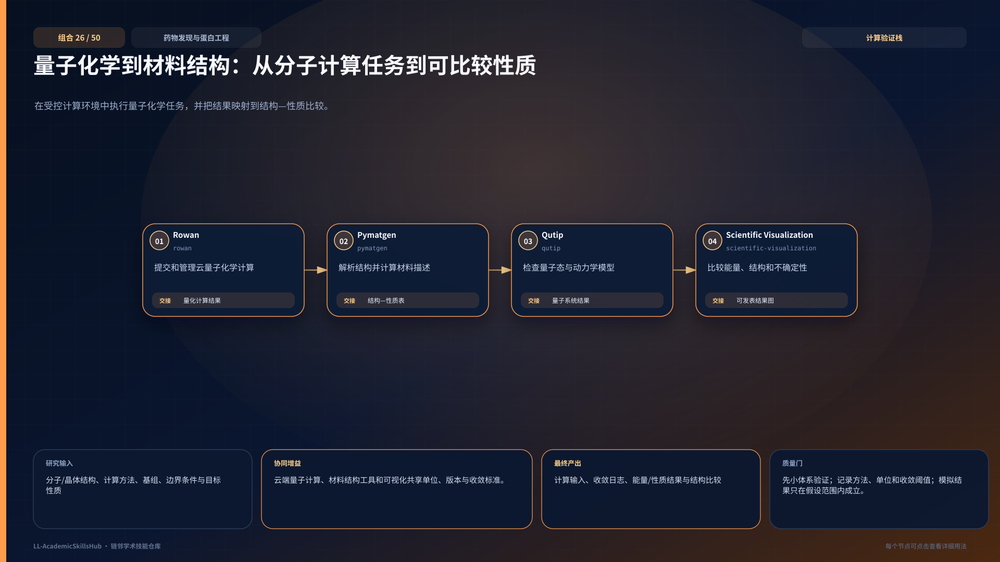
  </a>

**组合使用方式：**先由 **Rowan** 提交和管理云量子化学计算，交付“量化计算结果”；再由 **Pymatgen** 解析结构并计算材料描述，交付“结构—性质表”；再由 **Qutip** 检查量子态与动力学模型，交付“量子系统结果”；最后由 **Scientific Visualization** 比较能量、结构和不确定性，交付“可发表结果图”。

**输入：**分子/晶体结构、计算方法、基组、边界条件与目标性质 
**产出：**计算输入、收敛日志、能量/性质结果与结构比较 
**协同增益：**云端量子计算、材料结构工具和可视化共享单位、版本与收敛标准。 
**质量门：**先小体系验证；记录方法、单位和收敛阈值；模拟结果只在假设范围内成立。

**组合技能：**

- [Rowan](../skills/cheminformatics-drug-discovery/rowan/locales/zh-CN.md)：提交和管理云量子化学计算 → `量化计算结果`
- [Pymatgen](../skills/materials-physics/pymatgen/locales/zh-CN.md)：解析结构并计算材料描述 → `结构—性质表`
- [Qutip](../skills/materials-physics/qutip/locales/zh-CN.md)：检查量子态与动力学模型 → `量子系统结果`
- [Scientific Visualization](../skills/presentation-visualization/scientific-visualization/locales/zh-CN.md)：比较能量、结构和不确定性 → `可发表结果图`

[打开可编辑 SVG](../assets/brand/skill-combinations/26-quantum-chemistry-to-material.svg) · [下载高清 PNG](../assets/brand/skill-combinations/png/26-quantum-chemistry-to-material.png)

<strong>27 · 靶点—通路优先级：从疾病证据到可干预网络</strong>

> 融合遗传、组学、药物和网络证据，形成可解释的治疗靶点排序。

  <a href="../assets/brand/skill-combinations/27-target-pathway-prioritization.svg">
    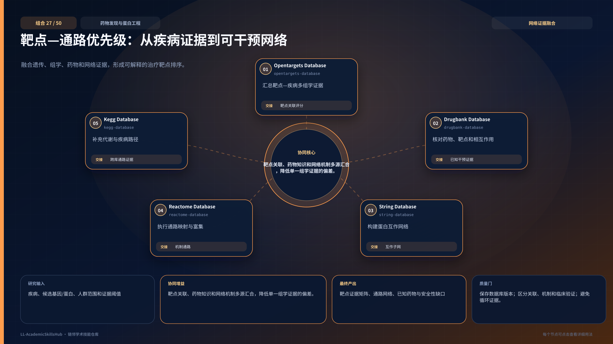
  </a>

**组合使用方式：**先由 **Opentargets Database** 汇总靶点—疾病多组学证据，交付“靶点关联评分”；再由 **Drugbank Database** 核对药物、靶点和相互作用，交付“已知干预证据”；再由 **String Database** 构建蛋白互作网络，交付“互作子网”；再由 **Reactome Database** 执行通路映射与富集，交付“机制通路”；最后由 **Kegg Database** 补充代谢与疾病路径，交付“跨库通路证据”。

**输入：**疾病、候选基因/蛋白、人群范围和证据阈值 
**产出：**靶点证据矩阵、通路网络、已知药物与安全性缺口 
**协同增益：**靶点关联、药物知识和网络机制多源汇合，降低单一组学证据的偏差。 
**质量门：**保存数据库版本；区分关联、机制和临床验证；避免循环证据。

**组合技能：**

- [Opentargets Database](../skills/scientific-databases/opentargets-database/locales/zh-CN.md)：汇总靶点—疾病多组学证据 → `靶点关联评分`
- [Drugbank Database](../skills/scientific-databases/drugbank-database/locales/zh-CN.md)：核对药物、靶点和相互作用 → `已知干预证据`
- [String Database](../skills/scientific-databases/string-database/locales/zh-CN.md)：构建蛋白互作网络 → `互作子网`
- [Reactome Database](../skills/scientific-databases/reactome-database/locales/zh-CN.md)：执行通路映射与富集 → `机制通路`
- [Kegg Database](../skills/scientific-databases/kegg-database/locales/zh-CN.md)：补充代谢与疾病路径 → `跨库通路证据`

[打开可编辑 SVG](../assets/brand/skill-combinations/27-target-pathway-prioritization.svg) · [下载高清 PNG](../assets/brand/skill-combinations/png/27-target-pathway-prioritization.png)

<strong>28 · 蛋白结构注释：从序列身份到结构域、构象与功能位点</strong>

> 联合序列、结构预测、结构域和实验数据库构建可验证的蛋白功能解释。

  <a href="../assets/brand/skill-combinations/28-protein-structure-annotation.svg">
    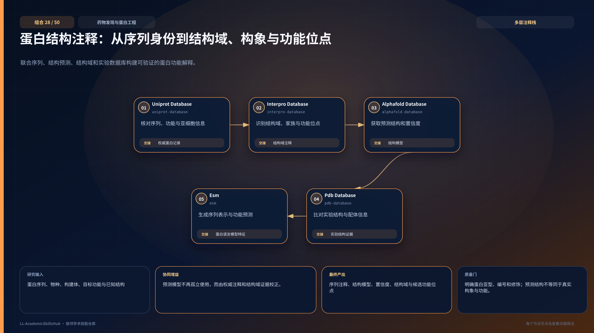
  </a>

**组合使用方式：**先由 **Uniprot Database** 核对序列、功能与亚细胞信息，交付“权威蛋白记录”；再由 **Interpro Database** 识别结构域、家族与功能位点，交付“结构域注释”；再由 **Alphafold Database** 获取预测结构和置信度，交付“结构模型”；再由 **Pdb Database** 比对实验结构与配体信息，交付“实验结构证据”；最后由 **Esm** 生成序列表示与功能预测，交付“蛋白语言模型特征”。

**输入：**蛋白序列、物种、构建体、目标功能与已知结构 
**产出：**序列注释、结构模型、置信度、结构域与候选功能位点 
**协同增益：**预测模型不再孤立使用，而由权威注释和结构域证据校正。 
**质量门：**明确蛋白亚型、编号和修饰；预测结构不等同于真实构象与功能。

**组合技能：**

- [Uniprot Database](../skills/protein-structural-biology/uniprot-database/locales/zh-CN.md)：核对序列、功能与亚细胞信息 → `权威蛋白记录`
- [Interpro Database](../skills/protein-structural-biology/interpro-database/locales/zh-CN.md)：识别结构域、家族与功能位点 → `结构域注释`
- [Alphafold Database](../skills/protein-structural-biology/alphafold-database/locales/zh-CN.md)：获取预测结构和置信度 → `结构模型`
- [Pdb Database](../skills/protein-structural-biology/pdb-database/locales/zh-CN.md)：比对实验结构与配体信息 → `实验结构证据`
- [Esm](../skills/protein-structural-biology/esm/locales/zh-CN.md)：生成序列表示与功能预测 → `蛋白语言模型特征`

[打开可编辑 SVG](../assets/brand/skill-combinations/28-protein-structure-annotation.svg) · [下载高清 PNG](../assets/brand/skill-combinations/png/28-protein-structure-annotation.png)

<strong>29 · 蛋白工程闭环：从设计候选到云实验反馈</strong>

> 生成蛋白变体、评估序列与糖基化约束，并通过自动实验反馈迭代。

  <a href="../assets/brand/skill-combinations/29-protein-engineering-loop.svg">
    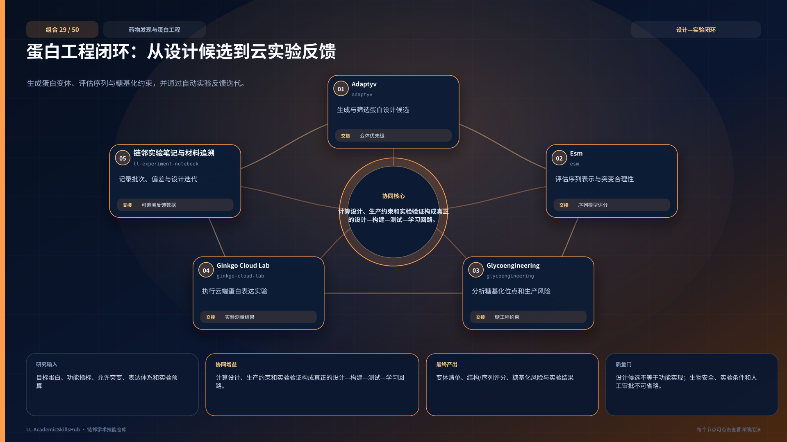
  </a>

**组合使用方式：**先由 **Adaptyv** 生成与筛选蛋白设计候选，交付“变体优先级”；再由 **Esm** 评估序列表示与突变合理性，交付“序列模型评分”；再由 **Glycoengineering** 分析糖基化位点和生产风险，交付“糖工程约束”；再由 **Ginkgo Cloud Lab** 执行云端蛋白表达实验，交付“实验测量结果”；最后由 **链邻实验笔记与材料追溯** 记录批次、偏差与设计迭代，交付“可追溯反馈数据”。

**输入：**目标蛋白、功能指标、允许突变、表达体系和实验预算 
**产出：**变体清单、结构/序列评分、糖基化风险与实验结果 
**协同增益：**计算设计、生产约束和实验验证构成真正的设计—构建—测试—学习回路。 
**质量门：**设计候选不等于功能实现；生物安全、实验条件和人工审批不可省略。

**组合技能：**

- [Adaptyv](../skills/protein-structural-biology/adaptyv/locales/zh-CN.md)：生成与筛选蛋白设计候选 → `变体优先级`
- [Esm](../skills/protein-structural-biology/esm/locales/zh-CN.md)：评估序列表示与突变合理性 → `序列模型评分`
- [Glycoengineering](../skills/protein-structural-biology/glycoengineering/locales/zh-CN.md)：分析糖基化位点和生产风险 → `糖工程约束`
- [Ginkgo Cloud Lab](../skills/lab-automation/ginkgo-cloud-lab/locales/zh-CN.md)：执行云端蛋白表达实验 → `实验测量结果`
- [链邻实验笔记与材料追溯](../skills/academic-core/ll-experiment-notebook/locales/zh-CN.md)：记录批次、偏差与设计迭代 → `可追溯反馈数据`

[打开可编辑 SVG](../assets/brand/skill-combinations/29-protein-engineering-loop.svg) · [下载高清 PNG](../assets/brand/skill-combinations/png/29-protein-engineering-loop.png)

## 06 · 临床与精准医学

<strong>30 · 精准肿瘤研究：从患者变异到功能依赖与候选靶点</strong>

> 联合癌症基因组、体细胞变异、细胞系依赖和靶点证据形成研究假设。

  <a href="../assets/brand/skill-combinations/30-precision-oncology.svg">
    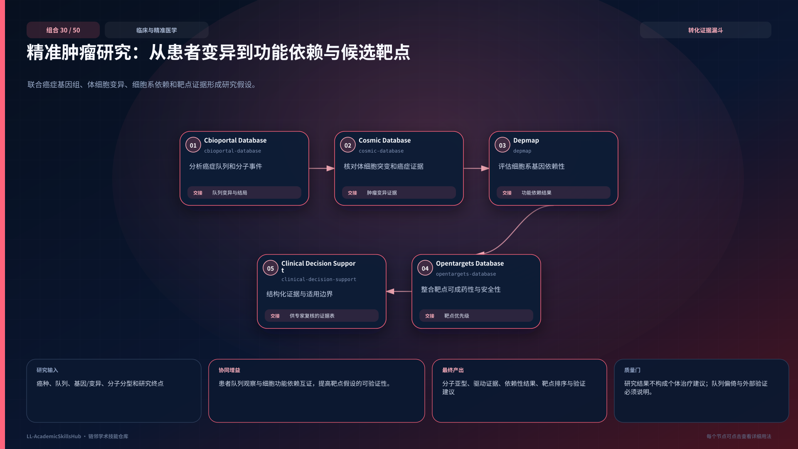
  </a>

**组合使用方式：**先由 **Cbioportal Database** 分析癌症队列和分子事件，交付“队列变异与结局”；再由 **Cosmic Database** 核对体细胞突变和癌症证据，交付“肿瘤变异证据”；再由 **Depmap** 评估细胞系基因依赖性，交付“功能依赖结果”；再由 **Opentargets Database** 整合靶点可成药性与安全性，交付“靶点优先级”；最后由 **Clinical Decision Support** 结构化证据与适用边界，交付“供专家复核的证据表”。

**输入：**癌种、队列、基因/变异、分子分型和研究终点 
**产出：**分子亚型、驱动证据、依赖性结果、靶点排序与验证建议 
**协同增益：**患者队列观察与细胞功能依赖互证，提高靶点假设的可验证性。 
**质量门：**研究结果不构成个体治疗建议；队列偏倚与外部验证必须说明。

**组合技能：**

- [Cbioportal Database](../skills/clinical-precision-medicine/cbioportal-database/locales/zh-CN.md)：分析癌症队列和分子事件 → `队列变异与结局`
- [Cosmic Database](../skills/clinical-precision-medicine/cosmic-database/locales/zh-CN.md)：核对体细胞突变和癌症证据 → `肿瘤变异证据`
- [Depmap](../skills/clinical-precision-medicine/depmap/locales/zh-CN.md)：评估细胞系基因依赖性 → `功能依赖结果`
- [Opentargets Database](../skills/scientific-databases/opentargets-database/locales/zh-CN.md)：整合靶点可成药性与安全性 → `靶点优先级`
- [Clinical Decision Support](../skills/clinical-precision-medicine/clinical-decision-support/locales/zh-CN.md)：结构化证据与适用边界 → `供专家复核的证据表`

[打开可编辑 SVG](../assets/brand/skill-combinations/30-precision-oncology.svg) · [下载高清 PNG](../assets/brand/skill-combinations/png/30-precision-oncology.png)

<strong>31 · 药物基因组与罕见病：从基因型到受控治疗证据</strong>

> 综合药物基因组、表型、群体频率和临床分类，支持专家级病例讨论。

  <a href="../assets/brand/skill-combinations/31-pharmacogenomics-rare-disease.svg">
    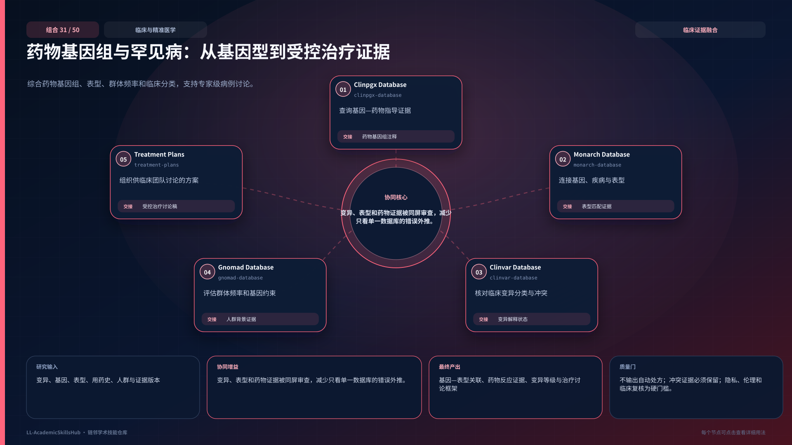
  </a>

**组合使用方式：**先由 **Clinpgx Database** 查询基因—药物指导证据，交付“药物基因组注释”；再由 **Monarch Database** 连接基因、疾病与表型，交付“表型匹配证据”；再由 **Clinvar Database** 核对临床变异分类与冲突，交付“变异解释状态”；再由 **Gnomad Database** 评估群体频率和基因约束，交付“人群背景证据”；最后由 **Treatment Plans** 组织供临床团队讨论的方案，交付“受控治疗讨论稿”。

**输入：**变异、基因、表型、用药史、人群与证据版本 
**产出：**基因—表型关联、药物反应证据、变异等级与治疗讨论框架 
**协同增益：**变异、表型和药物证据被同屏审查，减少只看单一数据库的错误外推。 
**质量门：**不输出自动处方；冲突证据必须保留；隐私、伦理和临床复核为硬门槛。

**组合技能：**

- [Clinpgx Database](../skills/clinical-precision-medicine/clinpgx-database/locales/zh-CN.md)：查询基因—药物指导证据 → `药物基因组注释`
- [Monarch Database](../skills/clinical-precision-medicine/monarch-database/locales/zh-CN.md)：连接基因、疾病与表型 → `表型匹配证据`
- [Clinvar Database](../skills/clinical-precision-medicine/clinvar-database/locales/zh-CN.md)：核对临床变异分类与冲突 → `变异解释状态`
- [Gnomad Database](../skills/scientific-databases/gnomad-database/locales/zh-CN.md)：评估群体频率和基因约束 → `人群背景证据`
- [Treatment Plans](../skills/clinical-precision-medicine/treatment-plans/locales/zh-CN.md)：组织供临床团队讨论的方案 → `受控治疗讨论稿`

[打开可编辑 SVG](../assets/brand/skill-combinations/31-pharmacogenomics-rare-disease.svg) · [下载高清 PNG](../assets/brand/skill-combinations/png/31-pharmacogenomics-rare-disease.png)

<strong>32 · 医学影像研究：从 DICOM/全切片到可复核综述与模型数据</strong>

> 获取受控影像，完成脱敏、切片/像素处理、数据管理和领域综述。

  <a href="../assets/brand/skill-combinations/32-medical-imaging-pipeline.svg">
    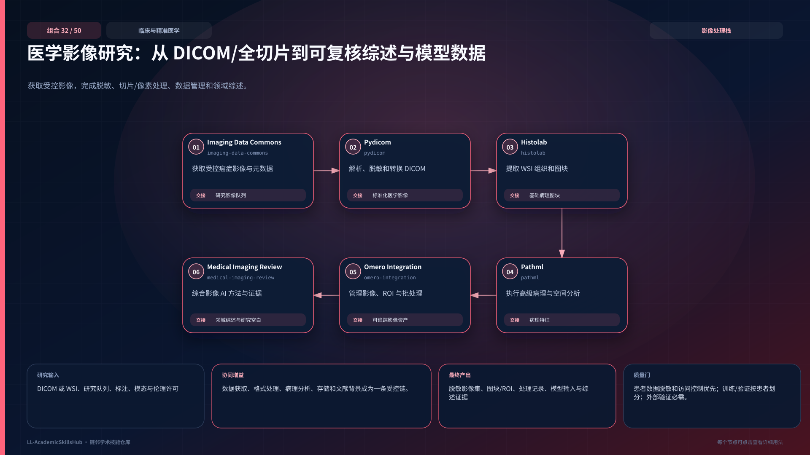
  </a>

**组合使用方式：**先由 **Imaging Data Commons** 获取受控癌症影像与元数据，交付“研究影像队列”；再由 **Pydicom** 解析、脱敏和转换 DICOM，交付“标准化医学影像”；再由 **Histolab** 提取 WSI 组织和图块，交付“基础病理图块”；再由 **Pathml** 执行高级病理与空间分析，交付“病理特征”；再由 **Omero Integration** 管理影像、ROI 与批处理，交付“可追踪影像资产”；最后由 **Medical Imaging Review** 综合影像 AI 方法与证据，交付“领域综述与研究空白”。

**输入：**DICOM 或 WSI、研究队列、标注、模态与伦理许可 
**产出：**脱敏影像集、图块/ROI、处理记录、模型输入与综述证据 
**协同增益：**数据获取、格式处理、病理分析、存储和文献背景成为一条受控链。 
**质量门：**患者数据脱敏和访问控制优先；训练/验证按患者划分；外部验证必需。

**组合技能：**

- [Imaging Data Commons](../skills/clinical-precision-medicine/imaging-data-commons/locales/zh-CN.md)：获取受控癌症影像与元数据 → `研究影像队列`
- [Pydicom](../skills/clinical-precision-medicine/pydicom/locales/zh-CN.md)：解析、脱敏和转换 DICOM → `标准化医学影像`
- [Histolab](../skills/clinical-precision-medicine/histolab/locales/zh-CN.md)：提取 WSI 组织和图块 → `基础病理图块`
- [Pathml](../skills/clinical-precision-medicine/pathml/locales/zh-CN.md)：执行高级病理与空间分析 → `病理特征`
- [Omero Integration](../skills/lab-automation/omero-integration/locales/zh-CN.md)：管理影像、ROI 与批处理 → `可追踪影像资产`
- [Medical Imaging Review](../skills/scientific-communication/medical-imaging-review/locales/zh-CN.md)：综合影像 AI 方法与证据 → `领域综述与研究空白`

[打开可编辑 SVG](../assets/brand/skill-combinations/32-medical-imaging-pipeline.svg) · [下载高清 PNG](../assets/brand/skill-combinations/png/32-medical-imaging-pipeline.png)

<strong>33 · 临床证据与医疗器械合规：从试验注册到质量体系</strong>

> 追踪临床试验和监管信息，形成规范临床报告并接受方法与质量体系审查。

  <a href="../assets/brand/skill-combinations/33-clinical-regulatory-evidence.svg">
    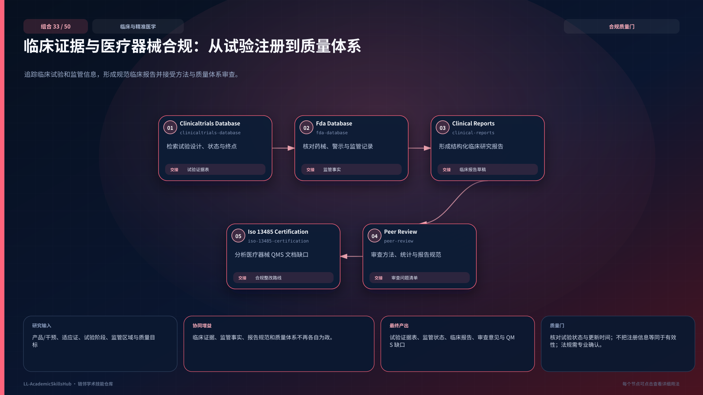
  </a>

**组合使用方式：**先由 **Clinicaltrials Database** 检索试验设计、状态与终点，交付“试验证据表”；再由 **Fda Database** 核对药械、警示与监管记录，交付“监管事实”；再由 **Clinical Reports** 形成结构化临床研究报告，交付“临床报告草稿”；再由 **Peer Review** 审查方法、统计与报告规范，交付“审查问题清单”；最后由 **Iso 13485 Certification** 分析医疗器械 QMS 文档缺口，交付“合规整改路线”。

**输入：**产品/干预、适应证、试验阶段、监管区域与质量目标 
**产出：**试验证据表、监管状态、临床报告、审查意见与 QMS 缺口 
**协同增益：**临床证据、监管事实、报告规范和质量体系不再各自为政。 
**质量门：**核对试验状态与更新时间；不把注册信息等同于有效性；法规需专业确认。

**组合技能：**

- [Clinicaltrials Database](../skills/clinical-precision-medicine/clinicaltrials-database/locales/zh-CN.md)：检索试验设计、状态与终点 → `试验证据表`
- [Fda Database](../skills/clinical-precision-medicine/fda-database/locales/zh-CN.md)：核对药械、警示与监管记录 → `监管事实`
- [Clinical Reports](../skills/clinical-precision-medicine/clinical-reports/locales/zh-CN.md)：形成结构化临床研究报告 → `临床报告草稿`
- [Peer Review](../skills/scientific-communication/peer-review/locales/zh-CN.md)：审查方法、统计与报告规范 → `审查问题清单`
- [Iso 13485 Certification](../skills/platform-infrastructure/iso-13485-certification/locales/zh-CN.md)：分析医疗器械 QMS 文档缺口 → `合规整改路线`

[打开可编辑 SVG](../assets/brand/skill-combinations/33-clinical-regulatory-evidence.svg) · [下载高清 PNG](../assets/brand/skill-combinations/png/33-clinical-regulatory-evidence.png)

<strong>34 · 神经与生理信号：从原始波形到预后模型</strong>

> 同步处理多模态生理信号和神经电活动，并建立带时间结局的预测模型。

  <a href="../assets/brand/skill-combinations/34-neurophysiology-modeling.svg">
    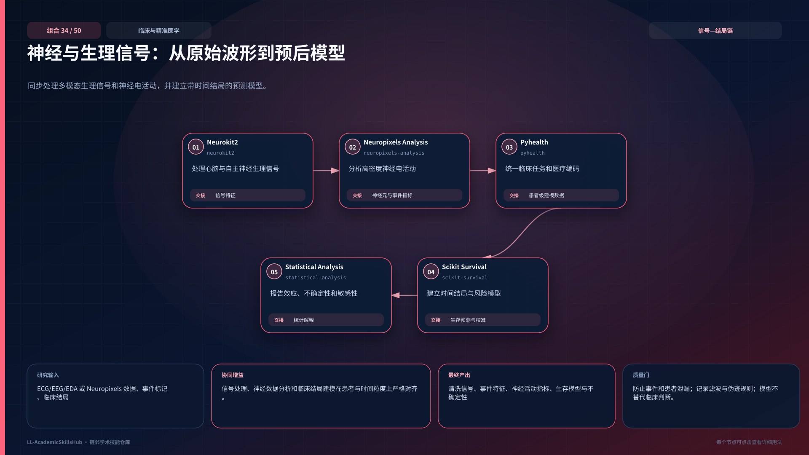
  </a>

**组合使用方式：**先由 **Neurokit2** 处理心脑与自主神经生理信号，交付“信号特征”；再由 **Neuropixels Analysis** 分析高密度神经电活动，交付“神经元与事件指标”；再由 **Pyhealth** 统一临床任务和医疗编码，交付“患者级建模数据”；再由 **Scikit Survival** 建立时间结局与风险模型，交付“生存预测与校准”；最后由 **Statistical Analysis** 报告效应、不确定性和敏感性，交付“统计解释”。

**输入：**ECG/EEG/EDA 或 Neuropixels 数据、事件标记、临床结局 
**产出：**清洗信号、事件特征、神经活动指标、生存模型与不确定性 
**协同增益：**信号处理、神经数据分析和临床结局建模在患者与时间粒度上严格对齐。 
**质量门：**防止事件和患者泄漏；记录滤波与伪迹规则；模型不替代临床判断。

**组合技能：**

- [Neurokit2](../skills/clinical-precision-medicine/neurokit2/locales/zh-CN.md)：处理心脑与自主神经生理信号 → `信号特征`
- [Neuropixels Analysis](../skills/clinical-precision-medicine/neuropixels-analysis/locales/zh-CN.md)：分析高密度神经电活动 → `神经元与事件指标`
- [Pyhealth](../skills/clinical-precision-medicine/pyhealth/locales/zh-CN.md)：统一临床任务和医疗编码 → `患者级建模数据`
- [Scikit Survival](../skills/machine-learning-ai/scikit-survival/locales/zh-CN.md)：建立时间结局与风险模型 → `生存预测与校准`
- [Statistical Analysis](../skills/data-analysis-statistics/statistical-analysis/locales/zh-CN.md)：报告效应、不确定性和敏感性 → `统计解释`

[打开可编辑 SVG](../assets/brand/skill-combinations/34-neurophysiology-modeling.svg) · [下载高清 PNG](../assets/brand/skill-combinations/png/34-neurophysiology-modeling.png)

<strong>35 · 临床 AI 治理：从模型结果到可解释、可审查的决策材料</strong>

> 把医疗 AI 输出转换为带适用范围、证据等级和人工决策点的临床材料。

  <a href="../assets/brand/skill-combinations/35-clinical-ai-governance.svg">
    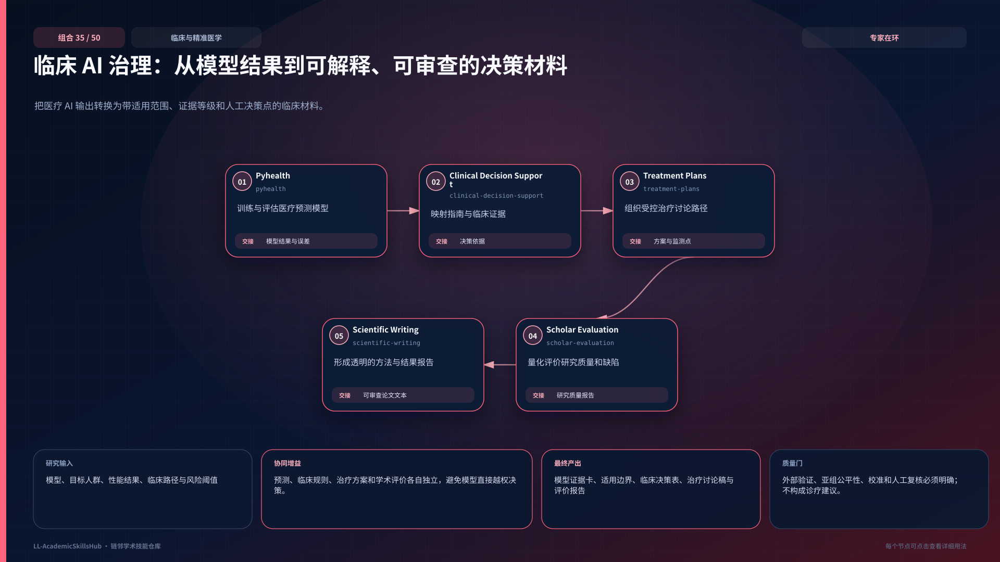
  </a>

**组合使用方式：**先由 **Pyhealth** 训练与评估医疗预测模型，交付“模型结果与误差”；再由 **Clinical Decision Support** 映射指南与临床证据，交付“决策依据”；再由 **Treatment Plans** 组织受控治疗讨论路径，交付“方案与监测点”；再由 **Scholar Evaluation** 量化评价研究质量和缺陷，交付“研究质量报告”；最后由 **Scientific Writing** 形成透明的方法与结果报告，交付“可审查论文文本”。

**输入：**模型、目标人群、性能结果、临床路径与风险阈值 
**产出：**模型证据卡、适用边界、临床决策表、治疗讨论稿与评价报告 
**协同增益：**预测、临床规则、治疗方案和学术评价各自独立，避免模型直接越权决策。 
**质量门：**外部验证、亚组公平性、校准和人工复核必须明确；不构成诊疗建议。

**组合技能：**

- [Pyhealth](../skills/clinical-precision-medicine/pyhealth/locales/zh-CN.md)：训练与评估医疗预测模型 → `模型结果与误差`
- [Clinical Decision Support](../skills/clinical-precision-medicine/clinical-decision-support/locales/zh-CN.md)：映射指南与临床证据 → `决策依据`
- [Treatment Plans](../skills/clinical-precision-medicine/treatment-plans/locales/zh-CN.md)：组织受控治疗讨论路径 → `方案与监测点`
- [Scholar Evaluation](../skills/research-methods/scholar-evaluation/locales/zh-CN.md)：量化评价研究质量和缺陷 → `研究质量报告`
- [Scientific Writing](../skills/scientific-communication/scientific-writing/locales/zh-CN.md)：形成透明的方法与结果报告 → `可审查论文文本`

[打开可编辑 SVG](../assets/brand/skill-combinations/35-clinical-ai-governance.svg) · [下载高清 PNG](../assets/brand/skill-combinations/png/35-clinical-ai-governance.png)

## 07 · 数据科学与人工智能

<strong>36 · 统计基线工程：从脏数据到可信基线模型</strong>

> 先建立变量字典、质量画像和透明基线，再考虑复杂模型。

  <a href="../assets/brand/skill-combinations/36-statistical-baseline.svg">
    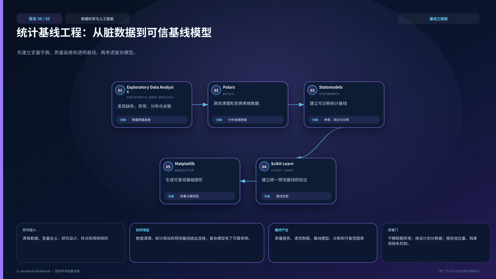
  </a>

**组合使用方式：**先由 **Exploratory Data Analysis** 发现缺失、异常、分布与关联，交付“数据质量画像”；再由 **Polars** 高效清理和变换表格数据，交付“分析就绪数据”；再由 **Statsmodels** 建立可诊断统计基线，交付“参数、效应与诊断”；再由 **Scikit Learn** 建立统一预测基线和验证，交付“基线性能”；最后由 **Matplotlib** 生成可复现基础图形，交付“质量与模型图”。

**输入：**表格数据、变量含义、研究设计、终点和排除规则 
**产出：**质量报告、清洗数据、基线模型、诊断和可复现图表 
**协同增益：**数据清理、统计假设和预测基线彼此连接，复杂模型有了可靠参照。 
**质量门：**不静默删异常；按设计划分数据；报告效应量、残差和缺失机制。

**组合技能：**

- [Exploratory Data Analysis](../skills/data-analysis-statistics/exploratory-data-analysis/locales/zh-CN.md)：发现缺失、异常、分布与关联 → `数据质量画像`
- [Polars](../skills/data-analysis-statistics/polars/locales/zh-CN.md)：高效清理和变换表格数据 → `分析就绪数据`
- [Statsmodels](../skills/data-analysis-statistics/statsmodels/locales/zh-CN.md)：建立可诊断统计基线 → `参数、效应与诊断`
- [Scikit Learn](../skills/machine-learning-ai/scikit-learn/locales/zh-CN.md)：建立统一预测基线和验证 → `基线性能`
- [Matplotlib](../skills/data-analysis-statistics/matplotlib/locales/zh-CN.md)：生成可复现基础图形 → `质量与模型图`

[打开可编辑 SVG](../assets/brand/skill-combinations/36-statistical-baseline.svg) · [下载高清 PNG](../assets/brand/skill-combinations/png/36-statistical-baseline.png)

<strong>37 · 时间序列智能：从海量时点到可解释预测</strong>

> 统一时点、频率和特征，比较经典、专用和基础模型预测。

  <a href="../assets/brand/skill-combinations/37-time-series-intelligence.svg">
    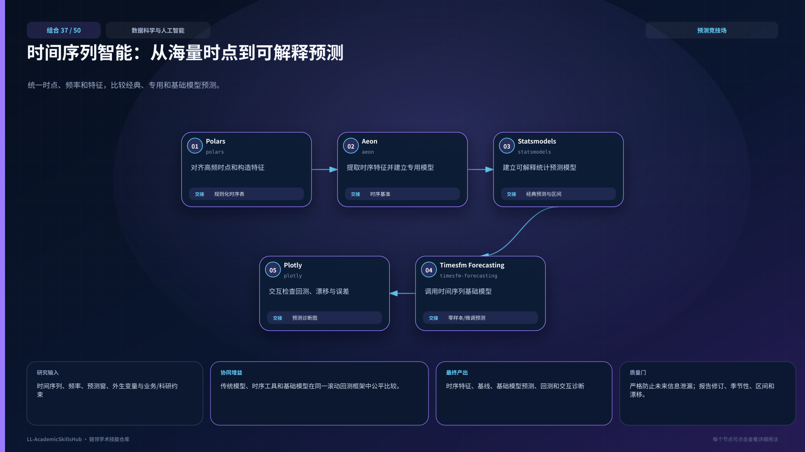
  </a>

**组合使用方式：**先由 **Polars** 对齐高频时点和构造特征，交付“规则化时序表”；再由 **Aeon** 提取时序特征并建立专用模型，交付“时序基准”；再由 **Statsmodels** 建立可解释统计预测模型，交付“经典预测与区间”；再由 **Timesfm Forecasting** 调用时间序列基础模型，交付“零样本/微调预测”；最后由 **Plotly** 交互检查回测、漂移与误差，交付“预测诊断图”。

**输入：**时间序列、频率、预测窗、外生变量与业务/科研约束 
**产出：**时序特征、基线、基础模型预测、回测和交互诊断 
**协同增益：**传统模型、时序工具和基础模型在同一滚动回测框架中公平比较。 
**质量门：**严格防止未来信息泄漏；报告修订、季节性、区间和漂移。

**组合技能：**

- [Polars](../skills/data-analysis-statistics/polars/locales/zh-CN.md)：对齐高频时点和构造特征 → `规则化时序表`
- [Aeon](../skills/machine-learning-ai/aeon/locales/zh-CN.md)：提取时序特征并建立专用模型 → `时序基准`
- [Statsmodels](../skills/data-analysis-statistics/statsmodels/locales/zh-CN.md)：建立可解释统计预测模型 → `经典预测与区间`
- [Timesfm Forecasting](../skills/machine-learning-ai/timesfm-forecasting/locales/zh-CN.md)：调用时间序列基础模型 → `零样本/微调预测`
- [Plotly](../skills/data-analysis-statistics/plotly/locales/zh-CN.md)：交互检查回测、漂移与误差 → `预测诊断图`

[打开可编辑 SVG](../assets/brand/skill-combinations/37-time-series-intelligence.svg) · [下载高清 PNG](../assets/brand/skill-combinations/png/37-time-series-intelligence.png)

<strong>38 · 贝叶斯假设引擎：从自动发现到后验不确定性</strong>

> 生成候选假设，构建概率模型，并通过批判检查保留不确定性。

  <a href="../assets/brand/skill-combinations/38-bayesian-hypothesis-engine.svg">
    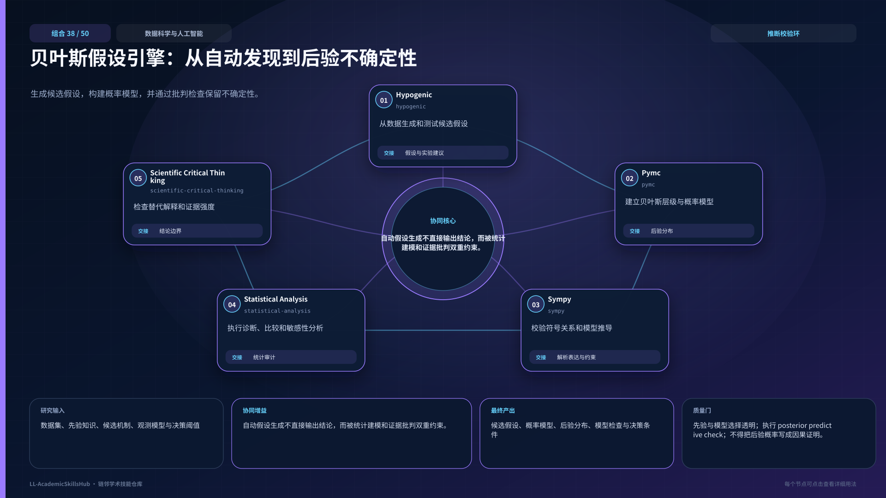
  </a>

**组合使用方式：**先由 **Hypogenic** 从数据生成和测试候选假设，交付“假设与实验建议”；再由 **Pymc** 建立贝叶斯层级与概率模型，交付“后验分布”；再由 **Sympy** 校验符号关系和模型推导，交付“解析表达与约束”；再由 **Statistical Analysis** 执行诊断、比较和敏感性分析，交付“统计审计”；最后由 **Scientific Critical Thinking** 检查替代解释和证据强度，交付“结论边界”。

**输入：**数据集、先验知识、候选机制、观测模型与决策阈值 
**产出：**候选假设、概率模型、后验分布、模型检查与决策条件 
**协同增益：**自动假设生成不直接输出结论，而被统计建模和证据批判双重约束。 
**质量门：**先验与模型选择透明；执行 posterior predictive check；不得把后验概率写成因果证明。

**组合技能：**

- [Hypogenic](../skills/machine-learning-ai/hypogenic/locales/zh-CN.md)：从数据生成和测试候选假设 → `假设与实验建议`
- [Pymc](../skills/machine-learning-ai/pymc/locales/zh-CN.md)：建立贝叶斯层级与概率模型 → `后验分布`
- [Sympy](../skills/data-analysis-statistics/sympy/locales/zh-CN.md)：校验符号关系和模型推导 → `解析表达与约束`
- [Statistical Analysis](../skills/data-analysis-statistics/statistical-analysis/locales/zh-CN.md)：执行诊断、比较和敏感性分析 → `统计审计`
- [Scientific Critical Thinking](../skills/research-methods/scientific-critical-thinking/locales/zh-CN.md)：检查替代解释和证据强度 → `结论边界`

[打开可编辑 SVG](../assets/brand/skill-combinations/38-bayesian-hypothesis-engine.svg) · [下载高清 PNG](../assets/brand/skill-combinations/png/38-bayesian-hypothesis-engine.png)

<strong>39 · 强化学习与数字仿真：先在可控世界中验证策略</strong>

> 构建离散事件环境，比较强化学习策略并评估资源与失败边界。

  <a href="../assets/brand/skill-combinations/39-reinforcement-learning-simulation.svg">
    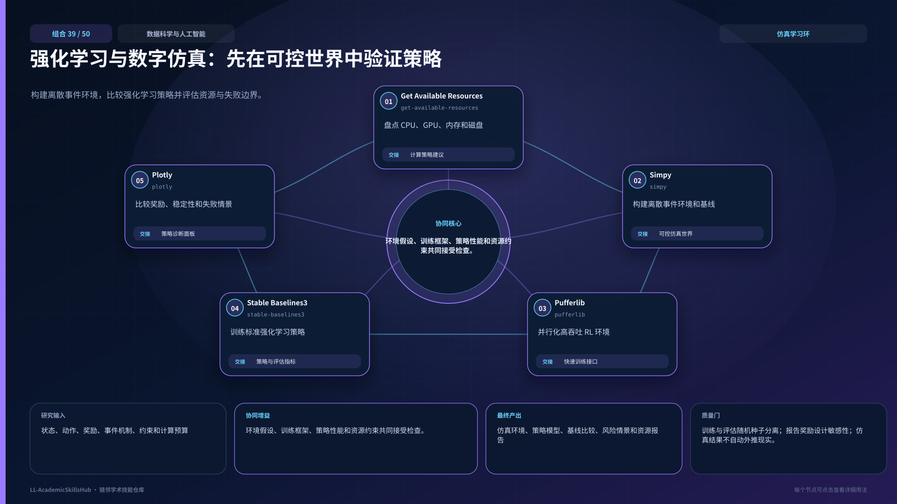
  </a>

**组合使用方式：**先由 **Get Available Resources** 盘点 CPU、GPU、内存和磁盘，交付“计算策略建议”；再由 **Simpy** 构建离散事件环境和基线，交付“可控仿真世界”；再由 **Pufferlib** 并行化高吞吐 RL 环境，交付“快速训练接口”；再由 **Stable Baselines3** 训练标准强化学习策略，交付“策略与评估指标”；最后由 **Plotly** 比较奖励、稳定性和失败情景，交付“策略诊断面板”。

**输入：**状态、动作、奖励、事件机制、约束和计算预算 
**产出：**仿真环境、策略模型、基线比较、风险情景和资源报告 
**协同增益：**环境假设、训练框架、策略性能和资源约束共同接受检查。 
**质量门：**训练与评估随机种子分离；报告奖励设计敏感性；仿真结果不自动外推现实。

**组合技能：**

- [Get Available Resources](../skills/platform-infrastructure/get-available-resources/locales/zh-CN.md)：盘点 CPU、GPU、内存和磁盘 → `计算策略建议`
- [Simpy](../skills/materials-physics/simpy/locales/zh-CN.md)：构建离散事件环境和基线 → `可控仿真世界`
- [Pufferlib](../skills/machine-learning-ai/pufferlib/locales/zh-CN.md)：并行化高吞吐 RL 环境 → `快速训练接口`
- [Stable Baselines3](../skills/machine-learning-ai/stable-baselines3/locales/zh-CN.md)：训练标准强化学习策略 → `策略与评估指标`
- [Plotly](../skills/data-analysis-statistics/plotly/locales/zh-CN.md)：比较奖励、稳定性和失败情景 → `策略诊断面板`

[打开可编辑 SVG](../assets/brand/skill-combinations/39-reinforcement-learning-simulation.svg) · [下载高清 PNG](../assets/brand/skill-combinations/png/39-reinforcement-learning-simulation.png)

<strong>40 · 深度学习治理：从训练编排到解释与弹性部署</strong>

> 以可复现训练、预训练模型、解释分析和云资源构成完整深度学习工程。

  <a href="../assets/brand/skill-combinations/40-deep-learning-governance.svg">
    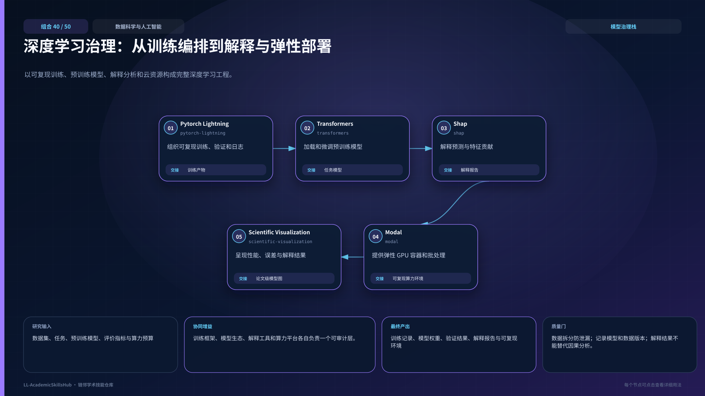
  </a>

**组合使用方式：**先由 **Pytorch Lightning** 组织可复现训练、验证和日志，交付“训练产物”；再由 **Transformers** 加载和微调预训练模型，交付“任务模型”；再由 **Shap** 解释预测与特征贡献，交付“解释报告”；再由 **Modal** 提供弹性 GPU 容器和批处理，交付“可复现算力环境”；最后由 **Scientific Visualization** 呈现性能、误差与解释结果，交付“论文级模型图”。

**输入：**数据集、任务、预训练模型、评价指标与算力预算 
**产出：**训练记录、模型权重、验证结果、解释报告与可复现环境 
**协同增益：**训练框架、模型生态、解释工具和算力平台各自负责一个可审计层。 
**质量门：**数据拆分防泄漏；记录模型和数据版本；解释结果不能替代因果分析。

**组合技能：**

- [Pytorch Lightning](../skills/machine-learning-ai/pytorch-lightning/locales/zh-CN.md)：组织可复现训练、验证和日志 → `训练产物`
- [Transformers](../skills/machine-learning-ai/transformers/locales/zh-CN.md)：加载和微调预训练模型 → `任务模型`
- [Shap](../skills/machine-learning-ai/shap/locales/zh-CN.md)：解释预测与特征贡献 → `解释报告`
- [Modal](../skills/platform-infrastructure/modal/locales/zh-CN.md)：提供弹性 GPU 容器和批处理 → `可复现算力环境`
- [Scientific Visualization](../skills/presentation-visualization/scientific-visualization/locales/zh-CN.md)：呈现性能、误差与解释结果 → `论文级模型图`

[打开可编辑 SVG](../assets/brand/skill-combinations/40-deep-learning-governance.svg) · [下载高清 PNG](../assets/brand/skill-combinations/png/40-deep-learning-governance.png)

<strong>41 · 图学习研究：从关系网络到低维结构和可解释预测</strong>

> 把实体关系构造成图，执行结构分析、图神经网络和嵌入解释。

  <a href="../assets/brand/skill-combinations/41-graph-learning.svg">
    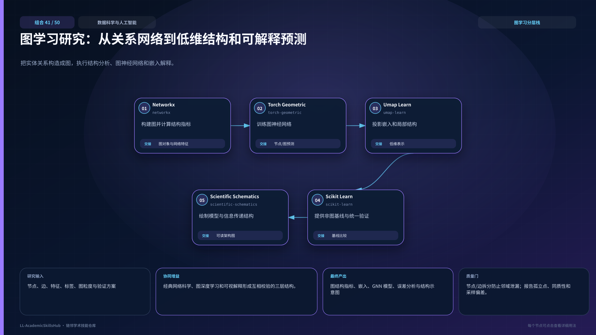
  </a>

**组合使用方式：**先由 **Networkx** 构建图并计算结构指标，交付“图对象与网络特征”；再由 **Torch Geometric** 训练图神经网络，交付“节点/图预测”；再由 **Umap Learn** 投影嵌入和局部结构，交付“低维表示”；再由 **Scikit Learn** 提供非图基线与统一验证，交付“基线比较”；最后由 **Scientific Schematics** 绘制模型与信息传递结构，交付“可读架构图”。

**输入：**节点、边、特征、标签、图粒度与验证方案 
**产出：**图结构指标、嵌入、GNN 模型、误差分析与结构示意图 
**协同增益：**经典网络科学、图深度学习和可视解释形成互相校验的三层结构。 
**质量门：**节点/边拆分防止邻域泄漏；报告孤立点、同质性和采样偏差。

**组合技能：**

- [Networkx](../skills/data-analysis-statistics/networkx/locales/zh-CN.md)：构建图并计算结构指标 → `图对象与网络特征`
- [Torch Geometric](../skills/machine-learning-ai/torch-geometric/locales/zh-CN.md)：训练图神经网络 → `节点/图预测`
- [Umap Learn](../skills/machine-learning-ai/umap-learn/locales/zh-CN.md)：投影嵌入和局部结构 → `低维表示`
- [Scikit Learn](../skills/machine-learning-ai/scikit-learn/locales/zh-CN.md)：提供非图基线与统一验证 → `基线比较`
- [Scientific Schematics](../skills/presentation-visualization/scientific-schematics/locales/zh-CN.md)：绘制模型与信息传递结构 → `可读架构图`

[打开可编辑 SVG](../assets/brand/skill-combinations/41-graph-learning.svg) · [下载高清 PNG](../assets/brand/skill-combinations/png/41-graph-learning.png)

<strong>42 · 大数据多目标优化：让速度、精度、成本和约束同时可见</strong>

> 在超内存数据上评估多个相互冲突的目标并形成 Pareto 决策面。

  <a href="../assets/brand/skill-combinations/42-multiobjective-big-data.svg">
    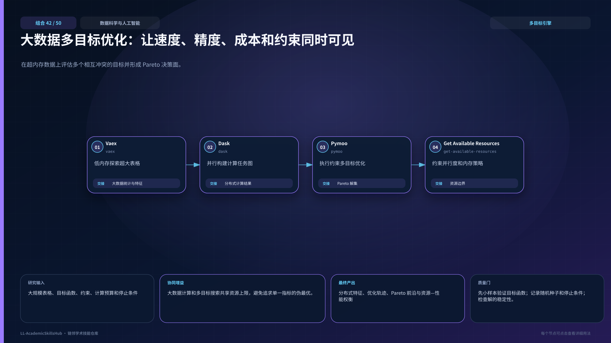
  </a>

**组合使用方式：**先由 **Vaex** 低内存探索超大表格，交付“大数据统计与特征”；再由 **Dask** 并行构建计算任务图，交付“分布式计算结果”；再由 **Pymoo** 执行约束多目标优化，交付“Pareto 解集”；最后由 **Get Available Resources** 约束并行度和内存策略，交付“资源边界”。

**输入：**大规模表格、目标函数、约束、计算预算和停止条件 
**产出：**分布式特征、优化轨迹、Pareto 前沿与资源—性能权衡 
**协同增益：**大数据计算和多目标搜索共享资源上限，避免追求单一指标的伪最优。 
**质量门：**先小样本验证目标函数；记录随机种子和停止条件；检查解的稳定性。

**组合技能：**

- [Vaex](../skills/data-analysis-statistics/vaex/locales/zh-CN.md)：低内存探索超大表格 → `大数据统计与特征`
- [Dask](../skills/data-analysis-statistics/dask/locales/zh-CN.md)：并行构建计算任务图 → `分布式计算结果`
- [Pymoo](../skills/machine-learning-ai/pymoo/locales/zh-CN.md)：执行约束多目标优化 → `Pareto 解集`
- [Get Available Resources](../skills/platform-infrastructure/get-available-resources/locales/zh-CN.md)：约束并行度和内存策略 → `资源边界`

[打开可编辑 SVG](../assets/brand/skill-combinations/42-multiobjective-big-data.svg) · [下载高清 PNG](../assets/brand/skill-combinations/png/42-multiobjective-big-data.png)

## 08 · 物理、材料与复杂系统

<strong>43 · 量子算法基准：跨框架验证线路、噪声与变分结果</strong>

> 在多个量子计算框架中复现实验，比较线路、噪声模型和变分优化。

  <a href="../assets/brand/skill-combinations/43-quantum-algorithm-benchmark.svg">
    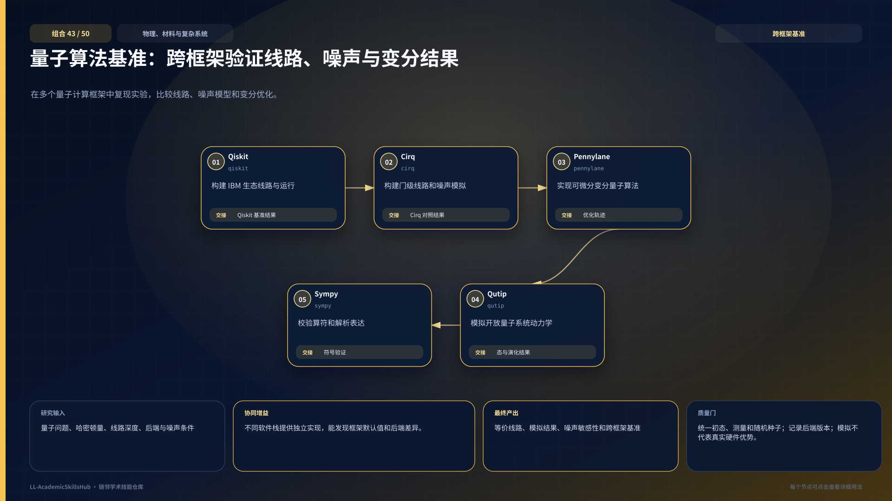
  </a>

**组合使用方式：**先由 **Qiskit** 构建 IBM 生态线路与运行，交付“Qiskit 基准结果”；再由 **Cirq** 构建门级线路和噪声模拟，交付“Cirq 对照结果”；再由 **Pennylane** 实现可微分变分量子算法，交付“优化轨迹”；再由 **Qutip** 模拟开放量子系统动力学，交付“态与演化结果”；最后由 **Sympy** 校验算符和解析表达，交付“符号验证”。

**输入：**量子问题、哈密顿量、线路深度、后端与噪声条件 
**产出：**等价线路、模拟结果、噪声敏感性和跨框架基准 
**协同增益：**不同软件栈提供独立实现，能发现框架默认值和后端差异。 
**质量门：**统一初态、测量和随机种子；记录后端版本；模拟不代表真实硬件优势。

**组合技能：**

- [Qiskit](../skills/materials-physics/qiskit/locales/zh-CN.md)：构建 IBM 生态线路与运行 → `Qiskit 基准结果`
- [Cirq](../skills/materials-physics/cirq/locales/zh-CN.md)：构建门级线路和噪声模拟 → `Cirq 对照结果`
- [Pennylane](../skills/materials-physics/pennylane/locales/zh-CN.md)：实现可微分变分量子算法 → `优化轨迹`
- [Qutip](../skills/materials-physics/qutip/locales/zh-CN.md)：模拟开放量子系统动力学 → `态与演化结果`
- [Sympy](../skills/data-analysis-statistics/sympy/locales/zh-CN.md)：校验算符和解析表达 → `符号验证`

[打开可编辑 SVG](../assets/brand/skill-combinations/43-quantum-algorithm-benchmark.svg) · [下载高清 PNG](../assets/brand/skill-combinations/png/43-quantum-algorithm-benchmark.png)

<strong>44 · 天文数据发现：从坐标和时序到可发表观测结论</strong>

> 处理天文坐标、时间和表格，完成探索、可视化与规范科学报告。

  <a href="../assets/brand/skill-combinations/44-astronomical-discovery.svg">
    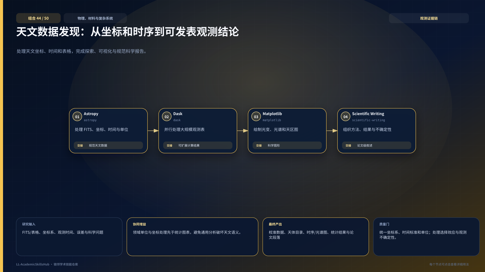
  </a>

**组合使用方式：**先由 **Astropy** 处理 FITS、坐标、时间与单位，交付“规范天文数据”；再由 **Dask** 并行处理大规模观测表，交付“可扩展计算结果”；再由 **Matplotlib** 绘制光变、光谱和天区图，交付“科学图形”；最后由 **Scientific Writing** 组织方法、结果与不确定性，交付“论文级叙述”。

**输入：**FITS/表格、坐标系、观测时间、误差与科学问题 
**产出：**校准数据、天体目录、时序/光谱图、统计结果与论文段落 
**协同增益：**领域单位与坐标处理先于统计图表，避免通用分析破坏天文语义。 
**质量门：**统一坐标系、时间标准和单位；处理选择效应与观测不确定性。

**组合技能：**

- [Astropy](../skills/materials-physics/astropy/locales/zh-CN.md)：处理 FITS、坐标、时间与单位 → `规范天文数据`
- [Dask](../skills/data-analysis-statistics/dask/locales/zh-CN.md)：并行处理大规模观测表 → `可扩展计算结果`
- [Matplotlib](../skills/data-analysis-statistics/matplotlib/locales/zh-CN.md)：绘制光变、光谱和天区图 → `科学图形`
- [Scientific Writing](../skills/scientific-communication/scientific-writing/locales/zh-CN.md)：组织方法、结果与不确定性 → `论文级叙述`

[打开可编辑 SVG](../assets/brand/skill-combinations/44-astronomical-discovery.svg) · [下载高清 PNG](../assets/brand/skill-combinations/png/44-astronomical-discovery.png)

<strong>45 · 流体与物理仿真：从方程原型到并行数值证据</strong>

> 定义边界条件、实现求解、检查收敛并形成可复现模拟证据。

  <a href="../assets/brand/skill-combinations/45-fluid-physics-simulation.svg">
    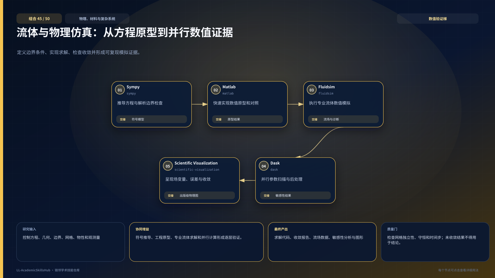
  </a>

**组合使用方式：**先由 **Sympy** 推导方程与解析边界检查，交付“符号模型”；再由 **Matlab** 快速实现数值原型和对照，交付“原型结果”；再由 **Fluidsim** 执行专业流体数值模拟，交付“流场与诊断”；再由 **Dask** 并行参数扫描与后处理，交付“敏感性结果”；最后由 **Scientific Visualization** 呈现场变量、误差与收敛，交付“出版级物理图”。

**输入：**控制方程、几何、边界、网格、物性和观测量 
**产出：**求解代码、收敛报告、流场数据、敏感性分析与图形 
**协同增益：**符号推导、工程原型、专业流体求解和并行计算形成逐层验证。 
**质量门：**检查网格独立性、守恒和时间步；未收敛结果不得用于结论。

**组合技能：**

- [Sympy](../skills/data-analysis-statistics/sympy/locales/zh-CN.md)：推导方程与解析边界检查 → `符号模型`
- [Matlab](../skills/materials-physics/matlab/locales/zh-CN.md)：快速实现数值原型和对照 → `原型结果`
- [Fluidsim](../skills/materials-physics/fluidsim/locales/zh-CN.md)：执行专业流体数值模拟 → `流场与诊断`
- [Dask](../skills/data-analysis-statistics/dask/locales/zh-CN.md)：并行参数扫描与后处理 → `敏感性结果`
- [Scientific Visualization](../skills/presentation-visualization/scientific-visualization/locales/zh-CN.md)：呈现场变量、误差与收敛 → `出版级物理图`

[打开可编辑 SVG](../assets/brand/skill-combinations/45-fluid-physics-simulation.svg) · [下载高清 PNG](../assets/brand/skill-combinations/png/45-fluid-physics-simulation.png)

<strong>46 · 材料发现：结构表示、多目标搜索与计算证据</strong>

> 在结构有效性、目标性质、稳定性和计算成本之间寻找材料候选。

  <a href="../assets/brand/skill-combinations/46-materials-discovery.svg">
    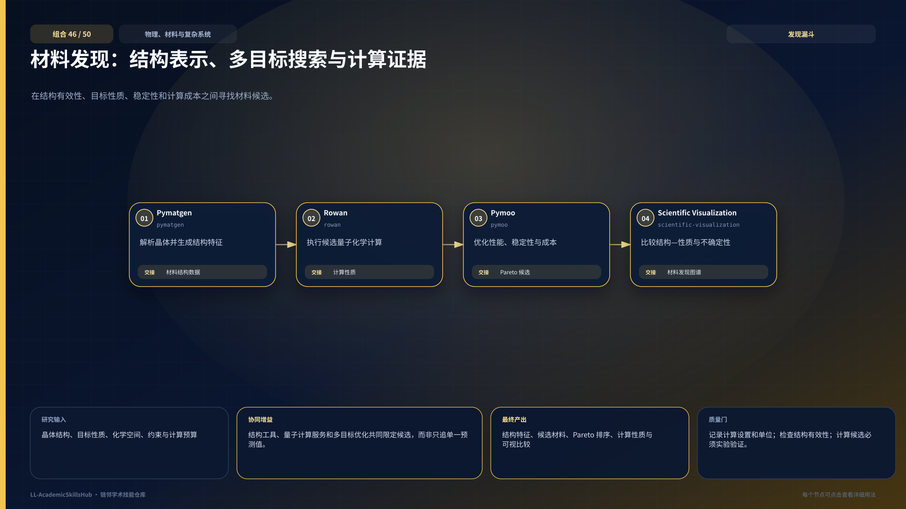
  </a>

**组合使用方式：**先由 **Pymatgen** 解析晶体并生成结构特征，交付“材料结构数据”；再由 **Rowan** 执行候选量子化学计算，交付“计算性质”；再由 **Pymoo** 优化性能、稳定性与成本，交付“Pareto 候选”；最后由 **Scientific Visualization** 比较结构—性质与不确定性，交付“材料发现图谱”。

**输入：**晶体结构、目标性质、化学空间、约束与计算预算 
**产出：**结构特征、候选材料、Pareto 排序、计算性质与可视比较 
**协同增益：**结构工具、量子计算服务和多目标优化共同限定候选，而非只追单一预测值。 
**质量门：**记录计算设置和单位；检查结构有效性；计算候选必须实验验证。

**组合技能：**

- [Pymatgen](../skills/materials-physics/pymatgen/locales/zh-CN.md)：解析晶体并生成结构特征 → `材料结构数据`
- [Rowan](../skills/cheminformatics-drug-discovery/rowan/locales/zh-CN.md)：执行候选量子化学计算 → `计算性质`
- [Pymoo](../skills/machine-learning-ai/pymoo/locales/zh-CN.md)：优化性能、稳定性与成本 → `Pareto 候选`
- [Scientific Visualization](../skills/presentation-visualization/scientific-visualization/locales/zh-CN.md)：比较结构—性质与不确定性 → `材料发现图谱`

[打开可编辑 SVG](../assets/brand/skill-combinations/46-materials-discovery.svg) · [下载高清 PNG](../assets/brand/skill-combinations/png/46-materials-discovery.png)

<strong>47 · 代谢系统建模：从酶动力学和通路到约束网络</strong>

> 整合酶参数和通路知识，建立可检验的代谢网络与通量预测。

  <a href="../assets/brand/skill-combinations/47-metabolic-systems-model.svg">
    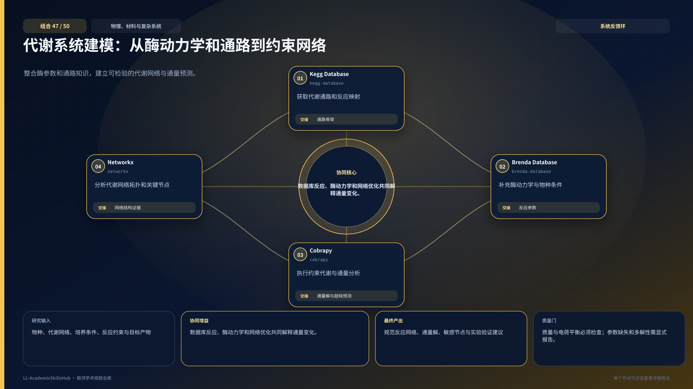
  </a>

**组合使用方式：**先由 **Kegg Database** 获取代谢通路和反应映射，交付“通路骨架”；再由 **Brenda Database** 补充酶动力学与物种条件，交付“反应参数”；再由 **Cobrapy** 执行约束代谢与通量分析，交付“通量解与敲除预测”；最后由 **Networkx** 分析代谢网络拓扑和关键节点，交付“网络结构证据”。

**输入：**物种、代谢网络、培养条件、反应约束与目标产物 
**产出：**规范反应网络、通量解、敏感节点与实验验证建议 
**协同增益：**数据库反应、酶动力学和网络优化共同解释通量变化。 
**质量门：**质量与电荷平衡必须检查；参数缺失和多解性需显式报告。

**组合技能：**

- [Kegg Database](../skills/scientific-databases/kegg-database/locales/zh-CN.md)：获取代谢通路和反应映射 → `通路骨架`
- [Brenda Database](../skills/scientific-databases/brenda-database/locales/zh-CN.md)：补充酶动力学与物种条件 → `反应参数`
- [Cobrapy](../skills/materials-physics/cobrapy/locales/zh-CN.md)：执行约束代谢与通量分析 → `通量解与敲除预测`
- [Networkx](../skills/data-analysis-statistics/networkx/locales/zh-CN.md)：分析代谢网络拓扑和关键节点 → `网络结构证据`

[打开可编辑 SVG](../assets/brand/skill-combinations/47-metabolic-systems-model.svg) · [下载高清 PNG](../assets/brand/skill-combinations/png/47-metabolic-systems-model.png)

## 09 · 自动化、经济与空间研究

<strong>48 · 机器人实验室：从协议到多设备执行与数据回流</strong>

> 把版本化实验协议转换为安全的液体处理和多设备自动化流程。

  <a href="../assets/brand/skill-combinations/48-robotic-laboratory.svg">
    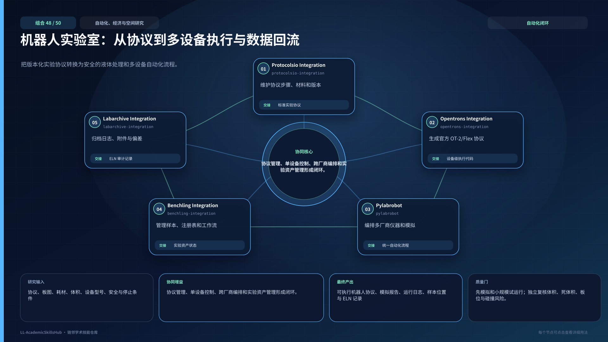
  </a>

**组合使用方式：**先由 **Protocolsio Integration** 维护协议步骤、材料和版本，交付“标准实验协议”；再由 **Opentrons Integration** 生成官方 OT-2/Flex 协议，交付“设备级执行代码”；再由 **Pylabrobot** 编排多厂商仪器和模拟，交付“统一自动化流程”；再由 **Benchling Integration** 管理样本、注册表和工作流，交付“实验资产状态”；最后由 **Labarchive Integration** 归档日志、附件与偏差，交付“ELN 审计记录”。

**输入：**协议、板图、耗材、体积、设备型号、安全与停止条件 
**产出：**可执行机器人协议、模拟报告、运行日志、样本位置与 ELN 记录 
**协同增益：**协议管理、单设备控制、跨厂商编排和实验资产管理形成闭环。 
**质量门：**先模拟和小规模试运行；独立复核体积、死体积、板位与碰撞风险。

**组合技能：**

- [Protocolsio Integration](../skills/lab-automation/protocolsio-integration/locales/zh-CN.md)：维护协议步骤、材料和版本 → `标准实验协议`
- [Opentrons Integration](../skills/lab-automation/opentrons-integration/locales/zh-CN.md)：生成官方 OT-2/Flex 协议 → `设备级执行代码`
- [Pylabrobot](../skills/lab-automation/pylabrobot/locales/zh-CN.md)：编排多厂商仪器和模拟 → `统一自动化流程`
- [Benchling Integration](../skills/lab-automation/benchling-integration/locales/zh-CN.md)：管理样本、注册表和工作流 → `实验资产状态`
- [Labarchive Integration](../skills/lab-automation/labarchive-integration/locales/zh-CN.md)：归档日志、附件与偏差 → `ELN 审计记录`

[打开可编辑 SVG](../assets/brand/skill-combinations/48-robotic-laboratory.svg) · [下载高清 PNG](../assets/brand/skill-combinations/png/48-robotic-laboratory.png)

<strong>49 · 金融宏观研究：市场、企业、财政与系统风险同框验证</strong>

> 对齐市场价格、公司披露、宏观指标、财政数据和对冲基金风险。

  <a href="../assets/brand/skill-combinations/49-financial-macro-research.svg">
    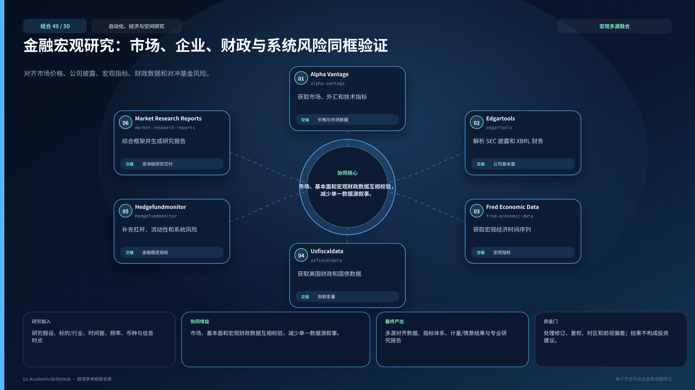
  </a>

**组合使用方式：**先由 **Alpha Vantage** 获取市场、外汇和技术指标，交付“价格与市场数据”；再由 **Edgartools** 解析 SEC 披露和 XBRL 财务，交付“公司基本面”；再由 **Fred Economic Data** 获取宏观经济时间序列，交付“宏观指标”；再由 **Usfiscaldata** 获取美国财政和国债数据，交付“财政变量”；再由 **Hedgefundmonitor** 补充杠杆、流动性和系统风险，交付“金融稳定指标”；最后由 **Market Research Reports** 综合框架并生成研究报告，交付“咨询级研究交付”。

**输入：**研究假设、标的/行业、时间窗、频率、币种与信息时点 
**产出：**多源对齐数据、指标体系、计量/情景结果与专业研究报告 
**协同增益：**市场、基本面和宏观财政数据互相校验，减少单一数据源叙事。 
**质量门：**处理修订、复权、时区和前视偏差；结果不构成投资建议。

**组合技能：**

- [Alpha Vantage](../skills/finance-economics/alpha-vantage/locales/zh-CN.md)：获取市场、外汇和技术指标 → `价格与市场数据`
- [Edgartools](../skills/finance-economics/edgartools/locales/zh-CN.md)：解析 SEC 披露和 XBRL 财务 → `公司基本面`
- [Fred Economic Data](../skills/finance-economics/fred-economic-data/locales/zh-CN.md)：获取宏观经济时间序列 → `宏观指标`
- [Usfiscaldata](../skills/finance-economics/usfiscaldata/locales/zh-CN.md)：获取美国财政和国债数据 → `财政变量`
- [Hedgefundmonitor](../skills/finance-economics/hedgefundmonitor/locales/zh-CN.md)：补充杠杆、流动性和系统风险 → `金融稳定指标`
- [Market Research Reports](../skills/finance-economics/market-research-reports/locales/zh-CN.md)：综合框架并生成研究报告 → `咨询级研究交付`

[打开可编辑 SVG](../assets/brand/skill-combinations/49-financial-macro-research.svg) · [下载高清 PNG](../assets/brand/skill-combinations/png/49-financial-macro-research.png)

<strong>50 · 地理空间研究：从公共统计和遥感到可发布地图证据</strong>

> 整合公共统计、矢量与遥感数据，完成空间分析、可视化和数据共享说明。

  <a href="../assets/brand/skill-combinations/50-geospatial-research-delivery.svg">
    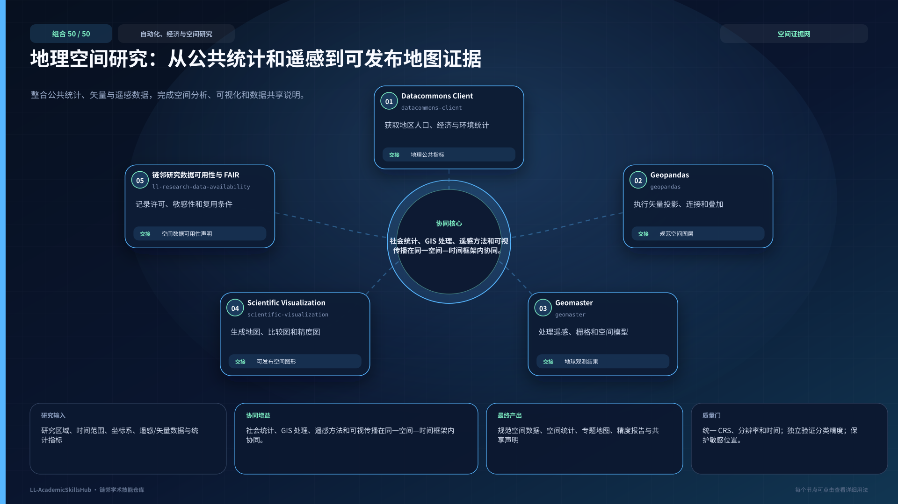
  </a>

**组合使用方式：**先由 **Datacommons Client** 获取地区人口、经济与环境统计，交付“地理公共指标”；再由 **Geopandas** 执行矢量投影、连接和叠加，交付“规范空间图层”；再由 **Geomaster** 处理遥感、栅格和空间模型，交付“地球观测结果”；再由 **Scientific Visualization** 生成地图、比较图和精度图，交付“可发布空间图形”；最后由 **链邻研究数据可用性与 FAIR** 记录许可、敏感性和复用条件，交付“空间数据可用性声明”。

**输入：**研究区域、时间范围、坐标系、遥感/矢量数据与统计指标 
**产出：**规范空间数据、空间统计、专题地图、精度报告与共享声明 
**协同增益：**社会统计、GIS 处理、遥感方法和可视传播在同一空间—时间框架内协同。 
**质量门：**统一 CRS、分辨率和时间；独立验证分类精度；保护敏感位置。

**组合技能：**

- [Datacommons Client](../skills/scientific-databases/datacommons-client/locales/zh-CN.md)：获取地区人口、经济与环境统计 → `地理公共指标`
- [Geopandas](../skills/geospatial-remote-sensing/geopandas/locales/zh-CN.md)：执行矢量投影、连接和叠加 → `规范空间图层`
- [Geomaster](../skills/geospatial-remote-sensing/geomaster/locales/zh-CN.md)：处理遥感、栅格和空间模型 → `地球观测结果`
- [Scientific Visualization](../skills/presentation-visualization/scientific-visualization/locales/zh-CN.md)：生成地图、比较图和精度图 → `可发布空间图形`
- [链邻研究数据可用性与 FAIR](../skills/academic-core/ll-research-data-availability/locales/zh-CN.md)：记录许可、敏感性和复用条件 → `空间数据可用性声明`

[打开可编辑 SVG](../assets/brand/skill-combinations/50-geospatial-research-delivery.svg) · [下载高清 PNG](../assets/brand/skill-combinations/png/50-geospatial-research-delivery.png)

## 数据与质量审计

- 权威组合数据：[`catalog/skill-combinations.json`](../catalog/skill-combinations.json)
- 自动审计报告：[`reports/skill-combination-audit.zh-CN.md`](../reports/skill-combination-audit.zh-CN.md)
- 视觉总检板：[`reports/skill-combination-contact-sheet.png`](../reports/skill-combination-contact-sheet.png)
- 生成脚本：[`scripts/build_skill_combinations.py`](../scripts/build_skill_combinations.py)
- 验证脚本：[`scripts/validate_skill_combinations.py`](../scripts/validate_skill_combinations.py)
